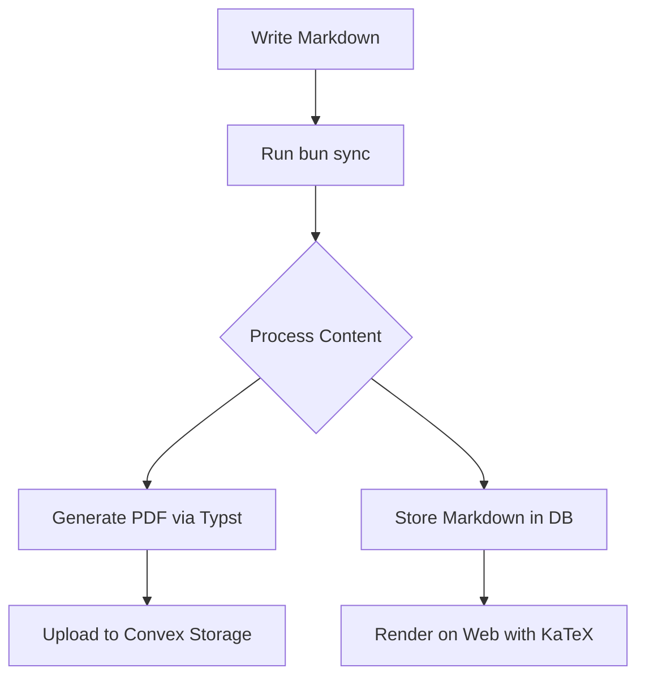

# Introduction

This is an example document to demonstrate the markdown-based content management system.
Write in markdown, render on the web with KaTeX for math, and generate beautiful PDFs via Typst.

## Why Markdown?

Markdown offers several advantages for academic and technical writing:

- **Familiar syntax** — Write in the format you already know
- **Excellent math support** — KaTeX on web, native math in PDF
- **Diagram support** — Mermaid diagrams work in both formats
- **Portable documents** — Single source, multiple outputs

# Mathematical Notation

The system supports mathematical expressions using standard LaTeX syntax. Here's Euler's identity:

$$e^{i\pi} + 1 = 0$$

And a more complex equation, the Gaussian integral:

$$\int_{-\infty}^{\infty} e^{-x^2} dx = \sqrt{\pi}$$

## Matrices and Linear Algebra

Matrix notation is also straightforward:

$$\mathbf{A} = \begin{pmatrix}
a_{11} & a_{12} & a_{13} \\
a_{21} & a_{22} & a_{23} \\
a_{31} & a_{32} & a_{33}
\end{pmatrix}$$

# Diagrams

You can include diagrams using Mermaid syntax:



# Code Examples

While the system is primarily for documents, we can include code snippets:

```python
def fibonacci(n: int) -> int:
    """Calculate the nth Fibonacci number."""
    if n <= 1:
        return n
    return fibonacci(n - 1) + fibonacci(n - 2)
```

# Conclusion

This example demonstrates that the markdown-based system provides a powerful, familiar approach to academic writing. The combination of beautiful PDF output via Typst, math rendering via KaTeX, and diagram support via Mermaid makes it an excellent choice for technical documentation.

*Document generated from markdown and synced via `bun sync`.*
