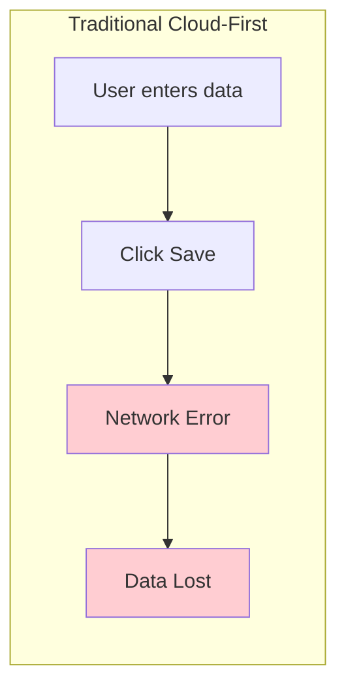
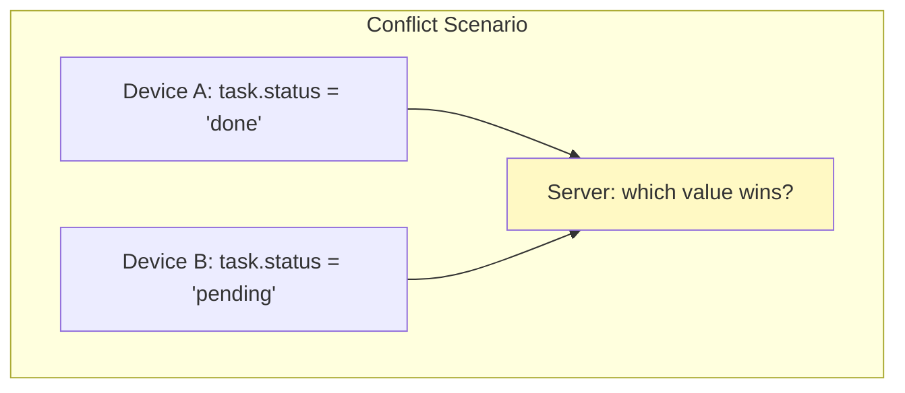
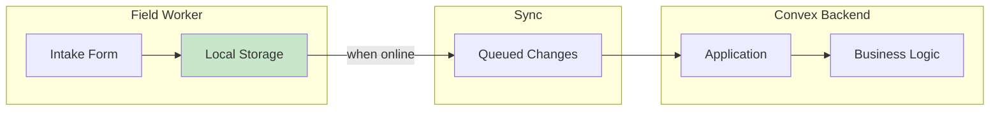
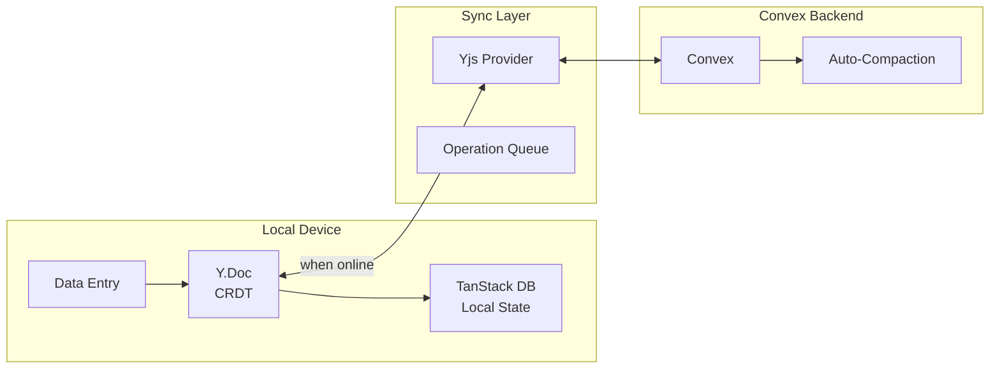
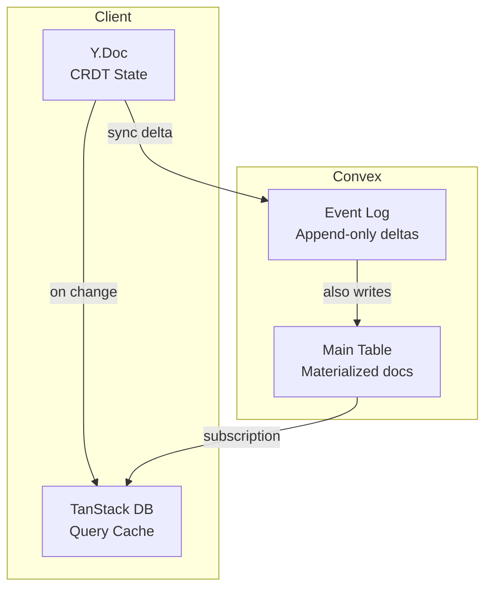
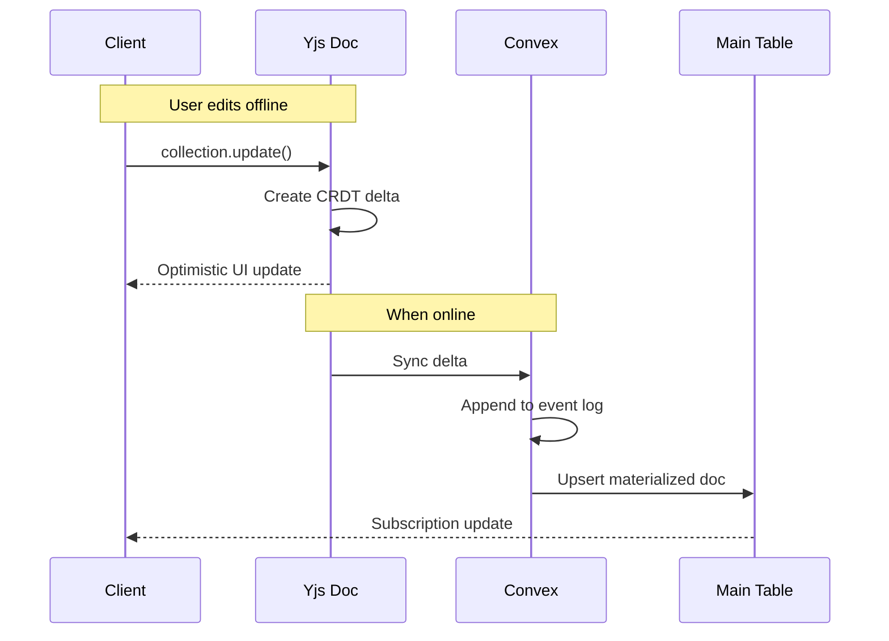
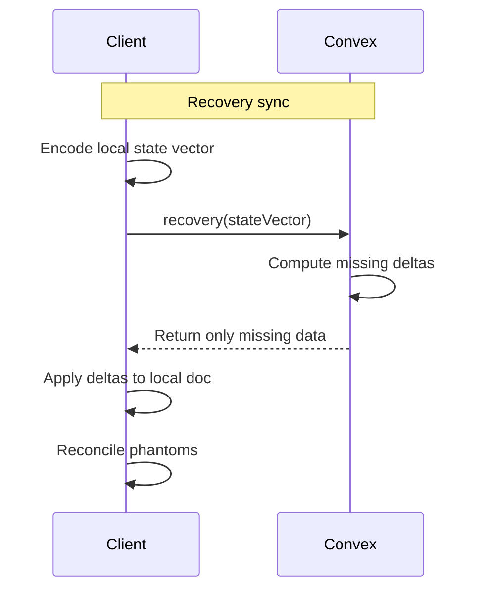
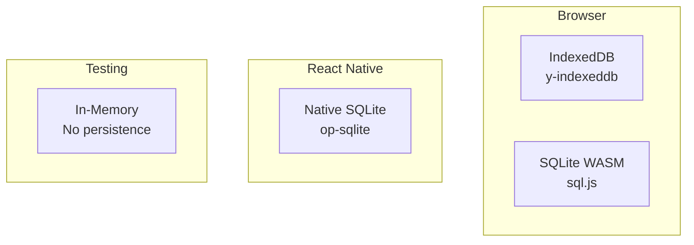
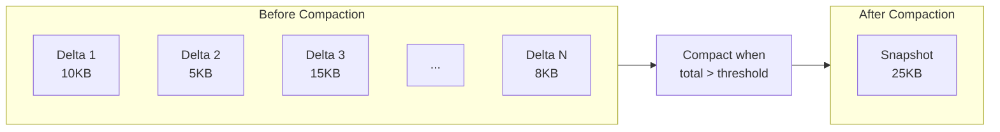
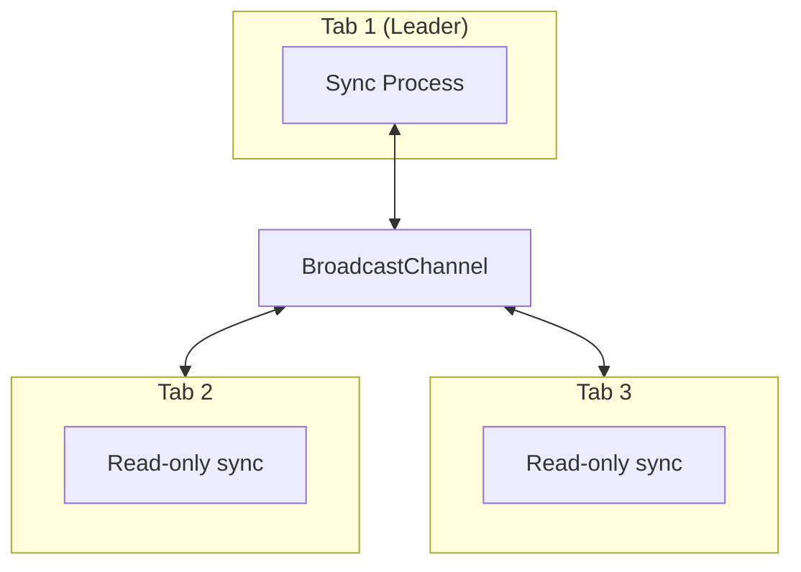

# Abstract

Field workers often operate in areas with unstable internet connectivity. Traditional cloud-first applications fail in these environments - losing data, showing loading spinners, or blocking critical workflows.

This paper presents **Replicate**, a [Convex component](https://docs.convex.dev/components) for offline-first sync that combines Yjs CRDTs (Conflict-free Replicated Data Types) with TanStack DB's reactive state management. Install via npm and mount with `app.use(replicate)`. Write data anywhere - offline, online, across devices. When connections resume, changes merge automatically without conflicts. Auto-compaction keeps storage bounded without manual maintenance.

The result is Convex applications that work reliably regardless of network conditions - as a drop-in component.

---

# What is a Convex Component?

[Convex components](https://docs.convex.dev/components) are reusable, self-contained modules that add functionality to any Convex application. They:

- **Install via npm** - `bun add @trestleinc/replicate`
- **Mount in your app** - `app.use(replicate)` in `convex.config.ts`
- **Provide typed APIs** - Full TypeScript support with generated types
- **Run in isolation** - Separate tables, no schema conflicts
- **Compose together** - Multiple components work side-by-side

Replicate follows this pattern. Install it, mount it, and you have a complete offline-first sync system with CRDT conflict resolution and auto-compaction.

---

# The Problem

## The Connectivity Problem

Many workers operate in challenging network environments:
- Rural areas with spotty cellular coverage
- Large buildings with WiFi dead zones
- Underground or industrial facilities
- Regions with unreliable infrastructure

Standard applications assume constant connectivity. When the network fails:



**Problems with cloud-first:**
- Loading spinners block workflow
- Saves fail silently or with errors
- Manual retry required
- Data can be lost entirely

## The Conflict Problem

Even with offline storage, synchronization creates conflicts:



Traditional solutions:
- **Last-write-wins** - Silent data loss
- **Manual conflict resolution** - User burden
- **Locking** - Blocks collaboration

What we need is conflict-free merging that preserves all changes without user intervention.

---

# Why We Built This

## The Trestle Context

At Trestle, we build software for human services organizations. Our users - case workers, intake specialists, field staff - often work in environments with unreliable connectivity:

- **Shelters** with overloaded WiFi
- **Client homes** in rural areas
- **Community centers** with spotty coverage
- **Field visits** with cellular dead zones

When a worker spends 30 minutes completing an intake form and hits "Save" only to see a network error, that's not just frustrating - it's potentially hours of lost work and a client who has to repeat their story.

**We needed:**
- Forms that save locally, always
- Automatic sync when connectivity returns
- No conflicts when multiple workers touch the same record
- Complete audit trail for compliance

Replicate was built to solve this problem for Ledger, our human services platform. But the patterns are universal - any Convex application with offline requirements can benefit.



---

# The Solution

## CRDT-Based Offline-First Architecture

Replicate combines three technologies:

1. **Yjs CRDTs** - Conflict-free data structures
2. **TanStack DB** - Reactive local state with optimistic updates
3. **Convex Backend** - Real-time sync with auto-compaction



### Why CRDTs?

CRDTs (Conflict-free Replicated Data Types) are data structures designed for distributed systems where:
- Multiple devices can edit simultaneously
- Network partitions are expected
- Merges must be automatic and deterministic

**Key CRDT Properties:**
- **Commutative** - Order of operations doesn't matter
- **Associative** - Grouping of operations doesn't matter
- **Idempotent** - Duplicate operations are safe

This means any device can apply any changes in any order and reach the same final state.

### Why Yjs?

We chose Yjs for several reasons:
- **Small bundle size** - No WASM required
- **Battle-tested** - Powers collaborative editors like Notion, Figma
- **Rich ecosystem** - Persistence providers, editor bindings
- **Efficient encoding** - State vectors enable minimal sync payloads

---

# Installation

## 1. Install the Package

```bash
# Using bun (recommended)
bun add @trestleinc/replicate

# Using npm
npm install @trestleinc/replicate
```

## 2. Mount the Component

```typescript
// convex/convex.config.ts
import { defineApp } from "convex/server";
import replicate from "@trestleinc/replicate/convex.config";

const app = defineApp();
app.use(replicate);

export default app;
```

## 3. Define Your Schema

Use the `table()` helper to automatically inject required replication fields:

```typescript
// convex/schema.ts
import { defineSchema } from "convex/server";
import { v } from "convex/values";
import { table } from "@trestleinc/replicate/server";

export default defineSchema({
  tasks: table(
    {
      id: v.string(),
      text: v.string(),
      isCompleted: v.boolean(),
    },
    (t) => t
      .index("by_user_id", ["id"])
      .index("by_timestamp", ["timestamp"])
  ),
});
```

## 4. Create Replication Functions

```typescript
// convex/tasks.ts
import { replicate } from "@trestleinc/replicate/server";
import { components } from "./_generated/api";

const r = replicate(components.replicate);

export const {
  stream,
  material,
  insert,
  update,
  remove,
  versions,
} = r<Task>({
  collection: "tasks",
  compaction: { threshold: 5_000_000 },  // Auto-compact at 5MB
});
```

## 5. Create a Custom Hook

```typescript
// src/useTasks.ts
import { createCollection } from "@tanstack/react-db";
import { convexCollectionOptions } from "@trestleinc/replicate/client";
import { api } from "../convex/_generated/api";

let tasksCollection: ReturnType<typeof createCollection<Task>>;

export function useTasks(initialData?: MaterializedData<Task>) {
  return useMemo(() => {
    if (!tasksCollection) {
      tasksCollection = createCollection(
        convexCollectionOptions<Task>({
          convexClient,
          api: api.tasks,
          collection: "tasks",
          getKey: (task) => task.id,
          material: initialData,
        })
      );
    }
    return tasksCollection;
  }, [initialData]);
}
```

## 6. Use in Components

```typescript
function TaskList() {
  const collection = useTasks();
  const { data: tasks, isLoading } = useLiveQuery(collection);

  const handleCreate = () => {
    collection.insert({
      id: crypto.randomUUID(),
      text: "New task",
      isCompleted: false,
    });
  };

  const handleUpdate = (id: string) => {
    collection.update(id, (draft) => {
      draft.isCompleted = !draft.isCompleted;
    });
  };

  // Works offline - changes queue automatically
  return (
    <div>
      <button onClick={handleCreate}>Add Task</button>
      {tasks.map((task) => (
        <TaskItem key={task.id} task={task} onToggle={handleUpdate} />
      ))}
    </div>
  );
}
```

---

# Technical Deep Dive

## Dual-Storage Architecture



**Why both storage layers?**

| Layer | Purpose | Properties |
|-------|---------|------------|
| Event Log | History, conflict resolution | Append-only, complete history |
| Main Table | Queries, indexes | Current state, fast lookups |

This is similar to CQRS/Event Sourcing: events are the source of truth, main table is a materialized view.

## Sync Protocol



## Recovery Mechanism

When a client reconnects after being offline:



**State vectors** enable efficient sync - only missing data is transferred, not the full document.

## Persistence Providers

Choose the right storage for your platform:



| Provider | Platform | Use Case |
|----------|----------|----------|
| `indexeddbPersistence()` | Browser | Default, zero config |
| `sqlitePersistence()` | Browser + React Native | Universal, auto-detects |
| `memoryPersistence()` | Any | Testing without side effects |

## Auto-Compaction

Without compaction, event logs grow unbounded. Replicate compacts automatically:



**How it works:**
1. Track total delta size per document
2. When threshold exceeded (default 5MB):
   - Merge all deltas into single snapshot
   - Validate merged state
   - Store snapshot, delete old deltas
3. No manual cron jobs needed - happens per-mutation

## Multi-Tab Coordination

TanStack DB handles multi-tab sync automatically:



**Benefits:**
- Only one tab runs sync (leader election)
- Changes propagate instantly across tabs
- Efficient use of network resources

---

# Component Ecosystem

Replicate is part of a family of Convex components that work together:

| Component | Purpose | Integration |
|-----------|---------|-------------|
| **[Bridge](/journal/bridge-reactive-data)** | Reactive data pipelines | Offline-queued procedures sync on reconnect |
| **[Crane](/journal/crane-browser-automation)** | Browser automation | Automation requires online vault access |
| **[Taxonomy](/journal/taxonomy-data-governance)** | Data governance | Local data respects classification rules |
| **[TSP](/journal/tsp-data-contracts)** | Data contracts | Offline submissions queue until sync |

Each component is independently installable. Use one, some, or all - they compose cleanly because each runs in isolated tables.

**Important limitations:**
- Crane's credential vault requires online access (vault key is server-side)
- TSP submissions validate on sync (may reject if rules changed)
- Taxonomy DSR requests process after sync completes

---

# Conclusion

Network connectivity should not determine data reliability. By combining CRDTs with dual-storage architecture:

1. **Works offline** - Full functionality without network
2. **Conflict-free** - Automatic merging, no user intervention
3. **Optimistic UI** - Instant updates, sync in background
4. **Bounded storage** - Auto-compaction prevents unbounded growth
5. **Multi-platform** - Browser and React Native support

The pattern applies universally: field data collection, collaborative editing, mobile applications, IoT devices. Any Convex application where connectivity is unreliable benefits from local-first architecture.

Your data should never be held hostage by the network.
