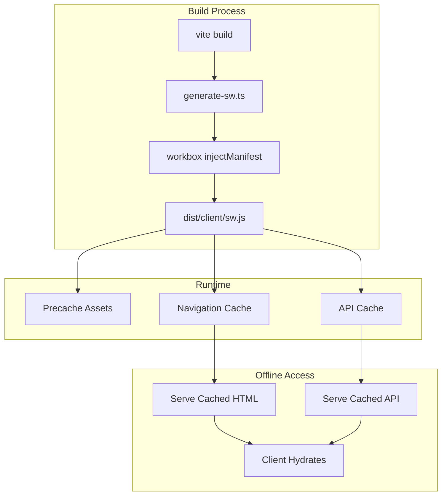
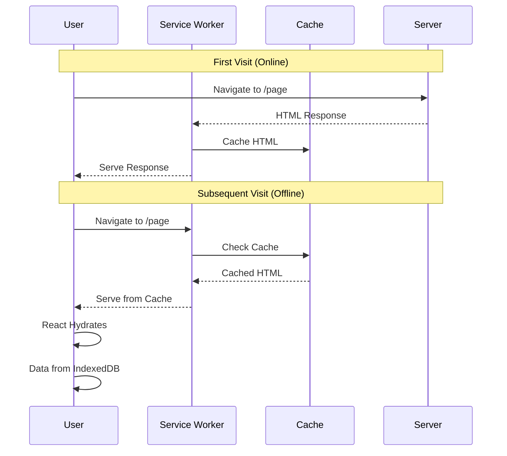

# Introduction

This guide solves the challenge of implementing PWA offline support in TanStack Start applications. Unlike static SPAs with a single `index.html`, TanStack Start uses Server-Side Rendering (SSR), which requires a custom approach to service worker generation.

**Key challenges solved:**
- Service worker generation in SSR frameworks
- Caching server-rendered HTML for offline access
- Runtime caching for API responses
- Working around vite-plugin-pwa's build hook limitations

# Architecture

The solution uses a post-build service worker generation strategy with Workbox.



## Caching Strategy

| Request Type | Strategy | Cache Name | Timeout |
|-------------|----------|------------|---------|
| Navigation | NetworkFirst | pages-cache | 3s |
| API calls | NetworkFirst | api-cache | 3s |
| Static assets | CacheFirst | static-assets | - |
| Images | CacheFirst | images-cache | - |

# Tech Stack

| Technology | Version | Purpose |
|------------|---------|---------|
| TanStack Start | 1.x | Full-stack React framework |
| vite-plugin-pwa | 1.x | Manifest generation |
| workbox-build | 7.x | Service worker generation |
| workbox-* | 7.x | Runtime caching strategies |
| Bun | 1.x | TypeScript transpilation |

# Prerequisites

- TanStack Start application
- Basic understanding of service workers
- Bun runtime installed

## Installation

```bash
bun add vite-plugin-pwa
bun add -D workbox-build workbox-precaching workbox-routing workbox-strategies workbox-expiration @types/bun
```

# Implementation

## 1. Custom Service Worker

Create `src/sw.ts` with Workbox caching strategies:

```typescript
import { cleanupOutdatedCaches, precacheAndRoute } from 'workbox-precaching';
import { registerRoute, NavigationRoute } from 'workbox-routing';
import { NetworkFirst, CacheFirst } from 'workbox-strategies';
import { ExpirationPlugin } from 'workbox-expiration';

declare let self: ServiceWorkerGlobalScope;

// Precache static assets (injected by workbox-build)
precacheAndRoute(self.__WB_MANIFEST);
cleanupOutdatedCaches();

// Navigation requests: NetworkFirst with offline fallback
// Caches SSR-rendered HTML pages for offline access
registerRoute(
  new NavigationRoute(
    new NetworkFirst({
      cacheName: 'pages-cache',
      networkTimeoutSeconds: 3,
      plugins: [
        new ExpirationPlugin({
          maxEntries: 50,
          maxAgeSeconds: 24 * 60 * 60, // 24 hours
        }),
      ],
    })
  )
);

// API requests: NetworkFirst with timeout
// Replace with your API pattern (e.g., Convex)
registerRoute(
  ({ url }) => url.hostname.includes('.convex.cloud'),
  new NetworkFirst({
    cacheName: 'api-cache',
    networkTimeoutSeconds: 3,
    plugins: [
      new ExpirationPlugin({
        maxEntries: 100,
        maxAgeSeconds: 24 * 60 * 60,
      }),
    ],
  })
);

// Static assets: CacheFirst for performance
registerRoute(
  ({ request }) =>
    request.destination === 'style' ||
    request.destination === 'script' ||
    request.destination === 'font',
  new CacheFirst({
    cacheName: 'static-assets',
    plugins: [
      new ExpirationPlugin({
        maxEntries: 100,
        maxAgeSeconds: 7 * 24 * 60 * 60, // 7 days
      }),
    ],
  })
);

// Images: CacheFirst
registerRoute(
  ({ request }) => request.destination === 'image',
  new CacheFirst({
    cacheName: 'images-cache',
    plugins: [
      new ExpirationPlugin({
        maxEntries: 50,
        maxAgeSeconds: 30 * 24 * 60 * 60, // 30 days
      }),
    ],
  })
);
```

## 2. Post-Build Script

Create `scripts/generate-sw.ts` to handle service worker generation after Vite build:

```typescript
import { injectManifest } from 'workbox-build';
import { resolve } from 'node:path';
import { existsSync, unlinkSync, writeFileSync } from 'node:fs';

const distClient = resolve(import.meta.dirname, '../dist/client');
const srcSw = resolve(import.meta.dirname, '../src/sw.ts');

async function generateServiceWorker() {
  if (!existsSync(distClient)) {
    console.error('Error: dist/client does not exist. Run build first.');
    process.exit(1);
  }

  // Use Bun to transpile TypeScript to JavaScript
  console.log('Transpiling service worker...');
  const transpiled = await Bun.build({
    entrypoints: [srcSw],
    format: 'esm',
    target: 'browser',
    minify: false,
  });

  if (!transpiled.success) {
    console.error('Failed to transpile service worker:', transpiled.logs);
    process.exit(1);
  }

  const swJsContent = await transpiled.outputs[0].text();
  const tempSwPath = resolve(distClient, 'sw-src.js');
  writeFileSync(tempSwPath, swJsContent);

  console.log('Generating service worker with workbox...');

  try {
    const { count, size, warnings } = await injectManifest({
      swSrc: tempSwPath,
      swDest: resolve(distClient, 'sw.js'),
      globDirectory: distClient,
      globPatterns: ['**/*.{js,css,ico,png,svg,woff2}'],
      globIgnores: ['sw-src.js', 'sw.js'],
      maximumFileSizeToCacheInBytes: 5 * 1024 * 1024, // 5MB
    });

    unlinkSync(tempSwPath);

    if (warnings.length > 0) {
      console.warn('Warnings:', warnings.join('\n'));
    }

    console.log(
      `✓ Service worker generated with ${count} files, totaling ${(size / 1024).toFixed(1)} KB`
    );
  } catch (error) {
    console.error('Error generating service worker:', error);
    process.exit(1);
  }
}

generateServiceWorker();
```

## 3. Vite Configuration

Update `vite.config.ts` to use vite-plugin-pwa for manifest generation only:

```typescript
import { VitePWA } from 'vite-plugin-pwa';

export default defineConfig({
  plugins: [
    // ... other plugins

    // VitePWA only generates manifest.webmanifest
    // Service worker is generated post-build via scripts/generate-sw.ts
    VitePWA({
      registerType: 'prompt',
      injectRegister: false, // Manual registration
      includeAssets: ['favicon.ico', 'favicon.svg', 'robots.txt'],
      manifest: {
        name: 'Your App Name',
        short_name: 'App',
        description: 'Your app description',
        theme_color: '#000000',
        background_color: '#ffffff',
        display: 'standalone',
        icons: [
          {
            src: 'logo192.png',
            sizes: '192x192',
            type: 'image/png',
          },
          {
            src: 'logo512.png',
            sizes: '512x512',
            type: 'image/png',
            purpose: 'any maskable',
          },
        ],
      },
      devOptions: {
        enabled: false,
        type: 'module',
        suppressWarnings: true,
      },
    }),
  ],
});
```

## 4. Build Script

Update `package.json` to chain service worker generation:

```json
{
  "scripts": {
    "build": "vite build && bun run generate-sw",
    "generate-sw": "bun scripts/generate-sw.ts"
  }
}
```

## 5. Service Worker Registration

Create a component to handle service worker registration and updates. With vite-plugin-pwa, you can use the virtual module:

```tsx
import { useRegisterSW } from 'virtual:pwa-register/react';

export function ReloadPrompt() {
  const {
    offlineReady: [offlineReady, setOfflineReady],
    needRefresh: [needRefresh, setNeedRefresh],
    updateServiceWorker,
  } = useRegisterSW();

  const close = () => {
    setOfflineReady(false);
    setNeedRefresh(false);
  };

  if (!offlineReady && !needRefresh) return null;

  return (
    <div className="fixed bottom-4 right-4 z-50 flex items-center gap-3 px-4 py-3 bg-white shadow-lg rounded-lg">
      <span className="text-sm">
        {offlineReady ? 'App ready to work offline' : 'New content available'}
      </span>
      <div className="flex items-center gap-2">
        {needRefresh && (
          <button onClick={() => updateServiceWorker(true)}>
            Reload
          </button>
        )}
        <button onClick={close}>Close</button>
      </div>
    </div>
  );
}
```

Include this component in your root layout.

# Why This Approach?

## The Problem

TanStack Start uses SSR, which means:
- No static `index.html` to fall back to
- vite-plugin-pwa's `generateSW` doesn't work with TanStack Start's build process
- The `closeBundle` hook that triggers SW generation isn't called properly

## The Solution

Post-build service worker generation:
1. vite-plugin-pwa generates only the manifest
2. Custom script runs after Vite build
3. Bun transpiles TypeScript service worker
4. workbox-build injects the precache manifest
5. Final `sw.js` placed in `dist/client/`

# How It Works Offline



1. **First visit (online)**: Server renders HTML, service worker caches the response
2. **Subsequent visits (offline)**: Service worker serves cached HTML
3. **Client hydration**: React hydrates with local data (IndexedDB if using offline-first architecture)

# Testing

```bash
# Build with service worker
bun run build

# Preview production build
bun run serve
```

In Chrome DevTools:
1. **Application > Service Workers** — Verify SW is active
2. **Application > Cache Storage** — Verify caches exist
3. **Network tab > Offline checkbox** — Enable offline mode
4. **Refresh** — Should load from cache
5. **Navigate** — Client-side routing should work

# Biome Configuration

If using Biome, add an override for the scripts directory:

```json
{
  "overrides": [
    {
      "includes": ["scripts/**"],
      "linter": {
        "rules": {
          "suspicious": {
            "noConsole": "off"
          }
        }
      }
    }
  ]
}
```

# Key Differences from Vite SPA

| Aspect | Vite SPA | TanStack Start |
|--------|----------|----------------|
| HTML | Static `index.html` | Server-rendered per request |
| Fallback | `navigateFallback: '/index.html'` | Cache first navigation response |
| SW Generation | vite-plugin-pwa `generateSW` | Post-build with workbox-build |
| Offline data | Cache API only | Cache + IndexedDB (if local-first) |

# Resources

- [vite-plugin-pwa Documentation](https://vite-pwa-org.netlify.app/)
- [Workbox Documentation](https://developer.chrome.com/docs/workbox/)
- [TanStack Start Guide](https://tanstack.com/start/latest)
- [Service Worker API](https://developer.mozilla.org/en-US/docs/Web/API/Service_Worker_API)
