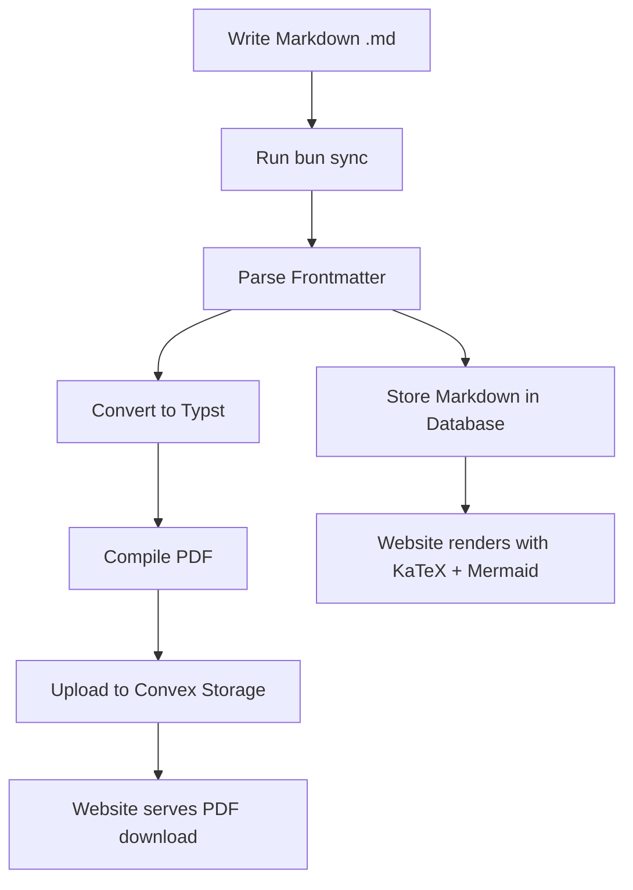
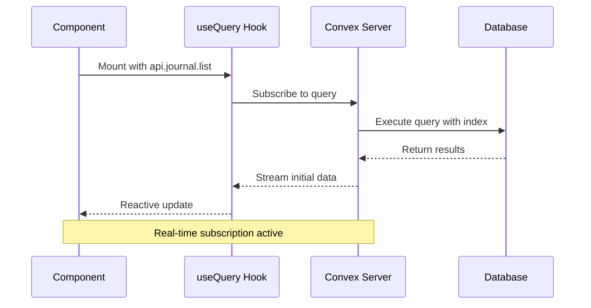
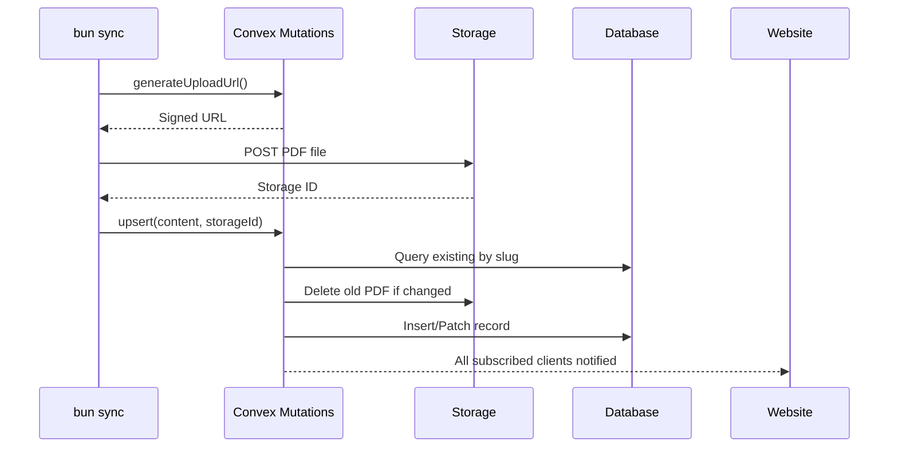

# Introduction

The robelest portfolio is a personal website built with modern web technologies, designed to showcase work through journal posts and academic documents. The architecture emphasizes simplicity, type safety, and beautiful content presentation.

**Source code**: [github.com/robelest/robelest](https://github.com/robelest/robelest)

## Design Goals

- **Minimal complexity** — Single-page app with clear navigation
- **Type safety** — End-to-end TypeScript with generated Convex types
- **Real-time data** — Automatic UI updates via Convex subscriptions
- **Beautiful documents** — Academic-quality PDFs via Typst compilation
- **Editorial aesthetic** — Warm, paper-inspired visual design

# Tech Stack Overview

The website is built on a modern JavaScript/TypeScript stack with specialized tools for 3D graphics and document rendering.

## Core Technologies

| Technology | Purpose |
|------------|---------|
| SvelteKit 2.43 | Full-stack framework with file-based routing |
| Svelte 5.39 | Reactive UI components with runes |
| TypeScript 5.9 | Type-safe development |
| Convex 1.30 | Backend-as-a-service with real-time database |
| Tailwind CSS 4.1 | Utility-first styling |
| Three.js 0.181 | 3D graphics rendering |
| Threlte 8.3 | Svelte bindings for Three.js |
| Typst | Document typesetting system |

## Package Manager

The project uses **Bun** as the package manager and runtime, providing fast dependency installation and script execution.

# Project Structure

The codebase follows SvelteKit conventions with additional directories for Convex functions and content management.

## Directory Layout

```
robelest/
├── src/
│   ├── routes/           # SvelteKit pages
│   │   ├── +layout.svelte
│   │   ├── +page.svelte
│   │   └── journal/[slug]/
│   ├── lib/
│   │   ├── components/   # Reusable UI components
│   │   └── utils/        # Helper functions
│   └── app.css           # Global styles
├── convex/
│   ├── schema.ts         # Database schema
│   └── journal.ts        # Journal queries/mutations
├── journal/
│   ├── *.md              # Markdown source files
│   └── templates/        # Typst templates
├── scripts/
│   └── sync.ts           # Content sync CLI
└── static/               # Static assets
```

## Routing Architecture

SvelteKit's file-based routing provides clean URL patterns:

| Route | Purpose |
|-------|---------|
| `/` | Home page with about, links, journal |
| `/journal/[slug]` | Individual journal entry |

# Convex Integration

Convex serves as the backend, providing a real-time database and file storage without requiring server infrastructure management.

## Database Schema

The schema defines the journal table with indexes for efficient querying:

```typescript
// convex/schema.ts
export default defineSchema({
  journal: defineTable({
    title: v.string(),
    slug: v.string(),
    content: v.string(),        // Markdown content
    pdfStorageId: v.id("_storage"),
    pdfUrl: v.string(),
    publishDate: v.string(),
    published: v.boolean(),
    tags: v.optional(v.array(v.string())),
  })
    .index("by_slug", ["slug"])
    .index("by_published", ["published", "publishDate"]),
});
```

## Query Pattern

Components use the `useQuery` hook from `convex-svelte` for reactive data fetching:

```svelte
<script lang="ts">
  import { useQuery } from 'convex-svelte';
  import { api } from '../convex/_generated/api';

  const journalQuery = useQuery(api.journal.list, {
    publishedOnly: true
  });

  const hasEntries = $derived(
    journalQuery.data && journalQuery.data.length > 0
  );
</script>

{#if journalQuery.isLoading}
  <p>Loading...</p>
{:else if hasEntries}
  {#each journalQuery.data as entry}
    <a href="/journal/{entry.slug}">{entry.title}</a>
  {/each}
{/if}
```

> **Real-time Updates**: Convex queries automatically subscribe to data changes. When entries are added or updated via the sync script, all connected clients receive updates without page refresh.

# Content Management

The content management system converts markdown source files to PDFs via Typst and syncs them to Convex Storage.

## Content Workflow



## Frontmatter Format

Markdown documents include YAML frontmatter:

```markdown
---
title: My Document Title
slug: my-document
description: Brief description
tags:
  - research
  - technical
publishDate: 2024-12-15
published: true
category: research
---

# Introduction

Your content here with **markdown formatting**...
```

## Sync Script

The `scripts/sync.ts` CLI handles the complete sync process:

1. **Discovery** — Find all `.md` files in `journal/`
2. **Parse** — Extract frontmatter with gray-matter
3. **Convert** — Transform markdown to Typst
4. **Compile** — Run `typst compile` to generate PDF
5. **Upload** — Send PDF to Convex Storage
6. **Upsert** — Create or update database record
7. **Cleanup** — Delete removed entries

```bash
bun sync
```

# Styling System

The visual design follows an editorial aesthetic with a warm, paper-inspired color palette.

## Color Palette

| Variable | Value | Usage |
|----------|-------|-------|
| `--base` | `#faf8f5` | Background |
| `--surface` | `#f5f2ed` | Cards, surfaces |
| `--border` | `#e8e4dc` | Borders, dividers |
| `--muted` | `#8c8780` | Secondary text |
| `--text` | `#1a1816` | Primary text |
| `--accent` | `#c25d3a` | Links, highlights (terracotta) |

## Typography

The design uses a combination of serif and sans-serif fonts:

- **Display text** — Newsreader (serif) for headings and brand
- **Journal content** — Crimson Pro (serif) for academic feel
- **Body text** — System sans-serif for UI readability
- **Code** — SF Mono / JetBrains Mono for monospace

## Tailwind Integration

Tailwind CSS 4 is configured with custom theme variables:

```css
@theme inline {
  --color-th-base: #faf8f5;
  --color-th-surface: #f5f2ed;
  --color-th-accent: #c25d3a;
  --font-display: "Newsreader", Georgia, serif;
}
```

Components use these via utility classes: `bg-th-surface`, `text-th-accent`, etc.

# 3D Graphics

The header features a rotating wireframe star built with Three.js and Threlte.

## Implementation

The star is rendered using Threlte's declarative syntax:

```svelte
<script lang="ts">
  import { T, useTask } from '@threlte/core';
  import * as THREE from 'three';

  let rotation = $state({ y: 0 });

  useTask((delta) => {
    rotation.y += 0.008;
  });
</script>

<T.Group rotation.y={rotation.y}>
  <T.LineSegments>
    <T.EdgesGeometry args={[geometry]} />
    <T.LineBasicMaterial color="#c25d3a" />
  </T.LineSegments>
</T.Group>
```

## Geometry

The star consists of two overlapping hollow square frames:

- Outer size: 1.0 units
- Inner size: 0.85 units (creating the hollow effect)
- Depth: 0.12 units for 3D appearance
- Second frame rotated 45 degrees for star shape

# Data Flow

Understanding how data flows through the application is essential for maintaining and extending the codebase.

## Query Flow (Read Path)



## Mutation Flow (Write Path)



# Deployment

The application is designed for serverless deployment with minimal infrastructure requirements.

## Build Process

```bash
bun run build    # Create production build
bun run preview  # Test production build locally
```

## Requirements

- **Node.js runtime** for SvelteKit server
- **Convex deployment** for backend (managed)
- **Typst CLI** for local document compilation

## Environment Variables

| Variable | Purpose |
|----------|---------|
| `PUBLIC_CONVEX_URL` | Convex deployment URL |

# Conclusion

This architecture provides a solid foundation for a personal portfolio with:

- **Type-safe development** via TypeScript and Convex generated types
- **Real-time updates** via Convex subscriptions
- **Beautiful documents** via Typst compilation
- **Modern UI** via Svelte 5 runes and Tailwind CSS
- **Minimal ops** via managed Convex backend

The markdown-based content management system enables authoring professional academic documents locally while seamlessly publishing them to the web.

*This document was written in markdown and rendered via the robelest content management system.*
