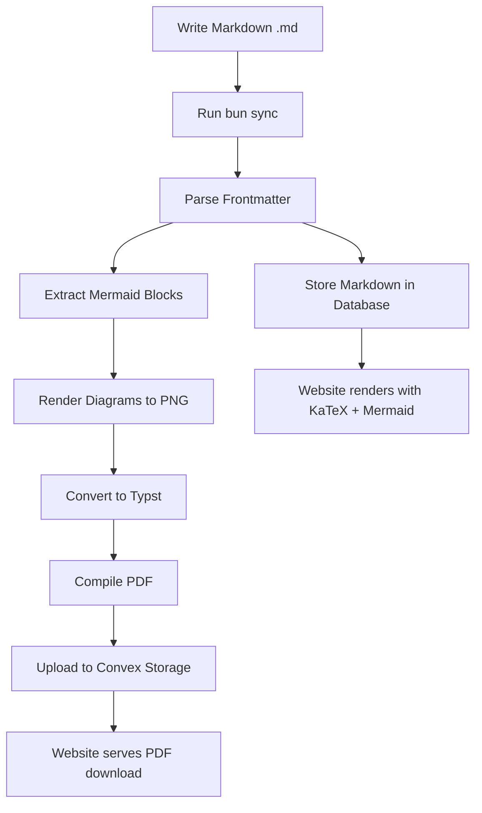
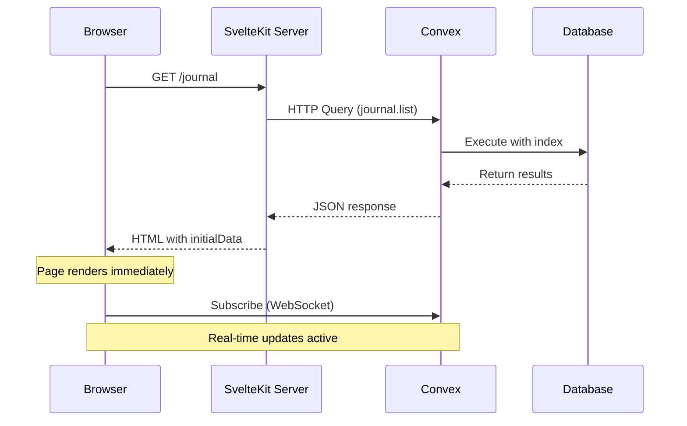
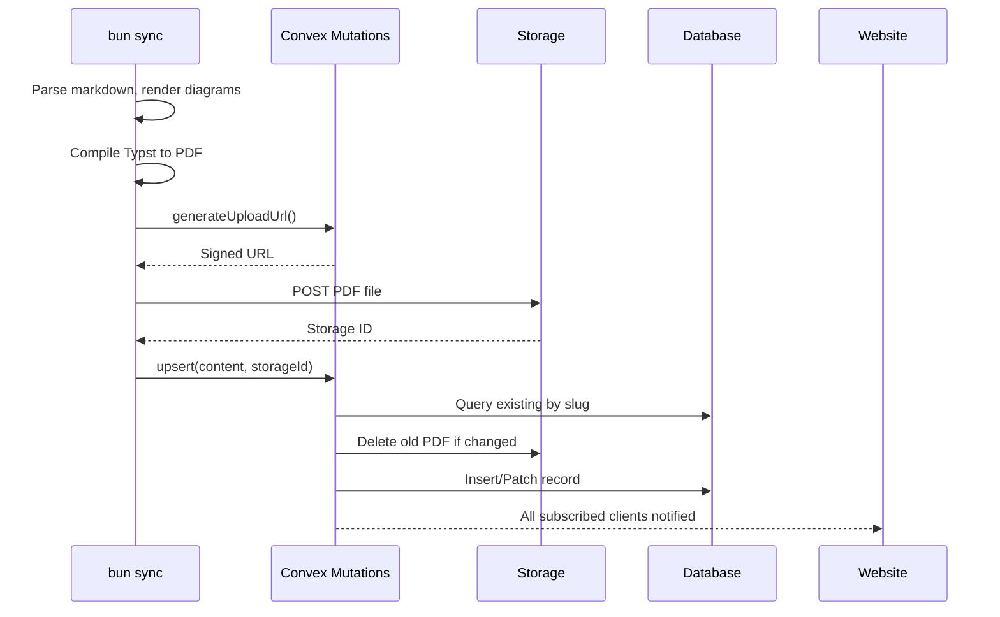

# Introduction

The robelest portfolio is a personal website built with modern web technologies, designed to showcase work through journal posts and academic documents. The architecture emphasizes simplicity, type safety, and beautiful content presentation.

**Source code**: [github.com/robelest/robelest](https://github.com/robelest/robelest)

## Design Goals

- **Minimal complexity** — Clean navigation with focused content areas
- **Type safety** — End-to-end TypeScript with generated Convex types
- **Server-side rendering** — Fast initial loads with SSR hydration
- **Beautiful documents** — Academic-quality PDFs via Typst compilation
- **Editorial aesthetic** — Warm, paper-inspired visual design

# Tech Stack Overview

The website is built on a modern JavaScript/TypeScript stack with specialized tools for document rendering and diagram generation.

## Core Technologies

| Technology | Version | Purpose |
|------------|---------|---------|
| SvelteKit | 2.43 | Full-stack framework with file-based routing |
| Svelte | 5.39 | Reactive UI components with runes |
| TypeScript | 5.9 | Type-safe development |
| Convex | 1.30 | Backend-as-a-service with real-time database |
| convex-svelte | 0.0.12 | Svelte bindings for Convex queries |
| Tailwind CSS | 4.1 | Utility-first styling |
| Typst | CLI | Document typesetting system |

## Content Processing Libraries

| Library | Purpose |
|---------|---------|
| marked | Markdown to HTML conversion |
| KaTeX | LaTeX math rendering in browser |
| mermaid | Diagram rendering in browser |
| @mermaid-js/mermaid-cli | Pre-rendered diagrams for PDFs |
| gray-matter | YAML frontmatter parsing |
| p-limit | Parallel processing with concurrency control |

## Package Manager

The project uses **Bun** as the package manager and runtime, providing fast dependency installation and script execution.

# Project Structure

The codebase follows SvelteKit conventions with additional directories for Convex functions and content management.

## Directory Layout

```
robelest/
├── src/
│   ├── routes/           # SvelteKit pages
│   │   ├── +layout.svelte
│   │   ├── +page.svelte
│   │   ├── journal/
│   │   │   ├── +page.svelte
│   │   │   ├── +page.server.ts
│   │   │   └── [slug]/
│   │   │       ├── +page.svelte
│   │   │       └── +page.server.ts
│   ├── lib/
│   │   ├── components/   # Reusable UI components
│   │   └── utils/        # Helper functions
│   └── app.css           # Global styles
├── convex/
│   ├── schema.ts         # Database schema
│   └── journal.ts        # Journal queries/mutations
├── journal/
│   ├── *.md              # Markdown source files
│   └── templates/        # Typst templates
├── scripts/
│   └── sync.ts           # Content sync CLI
└── static/               # Static assets
```

## Routing Architecture

SvelteKit's file-based routing with server-side rendering:

| Route | SSR | Purpose |
|-------|-----|---------|
| `/` | No | Home page with about, links |
| `/journal` | Yes | Journal listing with tag filtering |
| `/journal/[slug]` | Yes | Individual journal entry |

# Convex Integration

Convex serves as the backend, providing a real-time database and file storage without requiring server infrastructure management.

## Database Schema

The schema defines the journal table with comprehensive metadata fields:

```typescript
// convex/schema.ts
export default defineSchema({
  journal: defineTable({
    title: v.string(),
    slug: v.string(),
    description: v.optional(v.string()),
    content: v.string(),              // Markdown content
    pdfStorageId: v.id("_storage"),
    pdfUrl: v.string(),
    publishDate: v.string(),
    published: v.boolean(),
    featured: v.optional(v.boolean()),
    tags: v.optional(v.array(v.string())),
    category: v.optional(v.string()),
    pageCount: v.optional(v.number()),
    fileSize: v.optional(v.number()),
    contentHash: v.optional(v.string()),
    lastSyncedAt: v.optional(v.string()),
  })
    .index("by_slug", ["slug"])
    .index("by_published", ["published", "publishDate"])
    .index("by_category", ["category", "publishDate"]),
});
```

## SSR with Hydration Pattern

Journal pages use server-side rendering with `+page.server.ts` to fetch initial data, then hydrate with reactive Convex queries:

```typescript
// +page.server.ts
export const load = (async ({ setHeaders }) => {
  setHeaders({
    'cache-control': 'public, max-age=60, s-maxage=300'
  });

  const client = new ConvexHttpClient(PUBLIC_CONVEX_URL);
  const journalEntries = await client.query(api.journal.list, { 
    publishedOnly: true 
  });

  return { journalEntries };
}) satisfies PageServerLoad;
```

```svelte
<!-- +page.svelte -->
<script lang="ts">
  import { useQuery } from 'convex-svelte';
  import { api } from '../../../convex/_generated/api';

  let { data }: { data: PageData } = $props();

  // SSR data hydrates immediately, then stays reactive
  const journalQuery = useQuery(
    api.journal.list,
    () => ({ publishedOnly: true }),
    () => ({ initialData: data.journalEntries })
  );

  const entries = $derived(journalQuery.data || []);
</script>
```

> **SSR + Real-time**: The `initialData` option prevents loading flashes on page load while maintaining real-time subscription for subsequent updates.

# Content Management

The content management system converts markdown source files to PDFs via Typst and syncs them to Convex Storage.

## Content Workflow



## Frontmatter Format

Markdown documents include YAML frontmatter with optional metadata:

```markdown
---
title: My Document Title
slug: my-document
description: Brief description for previews
tags:
  - research
  - technical
publishDate: 2024-12-15
published: true
featured: true
category: research
---

# Introduction

Your content here with **markdown formatting**...
```

## Sync Script

The `scripts/sync.ts` CLI handles the complete sync process with parallel processing:

### Processing Phases

1. **Discovery & Parse** — Find all `.md` files in `journal/`, sanitize YAML frontmatter
2. **Extract** — Pull mermaid code blocks, compute content hashes
3. **Render Diagrams** — Parallel mermaid compilation (4 concurrent) with PNG caching
4. **Process Files** — Parallel Typst compilation and upload (6 concurrent)
5. **Cleanup** — Delete orphaned entries from database

### Parallel Processing

```typescript
const DIAGRAM_LIMIT = pLimit(4);  // 4 concurrent diagram renders
const FILE_LIMIT = pLimit(6);     // 6 concurrent file processes
```

### Mermaid Diagram Rendering

Diagrams are pre-rendered to PNG for PDF inclusion:

```typescript
async function renderMermaidDiagram(block: MermaidBlock): Promise<void> {
  // Skip if cached (content-hash based)
  if (await fileExists(block.svgPath)) return;
  
  await execAsync(
    `bunx mmdc -i "${mmdPath}" -o "${block.svgPath}" -b white -s 2`,
    { timeout: 30000 }
  );
}
```

### YAML Frontmatter Sanitization

The sync script automatically handles special characters that break YAML parsing:

- Smart quotes are escaped
- Em/en dashes are quoted
- Emojis are safely wrapped
- Special YAML characters (`:`, `#`, etc.) are quoted

```bash
bun sync
```

# Styling System

The visual design follows an editorial aesthetic with a warm, paper-inspired color palette.

## Color Palette

| Variable | Value | Usage |
|----------|-------|-------|
| `--th-base` | `#faf8f5` | Background |
| `--th-surface` | `#f5f2ed` | Cards, surfaces |
| `--th-border` | `#e8e4dc` | Borders, dividers |
| `--th-muted` | `#8c8780` | Secondary text |
| `--th-subtle` | `#6b665f` | Tertiary text |
| `--th-text` | `#1a1816` | Primary text |
| `--th-accent` | `#c25d3a` | Links, highlights (terracotta) |

## Typography

The design uses a combination of serif and sans-serif fonts:

- **Display text** — Newsreader (serif) for headings and brand
- **Journal content** — Crimson Pro (serif) for academic feel
- **Body text** — System sans-serif for UI readability
- **Code** — SF Mono / JetBrains Mono for monospace

## Tailwind Integration

Tailwind CSS 4 is configured with custom theme variables:

```css
@theme inline {
  --color-th-base: #faf8f5;
  --color-th-surface: #f5f2ed;
  --color-th-accent: #c25d3a;
  --font-display: "Newsreader", Georgia, serif;
}
```

Components use these via utility classes: `bg-th-surface`, `text-th-accent`, etc.

# Star Icon

The header features an animated wireframe star built with pure SVG and CSS animations.

## Implementation

The star is rendered as nested rotated squares using inline SVG:

```svelte
<script lang="ts">
  interface Props {
    size?: number;
    animate?: boolean;
  }

  let { size = 24, animate = false }: Props = $props();
</script>

<svg viewBox="0 0 32 32" class={animate ? 'star-animate' : ''}>
  <g stroke="currentColor" stroke-width="1.5" fill="none">
    <!-- Outer frame -->
    <rect x="5" y="5" width="22" height="22" />
    <rect x="8" y="8" width="16" height="16" />
    <!-- Corner connectors -->
    <line x1="5" y1="5" x2="8" y2="8" />
    <!-- ... additional lines ... -->
    <!-- Rotated 45 degrees duplicate -->
    <g transform="rotate(45 16 16)">
      <rect x="5" y="5" width="22" height="22" />
      <!-- ... -->
    </g>
  </g>
</svg>

<style>
  @keyframes star-spin {
    from { transform: rotate(0deg); }
    to { transform: rotate(360deg); }
  }

  .star-animate {
    animation: star-spin 60s linear infinite;
  }
</style>
```

## Geometry

The star consists of two overlapping hollow square frames:

- Outer size: 22 units (with 1.5px stroke)
- Inner size: 16 units (creating the hollow effect)
- Corner connectors for depth
- Second frame rotated 45 degrees for star shape
- Slow 60-second rotation animation

# Journal Features

The journal listing page provides tag-based filtering with URL persistence.

## Multi-Select Tag Filtering

Tags can be selected to filter entries (AND logic—entries must match all selected tags):

```svelte
<script lang="ts">
  import { SvelteSet } from 'svelte/reactivity';

  let selectedTags = $state<SvelteSet<string>>(new SvelteSet());

  const filteredEntries = $derived(
    selectedTags.size > 0
      ? journalQuery.data?.filter(e =>
          [...selectedTags].every(tag => e.tags?.includes(tag))
        )
      : journalQuery.data
  );
</script>
```

## Featured Entry

The most recent published entry is displayed prominently with description, while remaining entries appear in a compact archive list.

## Scroll Progress Indicator

A custom scroll indicator shows position within horizontally-scrolling tag chips on mobile.

# Data Flow

Understanding how data flows through the application is essential for maintaining and extending the codebase.

## Query Flow (SSR + Hydration)



## Mutation Flow (Sync Script)



# Deployment

The application is designed for serverless deployment with minimal infrastructure requirements.

## Build Process

```bash
bun run build    # Create production build
bun run preview  # Test production build locally
```

## Requirements

- **Node.js runtime** for SvelteKit server
- **Convex deployment** for backend (managed)
- **Typst CLI** for local document compilation

## Environment Variables

| Variable | Purpose |
|----------|---------|
| `PUBLIC_CONVEX_URL` | Convex deployment URL |

# Conclusion

This architecture provides a solid foundation for a personal portfolio with:

- **Server-side rendering** via SvelteKit +page.server.ts with Convex HTTP client
- **Type-safe development** via TypeScript and Convex generated types
- **Real-time updates** via convex-svelte with SSR hydration
- **Beautiful documents** via Typst compilation with mermaid diagrams
- **Modern UI** via Svelte 5 runes and Tailwind CSS
- **Minimal ops** via managed Convex backend
- **Parallel processing** via p-limit for efficient sync operations

The markdown-based content management system enables authoring professional academic documents locally while seamlessly publishing them to the web.

*This document was written in markdown and rendered via the robelest content management system.*
