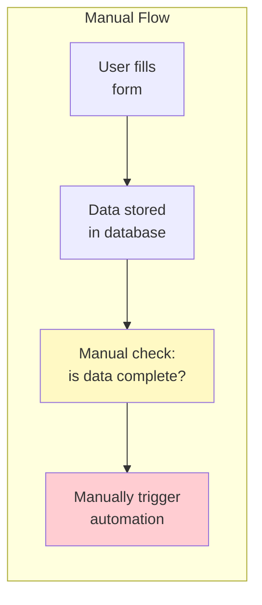
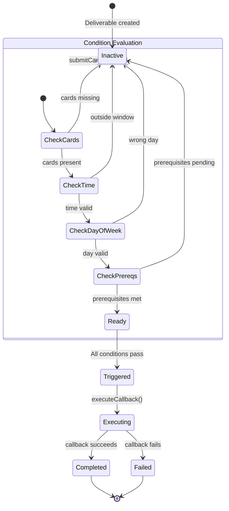
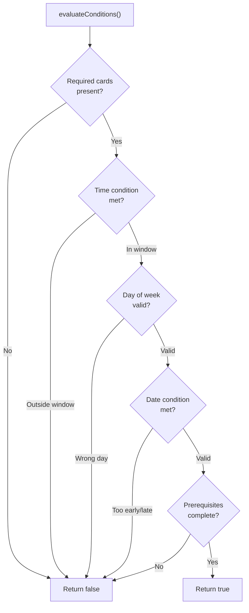
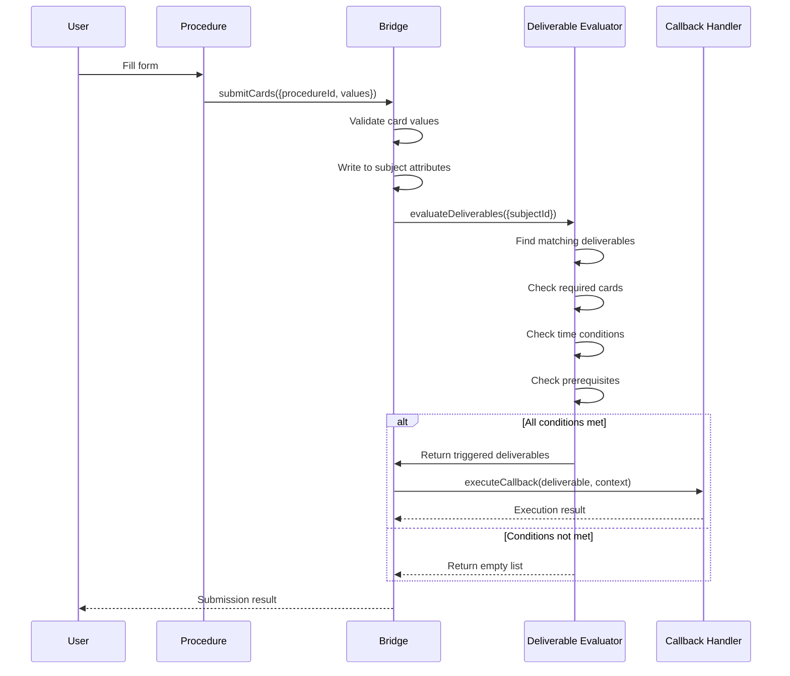
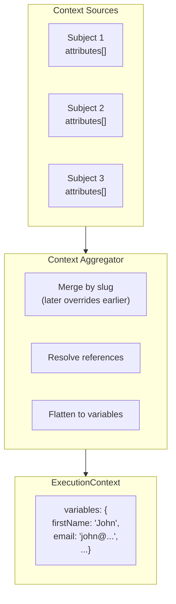

# Abstract

Most applications treat data collection and automation as separate concerns. Forms write to databases; automation scripts read from databases. This disconnect creates maintenance overhead, missed triggers, and complex synchronization logic.

This paper presents **Bridge**, a [Convex component](https://docs.convex.dev/components) that unifies schema definition, data collection, and automated triggers into a single system. Install via npm and mount with `app.use(bridge)`. Define your data schema once (Cards), organize collection workflows (Procedures), and declare conditions for automated actions (Deliverables). When data changes, Bridge evaluates conditions and invokes callbacks automatically.

The result is data that acts on itself - no polling, no external schedulers, no missed events - as a drop-in Convex component.

---

# What is a Convex Component?

[Convex components](https://docs.convex.dev/components) are reusable, self-contained modules that add functionality to any Convex application. They:

- **Install via npm** - `bun add @trestleinc/bridge`
- **Mount in your app** - `app.use(bridge)` in `convex.config.ts`
- **Provide typed APIs** - Full TypeScript support with generated types
- **Run in isolation** - Separate tables, no schema conflicts
- **Compose together** - Multiple components work side-by-side

Bridge follows this pattern. Install it, mount it, and you have a complete reactive data pipeline system with schema registry, collection workflows, and automated triggers.

---

# The Problem

## The Collection-Automation Gap

Organizations collect the same data repeatedly for different purposes: intake forms, reports, case management. Workers fill out forms, but nothing happens automatically afterward - someone must manually trigger follow-up actions.



**The problems with this approach:**

1. **Missed triggers** - Manual checks are error-prone
2. **Timing issues** - Actions happen too late or not at all
3. **No prerequisites** - Can't enforce action ordering
4. **Scattered logic** - Conditions live in multiple places

## What We Need

A reactive layer that:
- Defines data schemas with built-in validation
- Organizes data collection into workflows
- Declares trigger conditions declaratively
- Evaluates conditions automatically when data changes
- Invokes callbacks when conditions are met

---

# Why We Built This

## The Trestle Context

At Trestle, we build software for human services organizations - case management systems for nonprofits, government agencies, and community organizations. Our users collect enormous amounts of data:

- **Intake forms** with demographics, needs assessments, and eligibility criteria
- **Case notes** documenting client interactions
- **Assessments** for housing readiness, employment barriers, health status
- **Service records** tracking what was provided and when

The challenge: this data needs to trigger actions. When a client completes their housing assessment, the HMIS submission should fire automatically. When all intake fields are complete, the eligibility check should run. When a case note mentions a crisis, the supervisor should be alerted.

**What we needed:**
- Reusable data definitions that work across forms
- Automatic triggers when conditions are met
- Prerequisite chains (assessment must complete before submission)
- Time windows (only submit during business hours)
- Integration with browser automation for legacy portals

Bridge was built to make data reactive - when the right data is present, the right action happens. No manual intervention, no missed deadlines.

---

# The Solution

## Schema-Workflow-Trigger Pipeline

Bridge implements a three-layer architecture:

```mermaid
flowchart LR
    subgraph LAYER1["Schema Layer"]
        CARDS["Cards<br/>(data definitions)"]
    end

    subgraph LAYER2["Collection Layer"]
        PROCS["Procedures<br/>(workflows)"]
        SUBMIT["submitCards()"]
    end

    subgraph LAYER3["Reactive Layer"]
        DELIVER["Deliverables<br/>(trigger conditions)"]
        EVAL["evaluateDeliverables()"]
        CALLBACK["executeCallback()"]
    end

    subgraph ACTIONS["Actions"]
        AUTO["Browser Automation"]
        WEBHOOK["Webhooks"]
        FUNC["Custom Functions"]
    end

    CARDS --> PROCS
    PROCS --> SUBMIT
    SUBMIT --> EVAL
    EVAL --> DELIVER
    DELIVER -->|"conditions met"| CALLBACK
    CALLBACK --> ACTIONS
```



### Cards (Schema Registry)

A **Card** is the smallest fragment of data with its own validation rules. Cards are reusable across forms and define what data can be collected.

```typescript
interface Card {
  slug: string;           // Unique identifier
  label: string;          // Human-readable name
  type: CardType;         // STRING, NUMBER, DATE, EMAIL, SSN, etc.
  classification: string; // public, confidential, restricted
  subjectType: string;    // What entity this card belongs to
}
```

### Procedures (Collection Workflows)

A **Procedure** is a data collection workflow that writes to cards. Procedures define which cards to collect and where to write them.

```typescript
interface Procedure {
  name: string;
  type: "form" | "import" | "api";
  subject: {
    type: string;
    operation: "create" | "update";
  };
  cards: ProcedureCard[];  // Which cards to collect
}
```

### Deliverables (Reactive Triggers)

A **Deliverable** defines conditions for triggering side effects when card data changes. This is the reactive layer that connects data collection to automated actions.

```typescript
interface Deliverable {
  name: string;
  requiredCards: string[];     // What cards must be present
  conditions?: {
    time?: { after: string; before?: string };
    date?: { daysBeforeEvent?: number };
    dayOfWeek?: number[];
  };
  prerequisites?: string[];    // Other deliverables that must complete first
  callbackType: string;        // "automation", "webhook", "function"
  callbackConfig: any;         // Blueprint ID, URL, etc.
}
```

---

# Installation

## 1. Install the Package

```bash
# Using bun (recommended)
bun add @trestleinc/bridge

# Using npm
npm install @trestleinc/bridge
```

## 2. Mount the Component

```typescript
// convex/convex.config.ts
import { defineApp } from "convex/server";
import bridge from "@trestleinc/bridge/convex.config";

const app = defineApp();
app.use(bridge);

export default app;
```

## 3. Create the Client

```typescript
// convex/lib/bridge.ts
import { BridgeClient } from "@trestleinc/bridge/server";
import { components } from "./_generated/api";

export const bridgeClient = new BridgeClient(components.bridge);

// Register callback for webhooks
bridgeClient.registerCallback("webhook", async (ctx, deliverable, context) => {
  const response = await fetch(deliverable.callbackConfig.url, {
    method: "POST",
    headers: { "Content-Type": "application/json" },
    body: JSON.stringify(context),
  });
  return { success: response.ok };
});

// Register callback for custom functions
bridgeClient.registerCallback("function", async (ctx, deliverable, context) => {
  const fn = await import(deliverable.callbackConfig.module);
  return fn.default(context);
});
```

## 3. Define Cards

```typescript
await bridgeClient.defineCard(ctx, {
  organizationId: orgId,
  slug: "first_name",
  label: "First Name",
  type: "STRING",
  classification: "public",
  subjectType: "client",
});

await bridgeClient.defineCard(ctx, {
  organizationId: orgId,
  slug: "ssn",
  label: "Social Security Number",
  type: "SSN",
  classification: "restricted",
  subjectType: "client",
});
```

## 4. Create a Procedure

```typescript
await bridgeClient.createProcedure(ctx, {
  organizationId: orgId,
  name: "Client Intake",
  type: "form",
  subject: { type: "client", operation: "create" },
  cards: [
    { slug: "first_name", required: true, writeTo: { path: "$.attributes[?(@.slug=='first_name')].value" } },
    { slug: "last_name", required: true, writeTo: { path: "$.attributes[?(@.slug=='last_name')].value" } },
    { slug: "email", required: true, writeTo: { path: "$.attributes[?(@.slug=='email')].value" } },
  ],
});
```

## 5. Create a Deliverable

```typescript
await bridgeClient.createDeliverable(ctx, {
  organizationId: orgId,
  name: "Send Welcome Email",
  subjectType: "client",
  requiredCards: ["first_name", "email"],
  conditions: {
    time: { after: "09:00", before: "17:00" },
    dayOfWeek: [1, 2, 3, 4, 5],  // Monday-Friday
  },
  callbackType: "webhook",
  callbackConfig: { url: "https://api.example.com/welcome" },
  status: "active",
});
```

## 6. Submit Card Data

```typescript
// 1. Submit card values
const result = await bridgeClient.submitCards(ctx, {
  procedureId,
  subjectId: clientId,
  subjectType: "client",
  values: { first_name: "John", last_name: "Doe", email: "john@example.com" },
});

// 2. Evaluate deliverables
const triggered = await bridgeClient.evaluateDeliverables(ctx, {
  organizationId: orgId,
  subjectType: "client",
  subjectId: clientId,
  operation: "update",
});

// 3. Execute triggered deliverables
for (const deliverable of triggered) {
  await bridgeClient.executeCallback(ctx, deliverable, context);
}
```

---

# Technical Deep Dive

## Card Types

Bridge supports 11 card types with built-in validation:

| Type | Description | Example |
|------|-------------|---------|
| `STRING` | Short text | "John" |
| `TEXT` | Long text | Multi-paragraph description |
| `NUMBER` | Numeric value | 42, 3.14 |
| `BOOLEAN` | Yes/No | true, false |
| `DATE` | Date value | "2024-01-15" |
| `EMAIL` | Email address | "user@example.com" |
| `URL` | Web URL | "https://example.com" |
| `PHONE` | Phone number | "+1-555-123-4567" |
| `SSN` | Social Security Number | "123-45-6789" |
| `ADDRESS` | Physical address | Structured object |
| `SUBJECT` | Reference to entity | client ID |
| `ARRAY` | List of values | ["tag1", "tag2"] |

## Classification Levels

Cards integrate with the Taxonomy component for data governance:

| Level | Description | Access |
|-------|-------------|--------|
| `PUBLIC` | General information | All authenticated users |
| `CONFIDENTIAL` | Sensitive data | Admins and above |
| `RESTRICTED` | Highly sensitive (PII) | Special clearance only |

## Deliverable State Machine



## Condition Evaluation Flow



## Data Flow Sequence



## Context Aggregation

When executing a callback, Bridge aggregates context from multiple sources:



```typescript
function aggregateContext(...sources: Subject[]): ExecutionContext {
  const variables: Record<string, unknown> = {};

  // Later sources override earlier ones
  for (const source of sources.filter(Boolean)) {
    for (const attr of source.attributes) {
      variables[attr.slug] = attr.value;
    }
  }

  return { variables };
}
```

---

# Component Ecosystem

Bridge is part of a family of Convex components that work together:

| Component | Purpose | Integration |
|-----------|---------|-------------|
| **[Taxonomy](/journal/taxonomy-data-governance)** | Data governance | Card classifications sync to field labels |
| **[Crane](/journal/crane-browser-automation)** | Browser automation | Deliverables trigger blueprint execution |
| **[TSP](/journal/tsp-data-contracts)** | Data contracts | Card definitions map to Stack cards |
| **[Replicate](/journal/replicate-local-first)** | Offline-first sync | Offline-queued procedures sync on reconnect |

Each component is independently installable. Use one, some, or all - they compose cleanly because each runs in isolated tables.

---

# Conclusion

Bridge transforms data collection from a passive storage operation into an active automation trigger. By unifying schema definition, collection workflows, and reactive triggers:

1. **Data acts on itself** - No manual trigger checks
2. **Conditions are declarative** - Time, prerequisites, required fields
3. **Callbacks are pluggable** - Automation, webhooks, custom functions
4. **Schema is reusable** - Cards define validation once

The pattern applies universally: CRM systems, intake workflows, form processing, ETL pipelines. Any Convex application that collects data and needs to react to changes can benefit from this architecture.

Data collection should trigger automation. With Bridge, it does.
