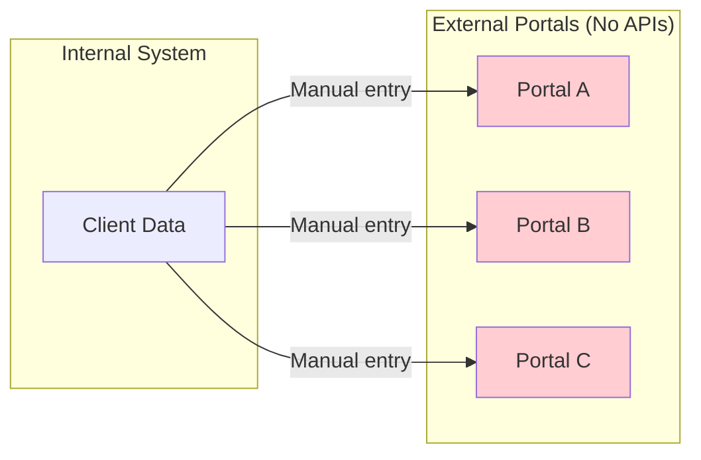
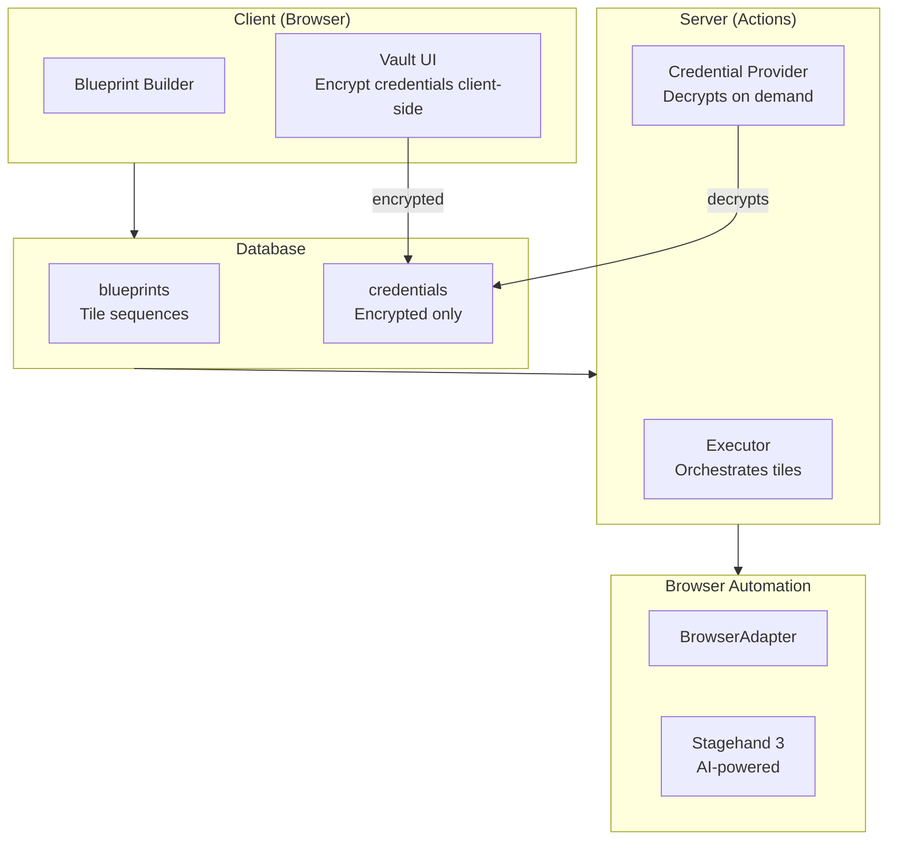
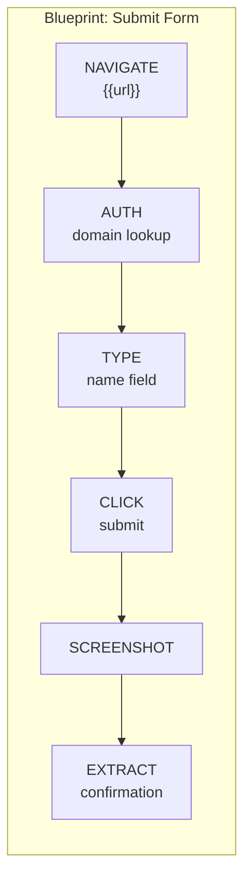
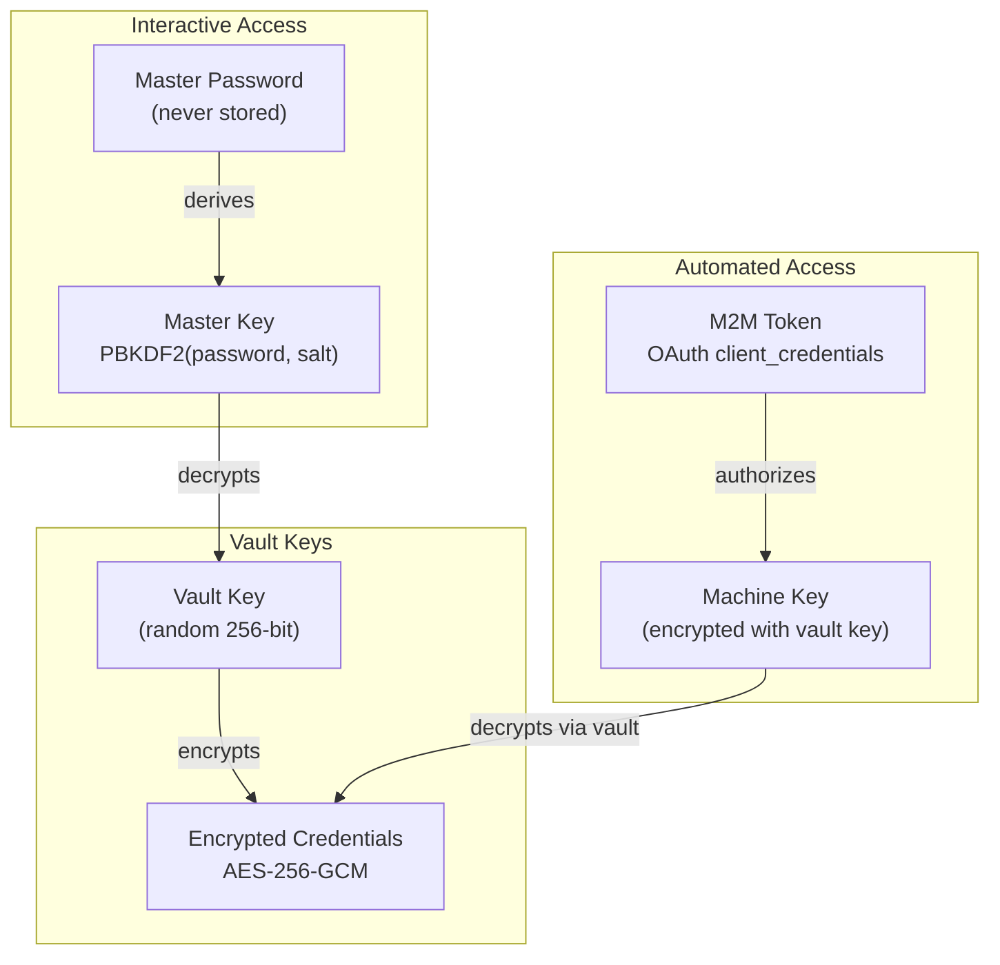
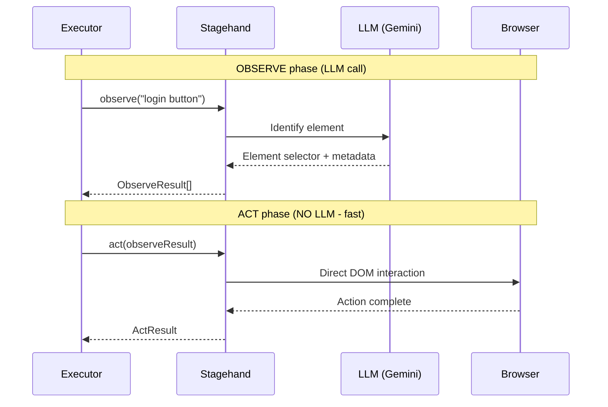
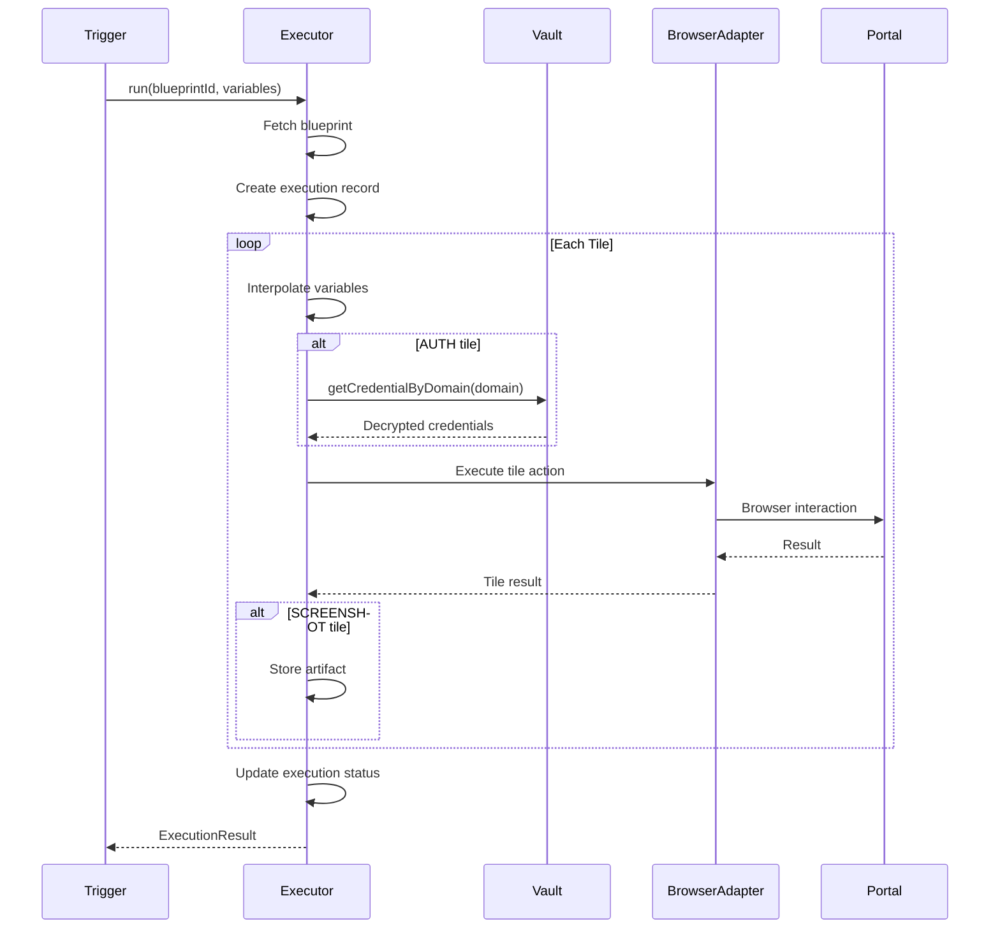
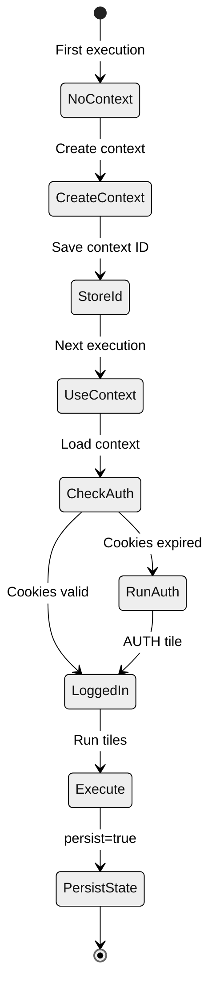

# Abstract

Many critical systems lack APIs. Government portals, legacy applications, and third-party services often require manual data entry through web interfaces. Traditional automation solutions either expose credentials insecurely or require complex infrastructure.

This paper presents **Crane**, a [Convex component](https://docs.convex.dev/components) for browser automation with a zero-knowledge credential vault. Install via npm and mount with `app.use(crane)`. Define automation workflows as declarative blueprints (sequences of tiles). Credentials are encrypted client-side and only decrypted during execution - the server never sees plaintext secrets. AI-powered element detection (via Stagehand) eliminates brittle CSS selectors.

The result is secure, maintainable automation for systems without APIs - as a drop-in Convex component.

---

# What is a Convex Component?

[Convex components](https://docs.convex.dev/components) are reusable, self-contained modules that add functionality to any Convex application. They:

- **Install via npm** - `bun add @trestleinc/crane`
- **Mount in your app** - `app.use(crane)` in `convex.config.ts`
- **Provide typed APIs** - Full TypeScript support with generated types
- **Run in isolation** - Separate tables, no schema conflicts
- **Compose together** - Multiple components work side-by-side

Crane follows this pattern. Install it, mount it, and you have a complete browser automation system with a secure credential vault.

---

# The Problem

## The API-less Integration Problem

Organizations must submit data to external systems that lack APIs:
- Government portals (benefits systems, regulatory filings)
- Legacy enterprise applications
- Third-party services with web-only interfaces

Workers spend hours manually entering the same data across multiple systems.



## The Credential Security Problem

Traditional automation approaches have credential problems:

| Approach | Problem |
|----------|---------|
| Hardcoded in scripts | Exposed in source control |
| Environment variables | Accessible to all processes |
| Secret managers | Server-side decryption exposes plaintext |
| Browser extensions | User-specific, not automatable |

What we need is automation where credentials are:
- Encrypted client-side before storage
- Decrypted only at execution time
- Never visible to the server in plaintext

---

# Why We Built This

## The Trestle Context

At Trestle, we build software for human services organizations - case management systems for nonprofits, government agencies, and community organizations. Our users must submit data to external systems that lack APIs:

- **HMIS portals** - HUD's Homeless Management Information System requires manual data entry
- **Benefits systems** - State welfare systems with web-only interfaces
- **Funder portals** - Foundation grant reporting through custom web forms
- **Coordinated entry** - Regional housing systems with no integration options

**The pain points:**
- Workers spend hours copying data from our system into external portals
- Portal logins are shared across teams (security nightmare)
- Manual entry introduces transcription errors
- No audit trail of what was submitted and when

**What we needed:**
- Declarative automation that non-developers can understand
- Zero-knowledge credential storage (we never see client passwords)
- AI-powered element detection (portals change layouts frequently)
- Full audit trail with screenshots

Crane was built as a Convex component so any Convex application can add secure browser automation without building a credential vault from scratch.

---

# The Solution

## Declarative Blueprints + Zero-Knowledge Vault

Crane separates concerns:

1. **Blueprints** - Declarative automation workflows (what to do)
2. **Executor** - Orchestrates tile execution (how to run)
3. **Vault** - Zero-knowledge credential storage (secure secrets)
4. **Adapter** - Pluggable browser interface (swappable backends)



---

# Installation

## 1. Install the Package

```bash
# Using bun (recommended)
bun add @trestleinc/crane

# Using npm
npm install @trestleinc/crane
```

## 2. Mount the Component

```typescript
// convex/convex.config.ts
import { defineApp } from "convex/server";
import crane from "@trestleinc/crane/convex.config";

const app = defineApp();
app.use(crane);

export default app;
```

## 3. Create the Client

```typescript
// convex/lib/crane.ts
import { CraneClient } from "@trestleinc/crane/server";
import { components } from "./_generated/api";

export const crane = new CraneClient(components.crane);
```

That's it. The component creates its own tables for blueprints, credentials, and executions - isolated from your application's schema.

---

# Usage

## Create a Blueprint

Blueprints are declarative automation workflows built with the Builder API:

```typescript
import { Builder } from "@trestleinc/crane/client";

const submitIntake = new Builder("submit-intake")
  .input("portalUrl", "string", true)
  .input("firstName", "string", true)
  .input("lastName", "string", true)
  .input("dateOfBirth", "string", true)

  .navigate("{{portalUrl}}")
  .auth()  // Domain-based credential lookup
  .type("first name field", { variable: "firstName" })
  .type("last name field", { variable: "lastName" })
  .type("date of birth field", { variable: "dateOfBirth" })
  .click("submit button")
  .screenshot()
  .extract("confirmation number", "confirmationNumber")

  .build();

// Store in database
await ctx.runMutation(api.crane.blueprints.create, submitIntake);
```

## Set Up the Vault

Credentials are encrypted client-side before storage:

```typescript
import { setupVault, saveCredential, unlockVault } from "@trestleinc/crane/client";

// One-time setup (client-side)
await setupVault(masterPassword, ctx);

// Save credentials (client-side encryption)
const { vaultKey } = await unlockVault(masterPassword, vault);
await saveCredential(vaultKey, {
  label: "HMIS Portal",
  domain: "portal.hmis.gov",
  fields: [
    { key: "username", value: "user@org.com", type: "username" },
    { key: "password", value: "secret123", type: "password" },
  ],
}, ctx);
```

## Execute a Blueprint

```typescript
import { Executor, createStagehandAdapter, createVaultCredentialProvider } from "@trestleinc/crane/server";

// Create browser adapter
const adapter = await createStagehandAdapter({
  blueprintId: "submit-intake",
  contextId: vault.browserbaseContextId,
});

try {
  const executor = new Executor(components.crane, adapter);
  const result = await executor.run(ctx, "submit-intake", {
    portalUrl: "https://portal.hmis.gov",
    firstName: "John",
    lastName: "Doe",
    dateOfBirth: "1990-01-15",
  }, {
    credentials: createVaultCredentialProvider(ctx, orgId, vaultKey),
  });

  console.log("Confirmation:", result.outputs.confirmationNumber);
} finally {
  await adapter.close();
}
```

## Integration with Bridge (Optional)

Register Crane as a Bridge callback for reactive automation:

```typescript
import { bridgeClient } from "./bridge";
import { Executor, createStagehandAdapter, createVaultCredentialProvider } from "@trestleinc/crane/server";

// Register Crane as a Bridge callback
bridgeClient.registerCallback("automation", async (ctx, deliverable, context) => {
  const adapter = await createStagehandAdapter({
    blueprintId: deliverable.callbackConfig.blueprintId,
    contextId: vault.browserbaseContextId,
  });

  try {
    const executor = new Executor(components.crane, adapter);
    const result = await executor.run(ctx, deliverable.callbackConfig.blueprintId, {
      portalUrl: deliverable.callbackConfig.portalUrl,
      firstName: context.variables.firstName,
      lastName: context.variables.lastName,
      dateOfBirth: context.variables.dateOfBirth,
    }, {
      credentials: createVaultCredentialProvider(ctx, orgId, vaultKey),
    });

    return result;
  } finally {
    await adapter.close();
  }
});
```

---

# Technical Deep Dive

## Blueprint Structure

A blueprint is a **sequence of tiles** (automation steps):



## Tile Types

| Type | Parameters | Description |
|------|------------|-------------|
| `NAVIGATE` | `url` | Go to URL (supports `{{variable}}`) |
| `CLICK` | `instruction` | Click element (natural language) |
| `TYPE` | `instruction`, `value`/`variable`/`credentialId` | Type into field |
| `EXTRACT` | `instruction`, `outputVariable`, `schema?` | Extract data |
| `SCREENSHOT` | `fullPage?` | Capture screenshot |
| `WAIT` | `ms` or `condition` | Wait for time/condition |
| `SELECT` | `instruction`, `value` | Select dropdown option |
| `AUTH` | *(domain-based)* | Login using stored credentials |
| `FORM` | `fields[]` | Fill multiple fields |

## Credential Vault Architecture

### Key Hierarchy



### Security Model

| Server Never Sees | Server Stores |
|-------------------|---------------|
| Master password | Encrypted vault key |
| Master key (derived) | Encrypted machine key |
| Vault key (plaintext) | Encrypted credentials |
| Credential plaintext | Salt, iterations |
| | Verification hash |

### Encryption Details

- **Algorithm**: AES-256-GCM
- **Key derivation**: PBKDF2 with 100,000 iterations
- **Salt**: Random 256-bit per vault
- **IV**: Random 96-bit per credential

## AI-Powered Element Detection

Crane uses Stagehand 3's observe-act pattern for reliable element detection:



**Benefits over CSS selectors:**
- Natural language instructions ("click the submit button")
- Resilient to UI changes
- No maintenance when layouts change
- Cached observations for repeated runs

## Execution Flow



## Browser Adapter Interface

Crane uses a pluggable adapter pattern for browser control:

```typescript
interface BrowserAdapter {
  navigate(url: string): Promise<void>;
  act(instruction: string): Promise<{ success: boolean }>;
  extract<T>(instruction: string, schema?: unknown): Promise<T>;
  screenshot(options?: { fullPage?: boolean }): Promise<Buffer>;
  currentUrl(): Promise<string>;
  close(): Promise<void>;
}
```

**Available adapters:**
- `createStagehandAdapter()` - AI-powered (recommended)
- `createPlaywrightAdapter()` - Direct Playwright control
- Custom adapters for specialized needs

## Persistent Browser Contexts

Browser state (cookies, localStorage) persists across executions:



Benefits:
- Skip login on subsequent runs
- Maintain session state
- Reduce execution time

---

# Component Ecosystem

Crane is part of a family of Convex components that work together:

| Component | Purpose | Integration |
|-----------|---------|-------------|
| **[Bridge](/journal/bridge-reactive-data)** | Reactive data pipelines | Deliverables trigger blueprint execution |
| **[TSP](/journal/tsp-data-contracts)** | Data contracts | Stack submissions executed via blueprints |
| **[Taxonomy](/journal/taxonomy-data-governance)** | Data governance | Credential access respects clearance levels |
| **[Replicate](/journal/replicate-local-first)** | Offline-first sync | Automation requires online vault access |

Each component is independently installable. Use one, some, or all - they compose cleanly because each runs in isolated tables.

---

# Conclusion

Browser automation shouldn't compromise security. By combining declarative blueprints with a zero-knowledge credential vault:

1. **Drop-in installation** - `npm install` and `app.use()`
2. **Declarative workflows** - Blueprints are data, not code
3. **Zero-knowledge credentials** - Server never sees plaintext
4. **AI-powered detection** - Natural language, not brittle selectors
5. **Pluggable backends** - Swap browser engines as needed
6. **Persistent contexts** - Maintain session state across runs

The pattern applies universally: government portal submissions, legacy system integration, web scraping, automated testing. Any Convex application that needs to automate web interfaces benefits from secure credential handling.

Install the component, define your blueprints, and automate securely.
