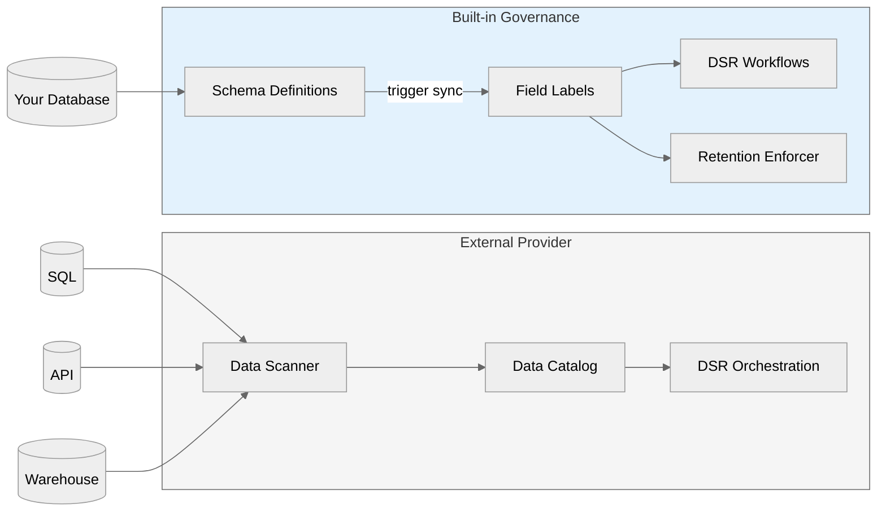
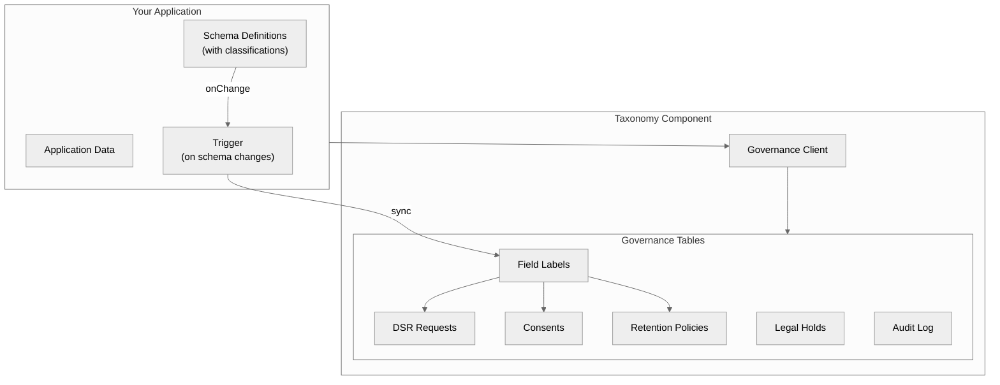
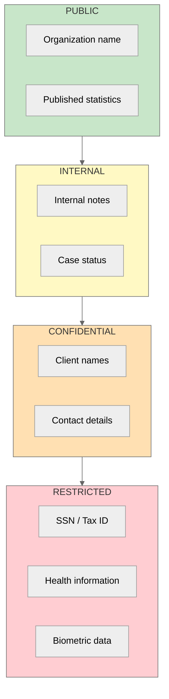
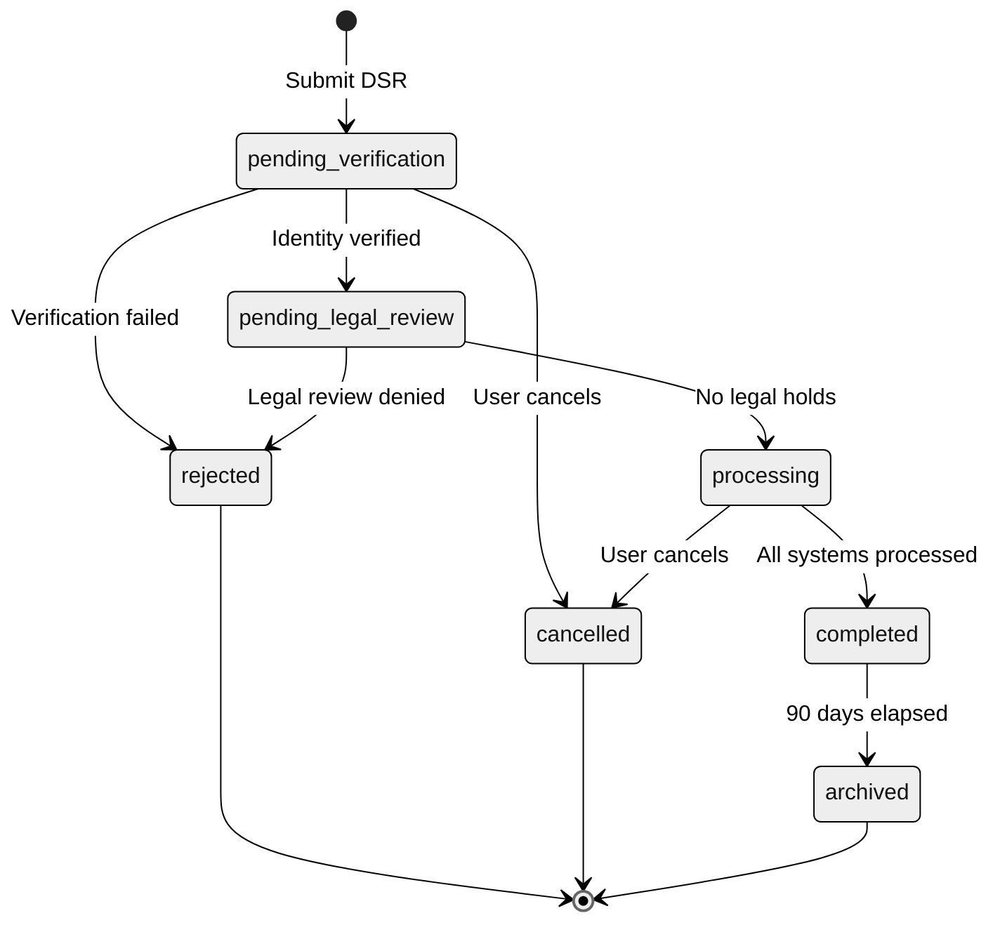
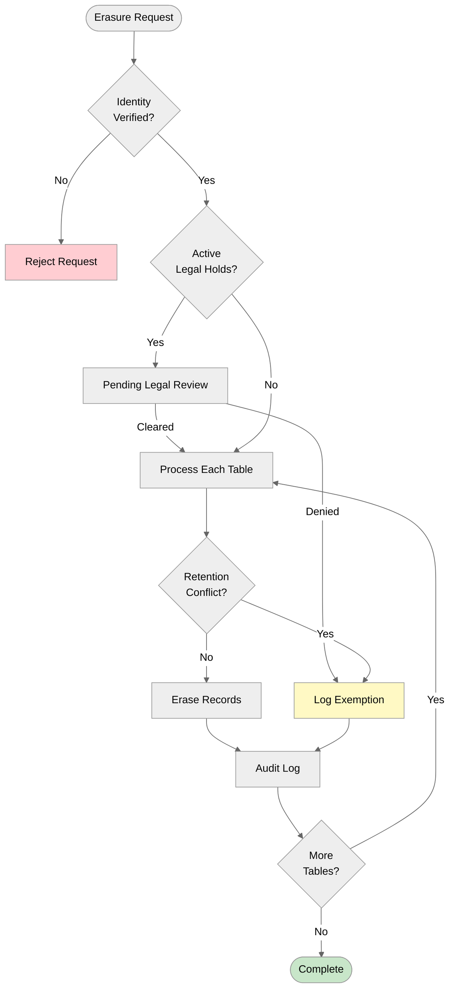
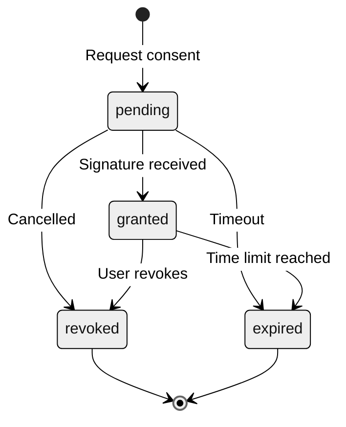
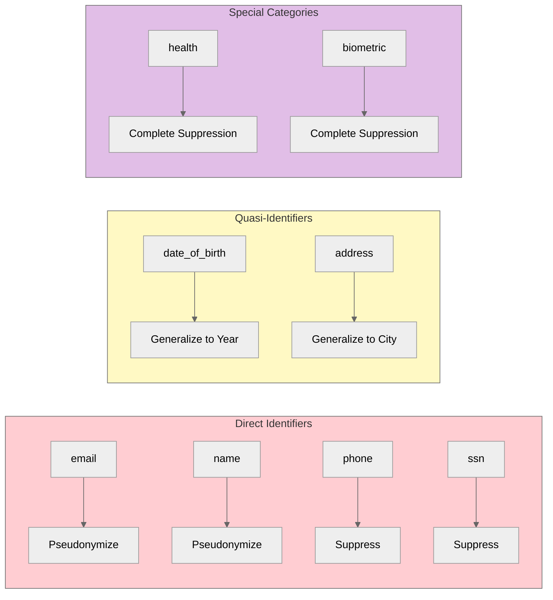

# Abstract

Modern applications face increasing regulatory pressure from GDPR, CCPA, and emerging privacy laws. Most organizations respond by adding external governance platforms that scan databases, catalog fields, and orchestrate compliance workflows. But what if governance was built directly into your data layer?

This paper presents **Taxonomy**, a [Convex component](https://docs.convex.dev/components) that embeds compliance directly where your data lives. Install via npm and mount with `app.use(taxonomy)`. Rather than integrating external tools, Taxonomy provides DSR (Data Subject Request) workflows, consent management, retention policies, and audit logging as native database operations.

The result is complete codebase ownership, faster compliance responses, and lower operational complexity - as a drop-in Convex component.

---

# What is a Convex Component?

[Convex components](https://docs.convex.dev/components) are reusable, self-contained modules that add functionality to any Convex application. They:

- **Install via npm** - `bun add @trestleinc/taxonomy`
- **Mount in your app** - `app.use(taxonomy)` in `convex.config.ts`
- **Provide typed APIs** - Full TypeScript support with generated types
- **Run in isolation** - Separate tables, no schema conflicts
- **Compose together** - Multiple components work side-by-side

Taxonomy follows this pattern. Install it, mount it, and you have a complete data governance system with DSR workflows, consent management, and retention enforcement.

---

# The Problem

## External Governance Platforms

Companies like Ethyca provide data governance platforms with:

- Automated data discovery and classification
- Privacy request orchestration
- Consent management
- Data mapping across multiple sources

These tools are designed for enterprises with multiple disconnected data sources (SQL databases, SaaS APIs, data warehouses), complex integration requirements, and large privacy engineering teams.

**The challenge**: Most modern applications use a single database as their source of truth. Adding external governance means:

1. **Integration overhead** - Connectors, API keys, webhook handlers
2. **Sync delays** - External systems poll or receive events with latency
3. **Split ownership** - Compliance logic lives outside your codebase
4. **Enterprise pricing** - Often prohibitive for smaller teams



## The Comparison

| Aspect | External Platform | Built-in Governance |
|--------|-------------------|---------------------|
| **Data sources** | Many (SQL, APIs, warehouses) | One (your database) |
| **Integration** | Complex connectors | Native component |
| **Discovery** | Automated scanning | Schema-defined sync |
| **Cost** | Enterprise pricing | Open source |
| **Control** | External SaaS | Complete codebase ownership |
| **Customization** | Configuration-based | Code-level |

---

# Why We Built This

## The Trestle Context

At Trestle, we build software for human services organizations - nonprofits, government agencies, and community organizations that serve vulnerable populations. These organizations handle some of the most sensitive data imaginable:

- **Social Security Numbers** for benefits enrollment
- **Health information** for case management
- **Immigration status** for legal services
- **Domestic violence history** for safety planning
- **Financial records** for housing assistance

When a client walks into a shelter or social services office, they're sharing deeply personal information. That data must be protected - not just from breaches, but from improper access, unauthorized retention, and regulatory violations.

**The problem**: External governance platforms are designed for enterprises with dedicated privacy engineering teams. Our clients are nonprofits with limited IT budgets. They need compliance built into the software they already use, not another vendor to manage.

**What we needed:**
- DSR workflows that case workers can execute without IT involvement
- Consent tracking integrated with intake forms
- Automatic retention enforcement (many grants require 7-year retention)
- Legal hold support for litigation and audits
- Complete audit trail for funder reporting

Taxonomy was built to embed these capabilities directly in Ledger, our human services platform. The patterns are universal - any Convex application handling personal data can benefit.

---

# The Solution

## Governance as a Database Component

Taxonomy is a Convex component that provides four integrated governance capabilities:

1. **DSR Workflows** - GDPR/CCPA request processing with legal hold checks
2. **Consent Management** - E-signature integration for compliance-grade records
3. **Retention Policies** - Automated data lifecycle with anonymization
4. **Audit Logging** - Immutable compliance trail

Instead of scanning databases externally, Taxonomy receives classifications from your schema definitions through triggers. When you define a field as containing an email address or SSN, that classification flows automatically to the governance layer.



---

# Installation

## 1. Install the Package

```bash
# Using bun (recommended)
bun add @trestleinc/taxonomy

# Using npm
npm install @trestleinc/taxonomy
```

## 2. Mount the Component

```typescript
// convex/convex.config.ts
import { defineApp } from "convex/server";
import taxonomy from "@trestleinc/taxonomy/convex.config";

const app = defineApp();
app.use(taxonomy);

export default app;
```

## 3. Create the Client

```typescript
// convex/lib/taxonomy.ts
import { TaxonomyClient } from "@trestleinc/taxonomy/server";
import { components } from "./_generated/api";

export const taxonomy = new TaxonomyClient(components.taxonomy);
```

That's it. The component creates its own tables for field labels, DSR requests, consents, retention policies, and audit logs - isolated from your application's schema.

---

# Usage

## Define Field Classifications

```typescript
// Field classification metadata
interface FieldLabel {
  tableName: string;
  fieldPath: string;
  sensitivityLevel: "public" | "internal" | "confidential" | "restricted";
  piiCategories: string[];  // "email", "ssn", "phone", etc.
  isDirectIdentifier: boolean;
  eligibleForErasure: boolean;
  retentionPolicyId?: string;
}
```

## 3. Register Triggers

```typescript
// convex/functions.ts
import { Triggers } from "convex-helpers/server/triggers";
import { TaxonomyClient } from "@trestleinc/taxonomy/server";
import { components } from "./_generated/api";

const taxonomy = new TaxonomyClient(components.taxonomy);
const triggers = new Triggers();

// Map your field types to PII categories
const fieldTypeToPII: Record<string, string[]> = {
  EMAIL: ["email"],
  PHONE: ["phone"],
  SSN: ["ssn"],
  ADDRESS: ["address"],
};

triggers.register("fields", taxonomy.trigger({
  fieldPath: (field) => field.slug,
  tableName: (field) => field.entityType,
  sensitivityLevel: (field) => field.securityLevel.toLowerCase(),
  piiCategories: (field) => fieldTypeToPII[field.type] ?? [],
  isDirectIdentifier: (field) => ["EMAIL", "PHONE", "SSN"].includes(field.type),
}));
```

## 4. Use the Client

```typescript
// Submit a DSR request
await taxonomy.dsr.submit(ctx, {
  type: "access",
  regulation: "gdpr",
  subjectIdentifier: "user@example.com",
  identifierType: "email",
});

// Check consent before processing
const consent = await taxonomy.consent.check(ctx, userId, "data-processing");
if (!consent.granted) {
  throw new Error("Consent not granted");
}
```

## 5. Implement DSR State Machine

```typescript
type DSRStatus =
  | "pending_verification"
  | "pending_legal_review"
  | "processing"
  | "completed"
  | "rejected"
  | "cancelled"
  | "archived";

// State transitions
const transitions = {
  "pending_verification": ["pending_legal_review", "rejected", "cancelled"],
  "pending_legal_review": ["processing", "rejected", "cancelled"],
  "processing": ["completed", "cancelled"],
  "completed": ["archived"],
};
```

## 6. Add Consent Tracking

```typescript
interface Consent {
  subjectId: string;
  purpose: string;
  status: "pending" | "granted" | "revoked" | "expired";
  policyVersion: string;
  collectionMethod: "web_form" | "e_signature" | "api" | "verbal";
  grantedAt?: number;
  revokedAt?: number;
}
```

## 7. Schedule Retention Enforcement

```typescript
// Run daily via cron
async function enforceRetention() {
  const policies = await getRetentionPolicies();
  for (const policy of policies) {
    const cutoff = Date.now() - policy.retentionDays * 24 * 60 * 60 * 1000;
    const records = await getRecordsOlderThan(policy.dataCategories, cutoff);

    for (const record of records) {
      if (await hasLegalHold(record)) continue;
      if (await hasPendingDSR(record)) continue;

      switch (policy.expirationAction) {
        case "delete": await deleteRecord(record); break;
        case "anonymize": await anonymizeRecord(record); break;
        case "archive": await archiveRecord(record); break;
      }
    }
  }
}
```

---

# Technical Deep Dive

## Data Classification Hierarchy

Data sensitivity follows a four-level hierarchy aligned with ISO 27001:



### PII Categories

**Standard PII:**
- `name`, `email`, `phone`, `address`
- `date_of_birth`, `ssn`, `credit_card`
- `ip_address`, `device_id`, `financial`, `government_id`

**Special Categories (GDPR Article 9):**
- `health`, `biometric`, `genetic`
- `racial_ethnic`, `political_opinion`
- `religious_belief`, `sexual_orientation`

## DSR Workflow State Machine



### DSR Types and Deadlines

| Type | GDPR Article | CCPA Section | GDPR Deadline | CCPA Deadline |
|------|--------------|--------------|---------------|---------------|
| **Access** | Article 15 | 1798.100 | 30 days | 45 days |
| **Erasure** | Article 17 | 1798.105 | 30 days | 45 days |
| **Portability** | Article 20 | 1798.100 | 30 days | 45 days |
| **Rectification** | Article 16 | 1798.106 | 30 days | 45 days |

## Erasure with Legal Hold Check



## Consent State Machine



### Collection Methods

- **Web form** - Checkbox with timestamp and IP
- **E-signature** - DocuSign/Dropbox Sign integration
- **API** - Programmatic consent submission
- **Verbal** - With recording reference
- **Written** - Scanned document URL

## Anonymization Strategies

Different PII types require different anonymization approaches:

| Category | Method | Example |
|----------|--------|---------|
| `email` | Pseudonymize | `PSEUDO_abc123_email` |
| `phone` | Suppress | `REDACTED` |
| `ssn` | Suppress | `XXX-XX-XXXX` |
| `name` | Pseudonymize | `PSEUDO_def456_name` |
| `date_of_birth` | Generalize | `1985` (year only) |
| `address` | Generalize | `San Francisco, CA` (city only) |
| `ip_address` | Generalize | `192.168.0.0/16` |
| `health` | Suppress | `null` |



## Legal Hold Precedence

**Conflict Resolution Rules:**

1. Legal hold **ALWAYS** takes precedence over retention policies
2. Among retention policies, the **LONGEST** retention period wins
3. All conflicts are logged in the audit log for compliance review

---

# Component Ecosystem

Taxonomy is part of a family of Convex components that work together:

| Component | Purpose | Integration |
|-----------|---------|-------------|
| **[Bridge](/journal/bridge-reactive-data)** | Reactive data pipelines | Card classifications sync to field labels |
| **[Crane](/journal/crane-browser-automation)** | Browser automation | Credential vault respects clearance levels |
| **[TSP](/journal/tsp-data-contracts)** | Data contracts | Data export respects PII categories |
| **[Replicate](/journal/replicate-local-first)** | Offline-first sync | Local data respects classification rules |

Each component is independently installable. Use one, some, or all - they compose cleanly because each runs in isolated tables.

---

# Conclusion

Data governance doesn't require external platforms. By embedding compliance directly in your data layer, you gain:

1. **Complete ownership** - All governance logic lives in your codebase
2. **Zero sync delay** - Classifications update instantly via triggers
3. **Lower complexity** - No external integrations to maintain
4. **Full customization** - Modify any behavior at the code level

The patterns in this paper - field labeling, DSR state machines, consent tracking, retention scheduling, and legal hold overrides - apply to any Convex application handling personal data.

Privacy compliance is a feature, not an external service.
