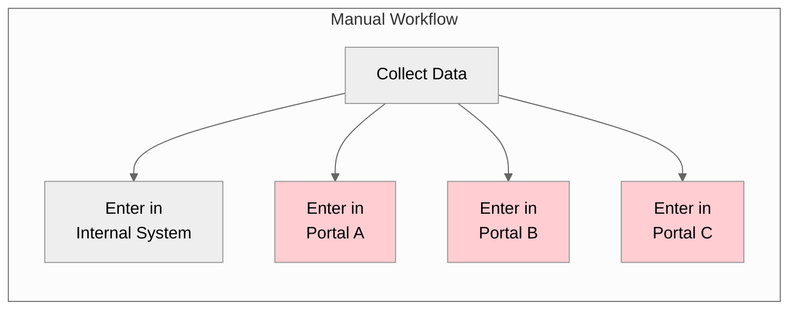
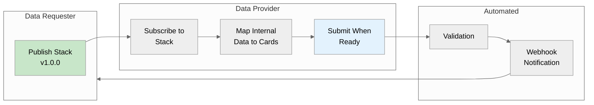
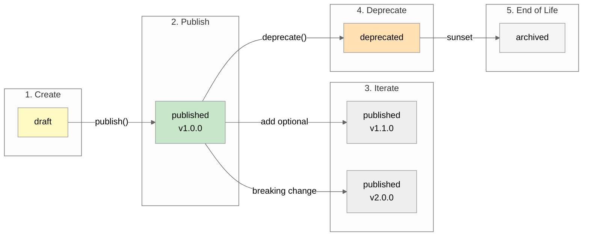
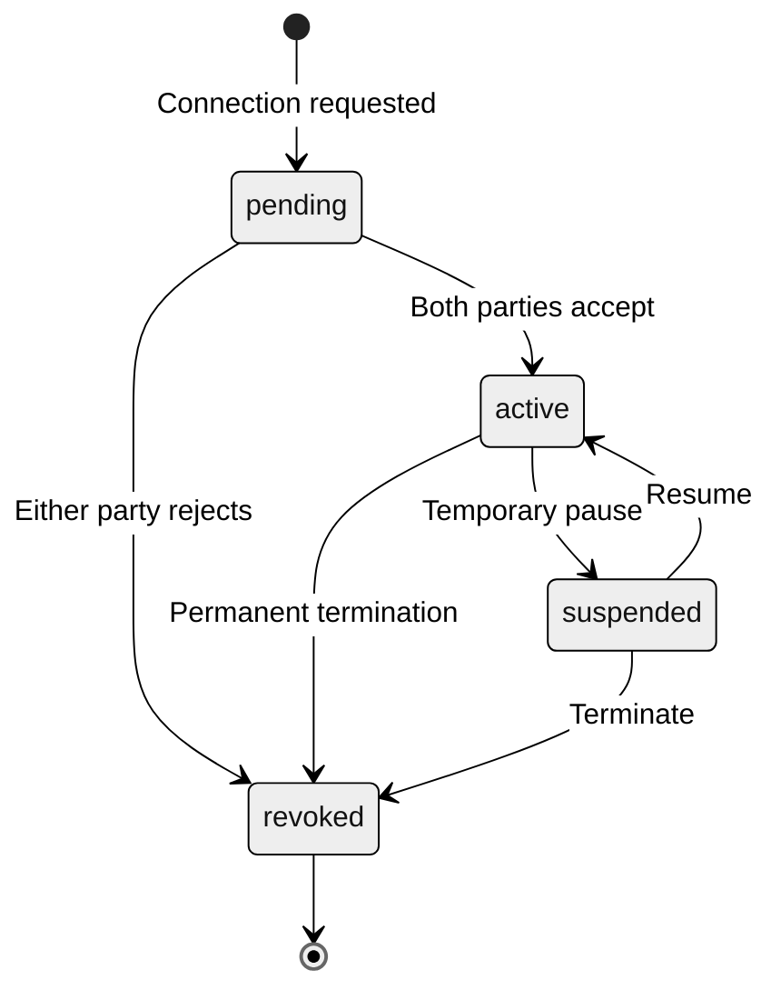
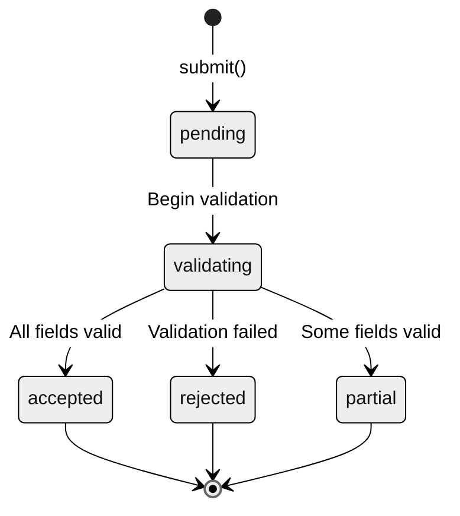

# Abstract

Organizations share data constantly - with partners, regulators, funders, and external systems. Yet most data exchange relies on ad-hoc integrations: custom API mappings, manual file exports, or workers re-entering data into separate portals.

This paper presents **TSP (Trestle Stacks Protocol)**, a [Convex component](https://docs.convex.dev/components) that formalizes inter-organization data exchange. Built on Convex's component system, TSP can be installed via npm and mounted in any Convex application with `app.use(tsp)`. Data requesters publish versioned contracts (Stacks) defining what they need. Data providers subscribe to contracts and map their internal data to the required schema. When data is ready, submissions flow automatically with validation, audit logging, and webhook notifications.

The result is data exchange that's explicit, versioned, and automated - as a drop-in Convex component.

---

# What is a Convex Component?

[Convex components](https://docs.convex.dev/components) are reusable, self-contained modules that add functionality to any Convex application. They:

- **Install via npm** - `npm install @tsp/convex`
- **Mount in your app** - `app.use(tsp)` in `convex.config.ts`
- **Provide typed APIs** - Full TypeScript support with generated types
- **Run in isolation** - Separate tables, no schema conflicts
- **Compose together** - Multiple components work side-by-side

TSP follows this pattern. Install it, mount it, and you have a complete data contract system.

---

# The Problem

## The Portal Problem

Workers in data-intensive organizations spend significant time manually entering data into external portals. Each partner, regulator, or funder has their own web portal where organizations must submit data. This creates:

- **Duplicate Data Entry** - Workers enter the same data in multiple places
- **Transcription Errors** - Manual re-entry introduces mistakes
- **Fragmented Records** - Data scattered across disconnected systems
- **Time Waste** - Hours spent on portal navigation instead of core work



## The Integration Problem

Traditional API integrations don't solve this either:

- **Undocumented schemas** - What fields are required? What formats?
- **Breaking changes** - APIs change without warning
- **No contract versioning** - Which version are you integrating with?
- **Bidirectional complexity** - Both sides build custom code

What we need is a **data contract** - a machine-readable definition of what data is needed, with versioning, validation, and lifecycle management.

---

# Why We Built This

## The Trestle Context

At Trestle, we build software for human services organizations. These organizations report to multiple external parties:

- **Government funders** - HUD HMIS, state benefits systems
- **Foundation grants** - Custom reporting portals
- **Coordinated entry** - Regional housing systems
- **Partner agencies** - Referral networks

Each of these external parties has their own data requirements, their own portal, and their own data format. A single client might need to be reported to five different systems - each requiring slightly different fields, different validation rules, and different submission schedules.

**The pain points:**
- Workers spend hours re-entering the same data in different portals
- Each portal has different field names for the same concepts
- Breaking changes in funder requirements break automations
- No visibility into what data is required until submission fails

**What we needed:**
- Versioned schemas that funders can publish
- Automatic mapping from internal data to external requirements
- Validation before submission (not after rejection)
- Deprecation warnings when requirements change

TSP was built as a Convex component so any Convex application can add data contracts without building from scratch.

---

# The Solution

## The Publish-Subscribe-Map Pattern

TSP inverts the traditional integration model:



**The flow:**

1. **Publishers define Stacks** - Machine-readable contracts specifying required data fields
2. **Subscribers connect** - Establish relationships with scope negotiation
3. **Mappers translate** - Internal data maps to contract schema
4. **Validators ensure quality** - Type checking, required fields, custom rules
5. **Webhooks notify** - HMAC-signed event delivery

---

# Installation

## 1. Install the Package

```bash
# Using bun (recommended)
bun add @trestleinc/tsp

# Using npm
npm install @trestleinc/tsp
```

## 2. Mount the Component

```typescript
// convex/convex.config.ts
import { defineApp } from "convex/server";
import tsp from "@trestleinc/tsp/convex.config";

const app = defineApp();
app.use(tsp);

export default app;
```

## 3. Create the Client

```typescript
// convex/lib/tsp.ts
import { TSPClient } from "@trestleinc/tsp/server";
import { components } from "./_generated/api";

export const tsp = new TSPClient(components.tsp, {
  defaultOrganizationId: process.env.ORG_ID,
});
```

That's it. The component creates its own tables, functions, and APIs - isolated from your application's schema.

---

# Usage

## Publish a Stack (as a Data Requester)

```typescript
// Create a draft stack
const { stackId, versionId } = await tsp.stacks.create(ctx, {
  name: "Client Intake",
  type: "form",
  subject: { type: "client", operation: "create" },
  cards: [
    { slug: "first_name", label: "First Name", type: "string", required: true, classification: "confidential" },
    { slug: "last_name", label: "Last Name", type: "string", required: true, classification: "confidential" },
    { slug: "ssn", label: "SSN", type: "string", format: "ssn", required: true, classification: "restricted" },
    { slug: "dob", label: "Date of Birth", type: "date", required: true, classification: "confidential" },
  ],
});

// Publish it
await tsp.stacks.publish(ctx, {
  stackId,
  version: "1.0.0",
  changelog: { summary: "Initial release", changes: [] },
});
```

## Subscribe to a Stack (as a Data Provider)

```typescript
// Subscribe to partner's stack
await tsp.subscriptions.subscribe(ctx, {
  stackId: "stack_partner_abc",
  version: "1.0.0",
  notifyOnNewVersion: true,
  notifyOnDeprecation: true,
});
```

## Submit Data

```typescript
// Map internal data to stack cards
const cards = [
  { slug: "first_name", value: client.firstName },
  { slug: "last_name", value: client.lastName },
  { slug: "ssn", value: client.ssn },
  { slug: "dob", value: client.dateOfBirth },
];

// Submit
const submission = await tsp.submissions.submit(ctx, {
  stackId: "stack_partner_abc",
  stackVersion: "1.0.0",
  submitterId: ctx.auth.userId,
  subject: { type: "client", id: client.id },
  cards,
});
```

## Register Webhooks

```typescript
// Receive notifications for submission status
await tsp.webhooks.register(ctx, {
  url: "https://your-app.com/webhooks/tsp",
  events: ["submission.accepted", "submission.rejected", "stack.deprecated"],
  retryPolicy: "exponential",
  maxRetries: 5,
});
```

---

# Technical Deep Dive

## Stack Lifecycle

Stacks follow a version lifecycle with semantic versioning:



## Versioning Rules

| Change Type | Impact | Version Bump |
|-------------|--------|--------------|
| Field removed | Breaking | MAJOR |
| Field type changed | Breaking | MAJOR |
| Field made required | Breaking | MAJOR |
| New required field | Breaking | MAJOR |
| New optional field | Non-breaking | MINOR |
| Description changed | Non-breaking | PATCH |
| Default value added | Non-breaking | PATCH |
| Validation relaxed | Non-breaking | PATCH |
| Validation tightened | Breaking | MAJOR |

## Connection State Machine



## Submission State Machine



## Card Validation

Cards support declarative validation rules:

```typescript
// Email with format validation
{
  slug: "email",
  type: "string",
  format: "email",
  required: true,
  validation: [
    { type: "pattern", pattern: "^[^@]+@[^@]+\\.[^@]+$", message: "Invalid email" },
    { type: "maxLength", value: 255, message: "Too long" },
  ],
}

// Number with range validation
{
  slug: "age",
  type: "number",
  required: true,
  validation: [
    { type: "min", value: 0, message: "Must be positive" },
    { type: "max", value: 150, message: "Must be realistic" },
  ],
}
```

## Card Dependencies

Cards can have conditional requirements:

```typescript
// spouse_name required only if married
{
  slug: "spouse_name",
  type: "string",
  required: false,
  dependsOn: [{
    cardSlug: "marital_status",
    condition: "equals",
    value: "married",
  }],
}
```

## Webhook Events

| Event | Description |
|-------|-------------|
| `stack.published` | New version published |
| `stack.deprecated` | Version deprecated |
| `connection.requested` | Connection request |
| `connection.accepted` | Connection accepted |
| `connection.revoked` | Connection revoked |
| `submission.accepted` | Submission validated |
| `submission.rejected` | Validation failed |

### Webhook Security

All webhooks are signed with HMAC-SHA256:

```
TSP-Signature: t=1234567890,v1=abc123def456...
```

Verification:

```typescript
function verifySignature(payload: string, signature: string, secret: string): boolean {
  const parts = Object.fromEntries(signature.split(",").map(p => p.split("=")));
  const expected = hmacSha256(`${parts.t}.${payload}`, secret);
  return timingSafeEqual(parts.v1, expected);
}
```

---

# Component Ecosystem

TSP is part of a family of Convex components that work together:

| Component | Purpose | Integration |
|-----------|---------|-------------|
| **[Bridge](/journal/bridge-reactive-data)** | Reactive data pipelines | Card definitions map to Stack cards |
| **[Crane](/journal/crane-browser-automation)** | Browser automation | Execute submissions via blueprints |
| **[Taxonomy](/journal/taxonomy-data-governance)** | Data governance | Respects PII categories for export |
| **[Replicate](/journal/replicate-local-first)** | Offline-first sync | Queue submissions until online |

Each component is independently installable. Use one, some, or all - they compose cleanly because each runs in isolated tables.

---

# Conclusion

Data exchange between organizations shouldn't require custom integrations for each partner. TSP provides:

1. **Drop-in installation** - `npm install` and `app.use()`
2. **Explicit schemas** - Both parties know exactly what data is needed
3. **Semantic versioning** - Breaking changes are predictable
4. **Automated validation** - Errors caught before submission
5. **Event-driven** - Webhooks notify of state changes

The publish-subscribe-map pattern applies universally: government reporting, partner integrations, regulatory compliance, data marketplace exchanges. Any Convex application that shares structured data benefits from explicit contracts.

Install the component, define your contracts, and let data flow.
