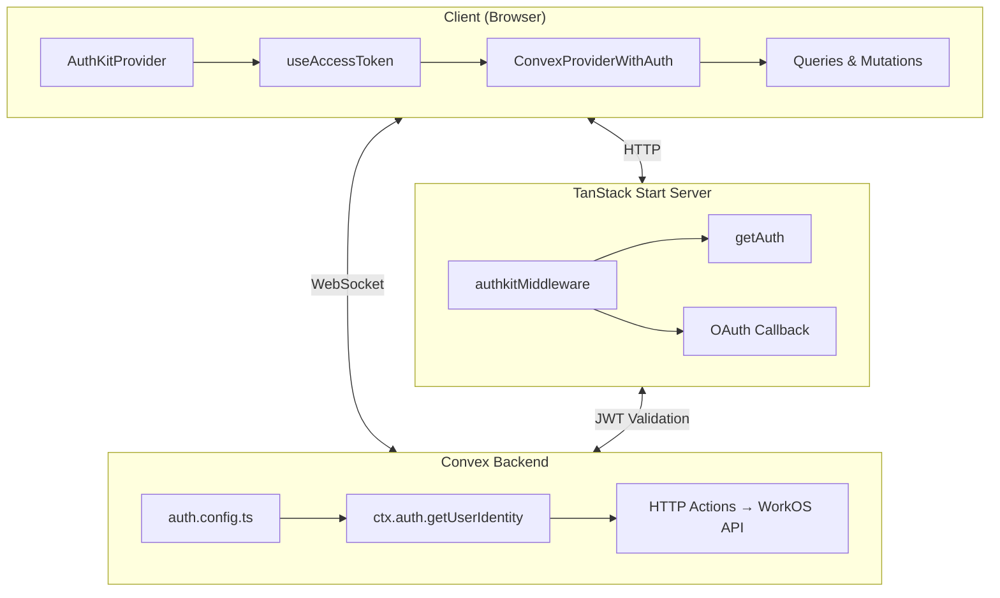
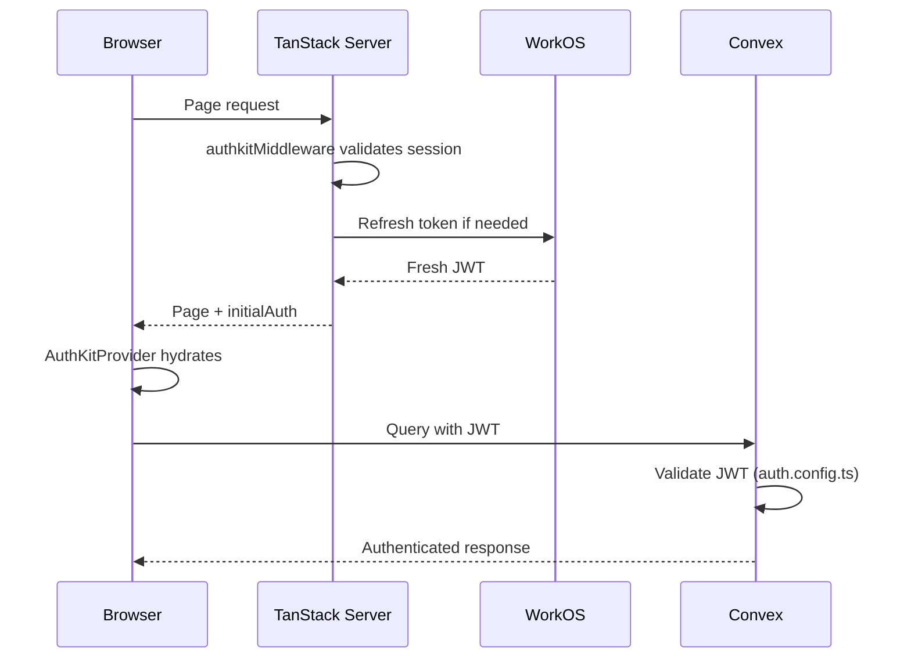

# Introduction

This guide fills the gap between Convex's existing [Next.js WorkOS integration](https://docs.convex.dev/auth/workos) and [React/Vite guide](https://docs.convex.dev/auth/advanced/custom-auth), providing a production-ready pattern for TanStack Start applications.

**Key challenges solved:**
- Bridging WorkOS AuthKit tokens to Convex authentication
- Avoiding infinite loops with proper React hook memoization
- Handling organization switching without race conditions
- Server-side rendering with hydration-safe auth state

# Architecture

The integration spans three layers: browser client, TanStack Start server, and Convex backend.



## Data Flow



# Tech Stack

| Technology | Version | Purpose |
|------------|---------|---------|
| TanStack Start | 1.x | Full-stack React framework |
| TanStack React Query | 5.x | Data fetching & caching |
| Convex | 1.x | Real-time backend |
| WorkOS AuthKit | Latest | Authentication |
| React | 19.x | UI framework |

# Prerequisites

- Convex project set up
- WorkOS account with AuthKit enabled
- TanStack Start application

## Installation

```bash
bun add @workos/authkit-tanstack-react-start convex @tanstack/react-query
```

## Environment Variables

```env
# Convex
VITE_CONVEX_URL=https://your-project.convex.cloud
CONVEX_DEPLOY_KEY=prod:...

# WorkOS AuthKit (for TanStack Start middleware)
WORKOS_CLIENT_ID=client_...
WORKOS_API_KEY=sk_test_...
WORKOS_REDIRECT_URI=http://localhost:3000/api/auth/callback
WORKOS_COOKIE_PASSWORD=... # min 32 characters

# WorkOS API Key (for Convex backend)
# Add via: npx convex env set WORKOS_API_KEY sk_test_...
```

# Implementation

## 1. Convex Auth Configuration

Create `convex/auth.config.ts`:

```typescript
const clientId = process.env.WORKOS_CLIENT_ID;

export default {
  providers: [
    {
      type: 'customJwt',
      issuer: `https://api.workos.com/`,
      algorithm: 'RS256',
      applicationID: clientId,
      jwks: `https://api.workos.com/sso/jwks/${clientId}`,
    },
    {
      type: 'customJwt',
      issuer: `https://api.workos.com/user_management/${clientId}`,
      algorithm: 'RS256',
      jwks: `https://api.workos.com/sso/jwks/${clientId}`,
    },
  ],
};
```

Two providers are needed because WorkOS issues JWTs with different issuers depending on the auth method (SSO vs user management).

## 2. TanStack Start Middleware

Create `src/start.ts`:

```typescript
import { createStart } from '@tanstack/react-start';
import { authkitMiddleware } from '@workos/authkit-tanstack-react-start';

export const startInstance = createStart(() => ({
  requestMiddleware: [authkitMiddleware()],
}));
```

This middleware validates and refreshes sessions on every request.

## 3. OAuth Callback Route

Create `src/routes/api/auth/callback.ts`:

```typescript
import { createFileRoute } from '@tanstack/react-router';
import { handleCallbackRoute } from '@workos/authkit-tanstack-react-start';
import { ConvexHttpClient } from 'convex/browser';
import { api } from '$convex/_generated/api';

function getConvexUrl(): string {
  const url = import.meta.env.VITE_CONVEX_URL;
  if (!url) throw new Error('VITE_CONVEX_URL environment variable is not configured');
  return url;
}

export const Route = createFileRoute('/api/auth/callback')({
  server: {
    handlers: {
      GET: handleCallbackRoute({
        onSuccess: async ({ user }) => {
          // Sync user to Convex after successful auth
          const convex = new ConvexHttpClient(getConvexUrl());
          const userName = `${user.firstName || ''} ${user.lastName || ''}`.trim() || user.email;

          await convex.mutation(api.auth.syncUserFromWorkOS, {
            workosUserId: user.id,
            email: user.email,
            name: userName,
          });
        },
        onError: () => {
          return new Response(null, {
            status: 302,
            headers: { Location: '/sign-in?error=auth_failed' },
          });
        },
      }),
    },
  },
});
```

## 4. Provider Configuration

The key insight is using `ConvexProviderWithAuth` inside `AuthKitProvider`, with a wrapper component to access the auth context.

In `src/routes/__root.tsx`:

```typescript
import { AuthKitProvider } from '@workos/authkit-tanstack-react-start/client';
import { ConvexProviderWithAuth } from 'convex/react';
import { getAuth } from '@workos/authkit-tanstack-react-start';
import { useAuthForConvex } from '@/lib/authClient';

export const Route = createRootRouteWithContext<RouterContext>()({
  loader: async (ctx) => {
    const authResult = await getAuth();

    // Handle auth redirects
    const publicRoutes = ['/sign-in', '/sign-up', '/invite', '/api/auth'];
    const isPublicRoute = publicRoutes.some(
      (route) => ctx.location.pathname === route || ctx.location.pathname.startsWith(`${route}/`)
    );

    if (!authResult.user && !isPublicRoute) {
      throw redirect({ to: '/sign-in' });
    }

    // Set token for Convex server-side queries
    if (authResult.accessToken) {
      ctx.context.convexQueryClient.serverHttpClient?.setAuth(authResult.accessToken);
    }

    return {
      userId: authResult.user?.id,
      token: authResult.accessToken,
      auth: authResult,
    };
  },
  component: RootComponent,
});

// Wrapper component must be inside AuthKitProvider
function ConvexAuthWrapper({ children }: { children: ReactNode }) {
  const context = useRouteContext({ from: Route.id });

  return (
    <ConvexProviderWithAuth client={context.convexClient} useAuth={useAuthForConvex}>
      {children}
    </ConvexProviderWithAuth>
  );
}

function RootComponent() {
  const loaderData = Route.useLoaderData();

  return (
    <AuthKitProvider
      initialAuth={loaderData.auth}
      onSessionExpired={() => {
        window.location.href = '/sign-in';
      }}
    >
      <ConvexAuthWrapper>
        <Outlet />
      </ConvexAuthWrapper>
    </AuthKitProvider>
  );
}
```

## 5. Token Integration Hook

The `useAuthForConvex` hook bridges WorkOS tokens to Convex. **Critical:** The `fetchAccessToken` callback must have an empty dependency array to prevent infinite loops.

In `src/lib/authClient.ts`:

```typescript
import { useCallback, useMemo } from 'react';
import {
  useAuth as useAuthKitAuth,
  useAccessToken,
} from '@workos/authkit-tanstack-react-start/client';

export function useAuthForConvex() {
  const { user, loading } = useAuthKitAuth();
  const { getAccessToken, refresh } = useAccessToken();

  const fetchAccessToken = useCallback(
    async ({ forceRefreshToken }: { forceRefreshToken?: boolean } = {}) => {
      try {
        if (forceRefreshToken) {
          const token = await refresh();
          return token ?? null;
        }
        const token = await getAccessToken();
        return token ?? null;
      } catch {
        return null;
      }
    },
    []
  );

  return useMemo(
    () => ({
      isLoading: loading,
      isAuthenticated: !!user,
      fetchAccessToken,
    }),
    [loading, user, fetchAccessToken]
  );
}
```

## 6. Organization Management via Convex Actions

Call the WorkOS API from Convex actions to manage organizations.

Create `convex/workos.ts`:

```typescript
import { action, internalMutation } from './_generated/server';
import { internal } from './_generated/api';
import { v } from 'convex/values';

const WORKOS_API_KEY = process.env.WORKOS_API_KEY;
const WORKOS_BASE_URL = 'https://api.workos.com';

async function workosApi<T = unknown>(
  endpoint: string,
  options: RequestInit = {}
): Promise<T> {
  if (!WORKOS_API_KEY) {
    throw new Error('WORKOS_API_KEY not set');
  }

  const res = await fetch(`${WORKOS_BASE_URL}${endpoint}`, {
    ...options,
    headers: {
      Authorization: `Bearer ${WORKOS_API_KEY}`,
      'Content-Type': 'application/json',
      ...options.headers,
    },
  });

  if (!res.ok) {
    const error = await res.text();
    throw new Error(`WorkOS API error (${res.status}): ${error}`);
  }

  return res.json() as Promise<T>;
}

export const listOrganizations = action({
  args: {},
  returns: v.array(v.object({ id: v.string(), name: v.string(), role: v.string() })),
  handler: async (ctx) => {
    const identity = await ctx.auth.getUserIdentity();
    if (!identity) return [];

    const memberships = await workosApi<{ data: { organization_id: string; role?: { slug: string } }[] }>(
      `/user_management/organization_memberships?user_id=${identity.subject}`
    );

    return Promise.all(
      memberships.data.map(async (m) => {
        const org = await workosApi<{ id: string; name: string }>(
          `/organizations/${m.organization_id}`
        );
        return {
          id: org.id,
          name: org.name,
          role: m.role?.slug || 'member',
        };
      })
    );
  },
});

export const sendInvitation = action({
  args: {
    email: v.string(),
    organizationId: v.string(),
    role: v.string(),
  },
  handler: async (ctx, args) => {
    const identity = await ctx.auth.getUserIdentity();
    if (!identity) throw new Error('Unauthorized');

    return workosApi('/user_management/invitations', {
      method: 'POST',
      body: JSON.stringify({
        email: args.email,
        organization_id: args.organizationId,
        role_slug: args.role,
        inviter_user_id: identity.subject,
      }),
    });
  },
});
```

## 7. Client Hooks

```typescript
import { useQuery, useMutation, useQueryClient } from '@tanstack/react-query';
import { useConvex } from 'convex/react';
import { api } from '$convex/_generated/api';

export function useOrganizations() {
  const convex = useConvex();

  return useQuery({
    queryKey: ['organizations', 'list'],
    queryFn: () => convex.action(api.workos.listOrganizations, {}),
    staleTime: 1000 * 60 * 5,
  });
}

export function useSendInvitation() {
  const convex = useConvex();
  const queryClient = useQueryClient();

  return useMutation({
    mutationFn: (data: { email: string; organizationId: string; role: string }) =>
      convex.action(api.workos.sendInvitation, data),
    onSuccess: () => {
      queryClient.invalidateQueries({ queryKey: ['organizations', 'members'] });
    },
  });
}
```

## 8. Protected Routes with Auto-Org Selection

In `src/routes/_authenticated.tsx`, use a `useEffect` with a `useRef` guard to auto-select the first organization:

```typescript
import { useRef, useEffect } from 'react';
import { useAuth as useAuthKitAuth } from '@workos/authkit-tanstack-react-start/client';

function AuthenticatedLayout() {
  const { organizationId, loading, switchToOrganization } = useAuthKitAuth();
  const { data: userOrganizations, isPending } = useOrganizations();

  // Prevent multiple switch calls
  const hasSwitched = useRef(false);

  // Auto-switch in useEffect to avoid setState during render
  useEffect(() => {
    if (
      !organizationId &&
      userOrganizations &&
      userOrganizations.length > 0 &&
      !hasSwitched.current
    ) {
      hasSwitched.current = true;
      switchToOrganization(userOrganizations[0].id);
    }
  }, [organizationId, userOrganizations, switchToOrganization]);

  if (loading || isPending || !organizationId) {
    return <Spinner fullScreen />;
  }

  // ... rest of component
}
```

# Key Differences from Next.js

| Aspect | Next.js | TanStack Start |
|--------|---------|----------------|
| Middleware | `middleware.ts` | `src/start.ts` |
| Server functions | API routes | Convex HTTP Actions |
| Session management | NextAuth | AuthKit middleware |
| Auth provider | Direct Convex | `ConvexProviderWithAuth` wrapper |

# Resources

- [WorkOS AuthKit TanStack Start SDK](https://github.com/workos/authkit-tanstack-start)
- [Convex Authentication Docs](https://docs.convex.dev/auth)
- [Convex Custom Auth Guide](https://docs.convex.dev/auth/advanced/custom-auth)
- [TanStack Start Middleware Guide](https://tanstack.com/start/latest/docs/framework/react/guide/middleware)
