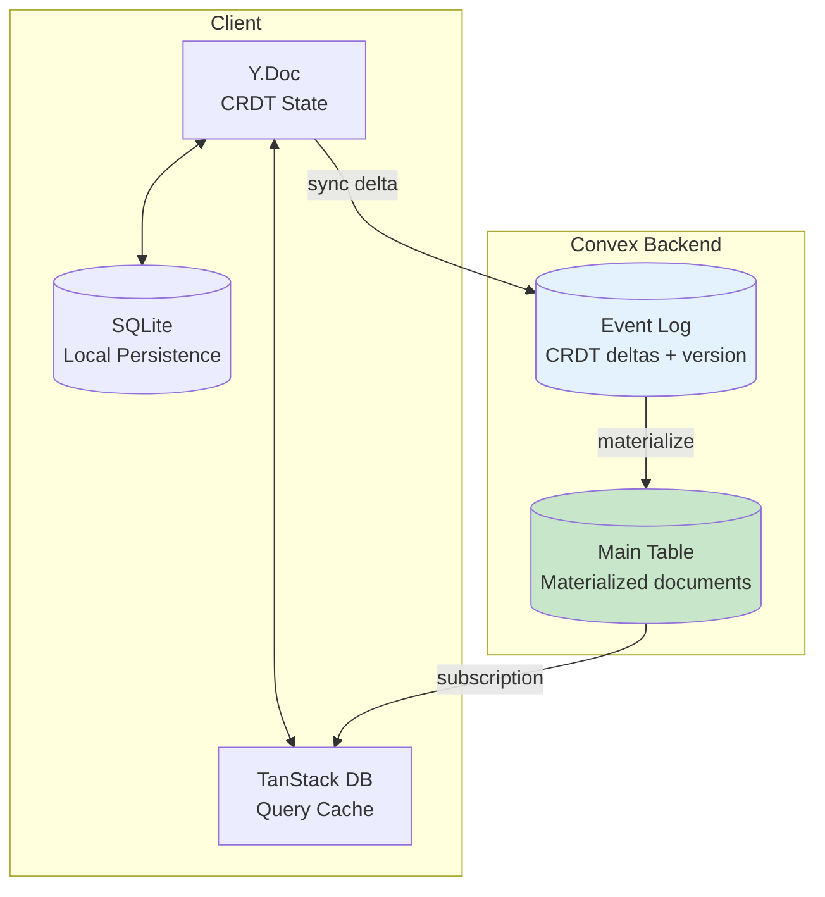
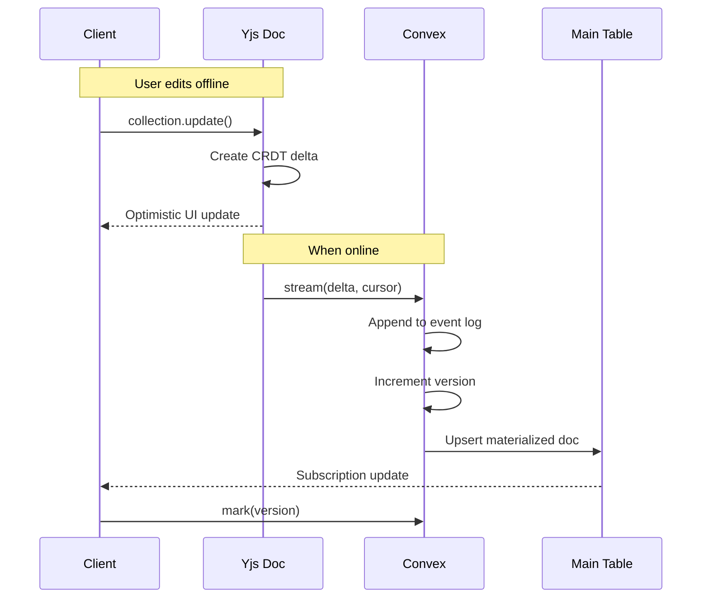
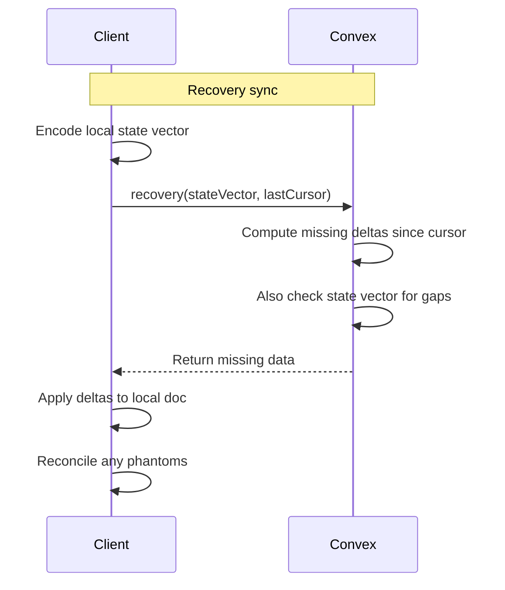

# Building Replicate: An Engineering Journey Through Local-First Sync

Francis had been using Linear and Superhuman religiously, and he wanted our pre-launch product to have that same buttery-smooth, instant-everything feel. No spinners. No lag. Just pure speed.

The thing is, I'd never built a true sync engine for a web application. My only reference point was a Go CLI I'd written to sync markdown notes to my VPS. But with no users yet and a completely green field, we had the rare opportunity to get the architecture right from day one.

Unfortunately, we didn't start on day one. Our core application, Ledger, was originally being built with Replicache for sync, but as our timelines sped up for investors and partners, sync had to be sacrificed for the v1 release. We shipped without it, knowing we'd need to come back to this problem.

Francis's mandate was clear: when we do build sync, it needs to feel like Linear. Instant. Offline-capable. No compromises.

---

# The Local-First Manifesto

Before diving into the engineering, it's worth understanding why local-first matters—not just technically, but philosophically.

In 2019, Ink & Switch published what has become the defining essay on local-first software. Their core observation: cloud apps like Google Docs and Trello are popular because they enable collaboration, but they take away ownership and agency from users. If a service shuts down, your data goes with it.

They proposed seven ideals for local-first software:

1. **No spinners** - Work happens instantly, on your device
2. **Your work is not hostage to a server** - Data lives locally first
3. **The network is optional** - Full functionality offline
4. **Seamless collaboration** - Multiple users, no conflicts
5. **The Long Now** - Your data outlives any company
6. **Security and privacy by default** - You control access
7. **You retain ownership** - Export, migrate, delete freely

Reading this, I realized local-first isn't just a technical architecture—it's a user rights issue. And for Trestle, it's even more fundamental.

## The Trestle Context

At Trestle, we build software for human services organizations. Our users—case workers, intake specialists, field staff—often work in environments with unreliable connectivity:

- **Shelters** with overloaded WiFi serving hundreds of people
- **Client homes** in rural areas with no cellular coverage
- **Community centers** with spotty public networks
- **Field visits** to remote locations

When a worker spends 30 minutes completing an intake form and hits "Save" only to see a network error, that's not just frustrating—it's potentially hours of lost work and a client who has to repeat their trauma. For vulnerable populations, being asked to tell their story twice isn't just inconvenient; it's re-traumatizing.

This isn't hypothetical. We've heard these stories from our partners. Data that can't be lost. Forms that must work everywhere. Sync that happens when it can, not when you demand it.

**We needed:**
- Forms that save locally, always
- Automatic sync when connectivity returns
- No conflicts when multiple workers touch the same record
- Complete audit trail for compliance

The local-first ideals weren't academic principles for us—they were product requirements.

---

# Understanding the Problem Space

Before diving into what I built and why, it's worth understanding the conceptual distinction that took me months to learn.

## Sync Engines vs Local-First

The terms "sync engine" and "local-first" get thrown around interchangeably, but they're not the same thing at all.

**Sync engines** are the WebSocket and reactive layer that keeps data flowing between client and server in real-time. Think of Convex's reactive subscriptions, Firebase's real-time database, or Zero Sync's automatic synchronization. These handle the *plumbing* of real-time data transport.

**Local-first** is an architectural philosophy where the user's device is the source of truth. Your app works offline, changes sync when connected, and most importantly, you need to handle *conflict resolution* when multiple clients make diverging changes offline.

Here's the key insight: **sync engines give you the transport layer. Local-first requires you to solve the hard problem of merging conflicting changes.**

Convex already gives us an excellent sync engine. Reactive queries, optimistic updates, WebSocket connections with automatic reconnection. What it doesn't give us out of the box is: what happens when User A and User B both edit the same document offline, then both come online?

## The Conflict Resolution Trilemma

When users edit data offline and sync later, conflicts are inevitable. User A changes a document's title while offline. User B changes the same document's status while offline. Both sync back to the server. What happens?

There are three main approaches:

### Last-Write-Wins (LWW)

The simplest approach: timestamp every change, and the most recent one wins.

```
User A (offline): title = "Meeting Notes" at 10:00:01
User B (offline): title = "Standup Notes" at 10:00:02

Result: "Standup Notes" wins, User A's change is silently lost
```

Simple to implement, but you lose data. User A's edit evaporates without warning. Great for simple use cases, unacceptable for collaborative editing or data that matters.

### Operational Transformation (OT)

Used by Google Docs and other real-time editors. Transform operations based on what other users have done. If User A inserts "hello" at position 5, and User B inserts "world" at position 3, OT transforms these operations so both edits survive in the correct order.

Powerful but incredibly complex. Order matters, and getting it wrong means data corruption. The algorithms are notoriously difficult to implement correctly—Google's Wave team famously struggled with OT bugs. And OT typically requires a central server to establish operation ordering, which breaks the local-first model.

### CRDTs (Conflict-free Replicated Data Types)

The mathematical approach. CRDTs guarantee that any two replicas that have seen the same set of updates will converge to the same state, regardless of the order those updates arrived. No central authority needed. No complex transformation logic. Just math that works.

**Key CRDT Properties:**
- **Commutative** - Order of operations doesn't matter: A + B = B + A
- **Associative** - Grouping doesn't matter: (A + B) + C = A + (B + C)
- **Idempotent** - Duplicates are safe: A + A = A

This means any device can apply any changes in any order and reach the same final state. It's almost magical when you first see it work.

The CRDT space has several major players:
- **Yjs**: Optimized for text editing, pure JavaScript, battle-tested
- **Automerge**: Optimized for JSON-like structured data, WASM-based
- **Loro**: Rust-first with WASM bindings, advanced algorithms

For our use case—structured documents in a collaborative environment with React Native as a target—the choice would become clear, but not before we learned some expensive lessons.

---

# The Search for the Right Architecture

Before I understood the theory I just explained, I learned it the hard way—by building the wrong thing, studying why others had failed, and slowly piecing together what actually works.

## My First Experiment: TanStack DB + Convex

When TanStack DB first released, I immediately saw the potential. They had a WebSocket example showing a clean push-pull model for optimistic updates. I built a prototype integrating TanStack DB's reactive collections with Convex's subscriptions.

It worked beautifully. Convex's reactive queries fed into TanStack DB's local state. Optimistic mutations felt instant. The UI updated in real-time across tabs. This was the buttery-smooth experience Francis wanted.

Then I took my laptop offline. Made some changes. Came back online.

The data was gone.

This was my first real lesson: **I had built a sync engine, not a local-first app**. TanStack DB + Convex gave us excellent real-time sync—reactive, optimistic, fast. What it didn't give us was persistence through offline periods, or any way to handle conflicts when multiple clients diverged.

## Learning from ElectricSQL's Journey

That failure sent me researching. ElectricSQL caught my attention because they'd been through the full evolution of local-first architecture—and had recently pivoted dramatically. Understanding why taught me crucial lessons.

### The Ambitious Original Vision: Rich-CRDTs (2022-2024)

ElectricSQL's original vision was ambitious: bring the full power of PostgreSQL to the client with automatic conflict resolution. They built on **Vaxine**, a Rich-CRDT database based on **AntidoteDB**—an Erlang-based, planet-scale transactional database built on CRDT technology.

AntidoteDB itself has an impressive pedigree. It emerged from the SyncFree European research project and the follow-up LightKone project. The core team included researchers who literally invented CRDTs—Marc Shapiro, Nuno Preguiça, Carlos Baquero. This wasn't amateur hour.

**What made Rich-CRDTs "rich"?**

Standard CRDTs handle data type conflicts (concurrent edits to the same field), but they don't handle database-level constraints. What happens when:
- User A deletes a parent record while User B adds a child that references it?
- Two users both try to claim the last available ticket?
- A uniqueness constraint is violated by concurrent inserts?

Rich-CRDTs extended basic CRDTs with three key mechanisms:

**1. Compensations**

When a constraint violation is detected during merge, compensations automatically "undo" the violating operation and apply a corrective action. Think of it like a database trigger that fires during CRDT merge.

```erlang
% Pseudocode for compensation
on_merge(Operation) ->
    case check_constraints(Operation) of
        ok -> apply(Operation);
        {violation, Type} -> 
            compensate(Type, Operation),
            log_compensation(Operation)
    end.
```

For referential integrity, if a parent is deleted while a child still references it, the compensation might:
- Cascade delete the child (dangerous)
- Reassign the child to a "tombstone" parent (safer)
- Reject the delete and resurrect the parent (safest but surprising)

**2. Reservations**

Reservations solve the "last ticket" problem using an escrow pattern. Before going offline, a client can reserve constraint "slots" that guarantee their operations will succeed.

```
Online: Client A reserves 5 "available slots" for unique usernames
Offline: Client A creates 3 users with unique usernames
Sync: Server validates against reservation, accepts all 3
```

This is similar to how distributed systems handle inventory: pre-allocate stock to regions so each region can sell locally without coordination.

**3. Shadow Tables**

Vaxine used "shadow tables" to track the CRDT state alongside regular Postgres tables. Every table had a corresponding shadow table storing:
- Operation history for each row
- Vector clocks for causality tracking
- Tombstones for deleted records

PostgreSQL's logical replication (WAL + LSN) synced changes between the server and client SQLite databases.

### Why They Abandoned It

In July 2024, ElectricSQL announced "Electric Next"—a complete architectural pivot. The Rich-CRDT approach was gone, replaced by HTTP streaming with "shapes" (subsets of data that sync incrementally).

The reasons were instructive:

1. **Complexity explosion**: Rich-CRDTs required understanding both CRDT semantics AND relational database semantics. The intersection created edge cases that were hard to reason about and harder to debug.

2. **Performance overhead**: Shadow tables doubled storage requirements. Every write triggered CRDT operations plus Postgres operations plus replication.

3. **Developer experience**: Explaining compensations and reservations to developers who just wanted offline forms was a non-starter. The abstraction leaked constantly.

4. **Client-side Postgres is heavy**: Running SQLite with Postgres-compatible CRDT extensions on every client device added significant bundle size and complexity.

James Arthur (ElectricSQL CEO) wrote candidly about the pivot: the original architecture tried to solve too many problems at once. The new architecture focused on one thing—efficient data streaming from Postgres to clients—and let developers handle conflict resolution in application code.

### My Experiment with Electric Next

Armed with this knowledge, I tried ElectricSQL's new architecture. The DX was impressive—define your schema in Postgres, Electric syncs it to clients automatically. I integrated it with TanStack DB.

Same result as my first experiment. Great sync. No conflict resolution.

Their new architecture explicitly avoided the hard problem:

> "We provide the sync. You bring the conflict resolution strategy."

For simple last-write-wins scenarios, this works. For case workers editing the same intake form from unreliable field locations, silently dropping changes wasn't acceptable.

### The Insight I Kept

But buried in ElectricSQL's legacy architecture was the key insight I needed: **the replication table pattern**—PostgreSQL's WAL + LSN approach adapted for sync. This pattern would become the cornerstone of Replicate's architecture.

While I liked Electric's streaming architecture, I didn't like the HTTP request experience. I wanted a clean WebSocket experience for an instant-feeling application. Convex already provides that.

## Evaluating Other Players

### PowerSync: Production-Ready but Painful

PowerSync was the other major player I evaluated. Production-ready, established companies using it at scale, PostgreSQL logical replication to SQLite on every device.

But the developer experience was frustrating. Their authentication model required either a dedicated endpoint or static key pairs for JWT generation. Their write path required constant HTTP requests to a catch-all endpoint. After days of wrestling with their patterns, I realized we'd be fighting their opinions at every turn.

The lesson: production-readiness doesn't mean production-pleasant.

### Zero by Rocicorp

Zero deserves special mention. Aaron Boodman and the Rocicorp team have been thinking about sync engines longer than almost anyone. Their thesis is compelling: put a sync engine in front of your database and distribute your backend all the way to the main thread of the UI.

Their architecture is elegant—hybrid queries that span client and server, automatic caching, incremental sync. But Zero is its own stack, and we were already committed to Convex. The patterns were instructive even if we couldn't adopt them directly.

From Zero, I learned that the user experience problem and the developer implementation problem are two sides of the same coin. Users expect instant, offline-capable, conflict-free software because that's what native apps trained them to expect. Developers struggle to build it because the primitives are scattered across different libraries and paradigms.

## The Community Signal

Throughout this exploration, I was watching the community closely.

**LocalFirst.fm** (the podcast and community channels) revealed a pattern: developers wanted batteries-included solutions but kept hitting walls. Replicache had excellent DX but significant vendor lock-in. PowerSync was great for mobile but tightly coupled to their backend. RxDB was open source but required a hundred configuration decisions before you could build anything.

**Convex's community** kept asking for local-first. Discord threads about offline support. AMA questions about conflict resolution. GitHub issues proposing offline-capable patterns like [hash-based conditional query fetching](https://github.com/get-convex/convex-backend/issues/146) to support locally cached data.

Then came Convex's Series B announcement in November 2025. Jamie Turner laid out three major features on their roadmap:

> "We aim to ship a **Convex-flavored take on local-first** that will feel as intuitive and ergonomic as the rest of our product."

Local-first was one of three headline features for their $24M raise. The demand was real. The gap was real.

## What I Needed to Build

By the end of my research, I had clarity:

1. **We need a sync engine** (WebSocket/reactive layer) → Convex already gives us this
2. **We need conflict resolution** (CRDTs) → We'll need to build this
3. **We need efficient queries** (server-side) → Can't query CRDT bytes directly
4. **We need local persistence** (offline) → IndexedDB/SQLite for the client

The question was: how do we combine these without the complexity that killed ElectricSQL's first attempt?

---

# The RxDB Gamble

In mid-September, I started this repository with what seemed like a brilliant idea: be unopinionated.

## Why RxDB? The TanStack Collection Provider

RxDB is a popular local-first database for JavaScript, and crucially, it's a **TanStack collection provider**. This meant I could potentially get the integration I wanted:

```
TanStack DB → RxDB → Convex
```

TanStack DB for the reactive query interface. RxDB for local persistence and conflict resolution. Convex for the sync transport. Three layers, each doing what it's best at.

RxDB's philosophy is flexibility: multiple storage backends, multiple sync protocols, multiple conflict resolution strategies. Let developers choose what works for their use case.

My thinking was:
- Use RxDB for local storage and conflict resolution flexibility
- Use TanStack DB for reactive queries over that data
- Use Convex WebSockets for the sync transport layer
- Let developers plug in their own conflict resolution if they want

This would be the Swiss Army knife of sync solutions. Flexible, powerful, unopinionated.

## The Anti-Pattern: Two Databases Fighting for Authority

What I didn't realize: **RxDB is meant to BE the backend, not work WITH another backend.**

The architecture I was building had a fundamental flaw. RxDB and Convex both wanted to own the data layer. RxDB expected to be the source of truth with its own persistence and sync. Convex expected to be the source of truth with its reactive subscriptions and mutations.

Putting them together meant:
- Extra reads: RxDB reading from IndexedDB, then Convex reading from its tables
- Extra writes: Changes going to RxDB first, then syncing to Convex, then Convex syncing back
- Broken sync: Convex's default reactive sync was now competing with RxDB's replication protocol

I was breaking Convex's elegant sync model by shoving another database layer in the middle.

## 34 Commits of Fighting Reality

The git history tells a brutal story. Over the next several weeks, I created 34 commits trying to make RxDB work with our stack:

```
5c23773: "Implement hybrid RxDB + Convex WebSocket architecture (WIP)"
c163699: "Fix RxDB replication errors and improve real-time sync"
f76980d: "Simplify RxDB replication to fix WebSocket sync issues"
702a5aa: "Fix: resolve all memory leaks and cleanup race conditions"
```

The problems kept mounting:

**Memory Leaks**: RxDB's replication protocol wasn't cleaning up subscriptions properly when working with Convex's reactive queries. Every page navigation leaked observers.

**Bundle Size**: RxDB brought its own WASM modules and IndexedDB adapters, adding significant weight to our client bundle. For a library meant to make things simple, it came with a lot of baggage.

**Impedance Mismatch**: RxDB wasn't designed for Convex's reactive model. We were fighting the framework at every integration point. RxDB expects to own the database; Convex expects to own the sync layer. Making them share responsibility was like forcing two territorial cats to share a bed.

**Complexity Without Benefit**: The "unopinionated" design meant we were configuring everything manually anyway. Where was the value in flexibility if we still needed to make all the hard decisions?

## The Realization

By mid-October, I had to admit the truth: being unopinionated was a feature, not a benefit.

I largely didn't see a reason for developers to have to pick a conflict resolution strategy and have multiple poor implementations. There just needs to be one fast implementation that is clearly incredible and has the least amount of data loss. Developers want to have fun building their app, not debugging sync protocols.

For a good product experience, you need opinions. You need to make the hard choices for your users so they can focus on their actual product.

RxDB was solving a problem we didn't have (supporting multiple databases and sync protocols) while creating problems we did have (complexity, bundle size, integration pain).

---

# The Automerge Revelation

On October 24th, I found the article that changed everything: "Automerge and Convex" on the Convex blog.

## The Key Insight: CRDT as Compute Layer, Not Database

The RxDB experiment failed because I was thinking about it wrong. RxDB is a **database** that happens to support CRDTs. It has opinions about storage, sync, and data ownership. Those opinions conflicted with Convex's opinions.

But Automerge, used correctly, isn't a database at all. **It's a compute layer.**

The article showed me the right architecture:

```
TanStack DB → Convex (with Automerge as pure merge logic)
```

Not three layers fighting for control. Just two:
- **TanStack DB + Convex**: Handle all the data management, persistence, sync, and reactivity
- **Automerge**: Just do the CRDT math when conflicts need merging

Automerge doesn't want to own your data. It doesn't have opinions about storage backends or sync protocols. It just takes two divergent states and produces a merged result. That's it. **Pure computation, no database opinions.**

## The Guide's Architecture

The Convex blog article proposed:

**1. Automerge CRDTs for conflict-free merging**
Instead of trying to be flexible about conflict resolution, just use Automerge. It works. It's production-ready. And critically—it doesn't try to own your data layer.

**2. Convex for everything else**
Convex handles the sync engine layer. Real-time WebSocket subscriptions, automatic reconnection, optimistic updates. Storage. Persistence. Don't reinvent any of this.

**3. Store CRDT bytes on the server**
Store Automerge documents as binary blobs in Convex. The server doesn't need to understand CRDTs. It just stores and serves bytes. The merge computation happens client-side.

**4. Hybrid storage**
Not all data needs CRDTs. Use them for collaborative documents. Use regular Convex tables for everything else.

## The Pivot

That day, October 24th, I made the call: rip out RxDB, go all-in on Automerge + Convex.

Six commits that day tell the story:

```
c8f37c4: "Feat: add Convex storage component for CRDT binary data"
1e49827: "Docs: add architecture documentation for Automerge migration"
8eb37fc: "Refactor: remove RxDB-based implementation from core package"
3f0bef7: "Refactor: replace RxDB with clean Automerge implementation"
3835c01: "Refactor: complete migration from RxDB to Automerge architecture"
```

The decision wasn't just about switching libraries. It was about being opinionated for the benefit of our users.

---

# Why "Replicate"? The Replication Table Pattern

The name isn't accidental. It's a reference to one of the oldest patterns in database engineering.

## PostgreSQL's Replication Tables

PostgreSQL has had logical replication for decades. At its core is a simple pattern:

1. **Write-Ahead Log (WAL)** - Every change is logged before being applied
2. **Log Sequence Numbers (LSN)** - Each entry has a monotonically increasing identifier
3. **Replication Slots** - Clients track their position in the log
4. **Incremental Sync** - Clients request changes since their last position

## The Cornerstone Commit

That first commit on October 24th became the cornerstone of the entire architecture:

```
c8f37c4: "Feat: add Convex storage component for CRDT binary data"
```

This commit established a replication table in Convex—a component table that stores CRDT bytes with timestamp indexes for incremental sync. Every commit after refined this philosophy:

```
b197f4f: "refactor: update replication helpers and store for CRDT bytes"
87ff70b: "refactor: update component to use crdtBytes and split insert/update/delete API"
f934227: "Refactor: migrate storage component to replicate API"
4c6681d: "Fix: Import replication helpers from /replication to avoid Automerge on server"
```

The pattern we built:

```typescript
// The replication table schema
documents: defineTable({
  collectionName: v.string(),
  documentId: v.string(),
  crdtBytes: v.bytes(),        // CRDT binary data
  version: v.number(),         // Monotonic sequence
  timestamp: v.number(),       // For checkpoint queries
})
  .index('by_timestamp', ['collectionName', 'timestamp'])
```

This is PostgreSQL's replication table pattern, adapted for Convex with CRDT bytes instead of row changes.

## The Double Meaning

So why "Replicate"?

1. **The verb**: To replicate data across devices, offline and online
2. **The noun reference**: We replicated the replication table pattern itself

We took the battle-tested pattern that powers PostgreSQL logical replication, that ElectricSQL proved worked for local-first sync, and built it as a Convex component. The progression from that cornerstone commit is the story of refining this philosophy—making the replication table pattern work beautifully with CRDTs in the Convex ecosystem.

It's a tribute to the database engineers who figured this out decades ago. We're just standing on their shoulders, adding CRDTs on top.

---

# Evolution to Yjs: The Right Tool

The Automerge architecture worked, but we hit a snag: WASM in the Convex runtime.

## The WASM Problem

Automerge is written in Rust and compiled to WASM for JavaScript environments. This is great for performance in the browser—Rust is fast, and WASM is near-native speed.

But Convex functions run in an isolated JavaScript environment with specific constraints and costs. Understanding these costs was crucial to our decision.

### Convex Runtime Constraints

According to Convex's documentation, their runtimes have specific limits:

| Resource | Convex Runtime | Node.js Runtime |
|----------|---------------|-----------------|
| Memory | 64 MiB RAM | 512 MiB RAM |
| Execution Time (Query/Mutation) | 1 second | 1 second |
| Execution Time (Action) | 10 minutes | 10 minutes |
| Code Size | 32 MiB per deployment | 32 MiB per deployment |

The pricing model also matters:
- **Function calls**: $2 per additional 1,000,000 calls (Professional plan)
- **Action execution**: $0.30/GiB-hour (Professional plan)

Loading WASM modules in Convex means:
- **Larger function bundles**: WASM files are not small—they eat into that 32 MiB limit
- **Cold start latency**: WASM initialization happens on every cold start
- **Compute costs**: Every function call pays for WASM initialization time
- **Memory pressure**: WASM modules consume that precious 64 MiB

For a component meant to be mounted in user applications, we were adding overhead to every Convex function, even ones that didn't use CRDTs. The server doesn't need to understand CRDT operations—it just stores bytes. But with Automerge, the WASM came along for the ride.

### The Hidden Cost of WASM Crossing

There's another cost that benchmarks often miss: the JavaScript/WASM boundary. Every time you pass data between JS and WASM, there's serialization overhead. For a sync library that might process many small operations, this adds up.

```javascript
// Each of these crosses the JS/WASM boundary
const doc = Automerge.init();           // WASM call
Automerge.change(doc, d => {            // WASM call  
  d.title = "Hello";                    // Multiple WASM calls for property access
});
const bytes = Automerge.save(doc);      // WASM call with serialization
```

## Why Yjs Won

Yjs is pure JavaScript. No WASM, no Rust compilation, no binary artifacts. It's also:

- **Battle-tested** at massive scale (Notion, Figma reportedly use similar CRDT approaches)
- **Small bundle size** (~30KB minified, ~91KB when including all dependencies)
- **Rich ecosystem** with persistence providers, editor bindings, awareness protocol
- **Efficient encoding** using state vectors for minimal sync payloads

### Bundle Size Comparison

Based on the crdt-benchmarks repository (using the Automerge paper dataset: 182,315 insertions, 77,463 deletions, 259,778 total operations):

| Library | Snapshot Size | With Compression |
|---------|--------------|------------------|
| Yjs (yrs) | 227 KB | 91 KB |
| Loro | 273 KB | 132 KB |
| Diamond-types | 281 KB | 151 KB |
| Automerge | 293 KB | 129 KB |

Yjs has the smallest uncompressed size. With compression, it's also the smallest. For a library that loads on every page, this matters.

The migration was captured in a single breaking change commit:

```
2e012e7: "feat!: migrate from Automerge to Yjs with TanStack offline-transactions"
```

## State Vector Sync

Yjs introduced us to state vectors—a compact representation of "what changes has this client seen?" that enables efficient delta sync.

```javascript
// Full sync: exchange complete documents
const state1 = Y.encodeStateAsUpdate(ydoc1)
const state2 = Y.encodeStateAsUpdate(ydoc2)
Y.applyUpdate(ydoc1, state2)
Y.applyUpdate(ydoc2, state1)

// Efficient sync: exchange only differences
const stateVector1 = Y.encodeStateVector(ydoc1)
const stateVector2 = Y.encodeStateVector(ydoc2)
const diff1 = Y.encodeStateAsUpdate(ydoc1, stateVector2)
const diff2 = Y.encodeStateAsUpdate(ydoc2, stateVector1)
Y.applyUpdate(ydoc1, diff2)
Y.applyUpdate(ydoc2, diff1)
```

Instead of sending the full document on every sync, we send: "Here's what I've seen. What am I missing?" The server responds with only the deltas the client needs. For large documents with many edits, this is orders of magnitude more efficient.

---

# The Loro Tangent: When Context Matters More Than Speed

While working on Yjs integration, I discovered Loro—a newer CRDT library with impressive benchmarks and cutting-edge algorithms (Fugue for text, Peritext for rich formatting). This became a multi-week exploration that taught us critical lessons about choosing tools for the right context.

## The loro Branch

I created a branch to explore Loro integration:

```
08b0b00: "feat: add Loro adapter layer and make component byte-agnostic"
4109978: "refactor: migrate collection layer from Yjs to Loro"
aeb9e76: "refactor: migrate persistence layer to store Loro snapshots directly"
894db9f: "refactor: complete platform-specific entry points for Loro migration"
```

We built a complete adapter layer abstracting Loro's WASM and native implementations:

```typescript
// From loro/adapter.ts - abstracting the CRDT implementation
export interface LoroAdapter {
  createDoc(peerId?: string): LoroDocHandle;
  import(doc: LoroDocHandle, bytes: Uint8Array): void;
  export(doc: LoroDocHandle, mode: ExportMode): Uint8Array;
  
  // Key difference: Loro uses "frontiers" not "stateVector"
  getFrontiers(doc: LoroDocHandle): Frontiers;
  encodeFrontiers(frontiers: Frontiers): Uint8Array;
  // ...
}
```

## Why We Didn't Ship It

After getting Loro working, three hard-earned lessons emerged:

### 1. Frontiers vs State Vectors: A Fundamental Mismatch

Loro uses **frontiers** for sync, not **state vectors** like Yjs. This sounds like a minor detail—both represent "what changes have I seen?"—but the implications for server-side operations are profound.

```typescript
// Yjs: Server can merge and validate state vectors
const serverVector = Y.encodeStateVectorFromUpdateV2(mergedState);
const diff = Y.diffUpdateV2(mergedState, clientVector);

// Loro: Frontiers are opaque bytes the server can't interpret
// From loro:src/component/schema.ts
snapshots: defineTable({
  frontiers: v.bytes(),  // Server stores but can't merge these
})
```

With Yjs, the Convex component can merge updates server-side, validate consistency, and compute diffs. With Loro, the server becomes a dumb byte store—it can't participate in CRDT operations because Loro's Rust implementation isn't available in the Convex runtime.

This breaks the service-authoritative model we needed.

### 2. Speed in the Wrong Context

Loro's benchmarks are impressive—Fugue's non-interleaving guarantees and Peritext's rich text merging are genuinely innovative. But these benefits shine in:
- **Rust-native applications** where you're not crossing WASM boundaries
- **Peer-to-peer architectures** where there's no central server
- **Rich text editors** with complex formatting requirements

Our architecture is different:
- **JavaScript clients** crossing WASM boundaries on every operation
- **Service-authoritative** with Convex as the source of truth
- **Structured documents** (forms, records) not rich text editors

The overhead of WASM serialization on every operation negated Loro's speed advantages. Yjs, being pure JavaScript, integrates seamlessly without boundary-crossing costs.

### 3. Compaction Complexity

The compaction story revealed the deepest mismatch. Compare the schemas:

```typescript
// Yjs (cursor branch): Server can work with stateVector
snapshots: defineTable({
  stateVector: v.bytes(),   // Server can use this for recovery sync
  snapshotBytes: v.bytes(),
})

// Loro: Server stores opaque frontiers
snapshots: defineTable({
  frontiers: v.bytes(),     // Server can't interpret this
  bytes: v.bytes(),
})
```

With Yjs, when a client reconnects after being offline, the server can compute exactly what updates the client is missing using state vector diffing. With Loro, the server has to send everything since the last snapshot—it can't compute a diff because frontiers are opaque.

## The Lesson

Loro is an excellent library—for the right context. Its algorithms represent real advances in CRDT theory. But **context matters more than speed**:

- If you're building a Rust-native collaborative editor: Loro is probably the right choice
- If you're building a JavaScript service-authoritative sync layer: Yjs wins on integration, not benchmarks

The `loro` branch remains in the repository as a reminder that choosing tools requires understanding your architecture's constraints, not just reading benchmark numbers.

---

# Component Authoring: Reverse Engineering the Future

One of the more surreal aspects of building Replicate was that we shipped version 1.0.0 *before* Convex publicly released their component authoring documentation.

## The Pre-Public Challenge

Convex components are a brilliant abstraction: self-contained modules with their own database tables, isolated function execution, and clean composition. When Convex announced components, the R2 storage component was one of the examples. But the authoring guide wasn't public yet.

We wanted to build Replicate as a proper component—not a library, not a bunch of copy-paste code, but a true component that developers could install with `bun add` and mount with `app.use()`. So we reverse-engineered it.

The process:
1. Clone the Convex R2 component example
2. Study the file structure and configuration patterns
3. Strip out R2-specific code, insert our CRDT sync logic
4. Regenerate the build system through trial and error
5. Test by mounting in a real application

This was before `npx convex codegen --component-dir` was documented. Before the authoring guide explained the `convex.config.ts` anatomy. We were cargo-culting from examples and praying.

The payoff was worth it. When Convex did release component authoring publicly, Replicate was already compatible. We'd guessed correctly on the patterns that would become standard.

## Build System Evolution

The build tooling for components went through its own journey, each phase teaching us something about the trade-offs in TypeScript library development:

### Phase 1: tsc (TypeScript Compiler)

Just the TypeScript compiler. Simple and correct, but:
- **Slow**: Full type-checking on every build
- **No bundling**: Outputs many small files
- **No optimization**: No tree-shaking, no minification
- **Dual output pain**: Generating both ESM and CJS required separate configs

```json
// tsconfig.json (Phase 1)
{
  "compilerOptions": {
    "outDir": "./dist",
    "declaration": true,
    "declarationMap": true
  }
}
```

### Phase 2: rslib/rsbuild

Moved to Rslib (built on Rspack, the Rust-based Webpack alternative) for proper bundling:

```
142d04b: "feat: migrate core to Rslib and externalize Automerge as peer dependency"
```

Benefits:
- **Fast**: Rspack is significantly faster than Webpack
- **Dual ESM/CJS**: Native support for both module formats
- **Tree-shaking**: Dead code elimination
- **Externalization**: Peer dependencies excluded from bundle

```javascript
// rslib.config.js (Phase 2)
export default {
  lib: [
    { format: 'esm', syntax: 'es2021' },
    { format: 'cjs', syntax: 'es2019' }
  ],
  output: {
    externals: ['yjs', '@convex/component']
  }
};
```

### Phase 3: tsdown

Eventually settled on tsdown—a simpler alternative with excellent defaults:

```
7d9dbbd: "refactor: migrate to tsdown and simplify convexCollectionOptions API"
```

Why tsdown won:
- **Minimal configuration**: Sensible defaults for library authoring
- **Fast builds**: Uses esbuild under the hood
- **Clean DTS**: Proper TypeScript declaration bundling
- **Watch mode**: Fast iteration during development

```javascript
// tsdown.config.js (Phase 3)
export default {
  entry: ['src/index.ts', 'src/client.ts', 'src/server.ts'],
  format: ['esm', 'cjs'],
  dts: true,
  clean: true
};
```

The lesson: start simple (tsc), add complexity when needed (rslib), then simplify when you understand your requirements (tsdown).

## Package Consolidation

The repository structure also evolved:

**Early: Separate Packages**
- `@trestleinc/convex-replicate-component` - Convex component
- `@trestleinc/convex-replicate-core` - Client utilities
- `@trestleinc/convex-replicate-react` - React bindings

**Current: Unified Package**
- `@trestleinc/replicate` - Everything, with entry points (`/client`, `/server`, `/convex.config`)

```
480da8f: "refactor!: merge component and core packages into unified @trestleinc/replicate"
05e7eae: "refactor: flatten monorepo structure (packages/replicate → root)"
```

The consolidation reduced confusion (one package to install, one version to track) and simplified the build process.

---

# The API Evolution: From Boilerplate to Elegance

One of the less visible but most important aspects of the project was the API design journey. The API went through four distinct phases, each teaching us something about developer experience.

## Phase 1: The Automerge Era (Direct Component Calls)

In the earliest Automerge implementation, there was no server-side wrapper at all. Developers called the component's mutations directly:

```typescript
// Automerge era: direct component mutations
// packages/storage/src/component/public.ts

export const submitSnapshot = mutation({
  args: {
    collectionName: v.string(),
    documentId: v.string(),
    data: v.bytes(),
  },
  handler: async (ctx, args) => {
    // Hash-based deduplication
    const hash = generateHash(args.data);
    // ... store in documents table
  },
});

export const submitChange = mutation({ /* similar */ });
export const submitBatch = mutation({ /* batch operations */ });
export const pullChanges = query({ /* checkpoint-based sync */ });
export const changeStream = query({ /* reactive stream metadata */ });
```

The client used a `SyncAdapter` class:

```typescript
// Client-side adapter class
export class SyncAdapter<T extends { id: string }> {
  async start(): Promise<void> {
    await this.pull();
    this.pushInterval = setInterval(() => void this.push(), 5000);
    this.unsubscribe = this.client.onUpdate(
      this.api.changeStream,
      { collectionName: this.collectionName },
      () => void this.pull()
    );
  }

  stop(): void {
    if (this.pushInterval) clearInterval(this.pushInterval);
    if (this.unsubscribe) this.unsubscribe();
  }

  private async push(): Promise<void> {
    const dirty = this.store.getDirty();
    await this.client.mutation(this.api.submitBatch, { operations: dirty });
  }
}
```

This worked, but developers had to:
- Understand the component's internal mutations
- Manage the sync adapter lifecycle manually
- Handle checkpoint tracking themselves
- Wire up push/pull logic

## Phase 2: The Yjs Rewrite (Helper Functions)

After migrating to Yjs, we introduced server-side helper functions:

```typescript
// Yjs era: helper functions
// packages/replicate/src/component/public.ts

export const insertDocument = mutation({
  args: {
    collectionName: v.string(),
    documentId: v.string(),
    crdtBytes: v.bytes(),
    version: v.number(),
  },
  handler: async (ctx, args) => { /* ... */ },
});

export const updateDocument = mutation({ /* ... */ });
export const deleteDocument = mutation({ /* ... */ });
export const stream = query({ /* incremental sync */ });
```

And server helpers to call them:

```typescript
// Server helpers for user code
export {
  insertDocumentHelper,
  updateDocumentHelper,
  deleteDocumentHelper,
  streamHelper,
} from './replication.js';
```

Better—developers had cleaner primitives. But still verbose for common use cases.

## Phase 3: The Factory Pattern

The factory pattern unified configuration:

```typescript
// Factory pattern: bind once, reuse
import { replicate } from '@trestleinc/replicate/server';
import { components } from './_generated/api';

const r = replicate(components.replicate);

export const tasks = r<Task>({
  collection: 'tasks',
  compaction: { retention: 5_000_000 },
  hooks: {
    evalWrite: async (ctx, doc) => { /* authorization */ },
    onInsert: async (ctx, doc) => { /* side effects */ },
  },
});

// Returns: { stream, material, insert, update, remove, versions, compact, ... }
```

```
704b549: "refactor: simplify server API to factory pattern with replicate()"
```

One function call, one configuration object, all operations returned.

## Phase 4: Nested Object Pattern

We refined the exports for better discoverability:

```typescript
// Nested exports for cleaner imports
export { replicate } from '$/server/builder.js';

export const schema = {
  table,
  prose,
} as const;
```

```
dae9314: "feat: refactor API to nested object pattern"
```

## Current API: collection.create()

The current API uses Zod schemas for validation and a clean creation pattern:

```typescript
// convex/schema.ts
import { schema } from "@trestleinc/replicate/server";

export default defineSchema({
  tasks: schema.table({
    id: z.string(),
    text: z.string(),
    isCompleted: z.boolean(),
  }),
});

// convex/tasks.ts
import { replicate } from "@trestleinc/replicate/server";

export const tasks = replicate(components.replicate).collection("tasks", {
  compaction: { threshold: 5_000_000 },
});
```

And on the client:

```typescript
// Client: collection creation with type safety
import { collection } from "@trestleinc/replicate/client";

const tasks = collection.create({
  api: api.tasks,
  getKey: (task) => task.id,
});

// Usage
tasks.insert({ id: uuid(), text: "New task", isCompleted: false });
tasks.update(id, (draft) => { draft.isCompleted = true });
tasks.delete(id);
```

```
2b76731: "feat: add SSR material prefetch and refactor collection.create() API"
```

The evolution prioritized:
- **Fewer imports** - Don't make users import from generated files
- **Type inference** - Let TypeScript do the work
- **Zod integration** - Validation at runtime, not just types
- **Familiar patterns** - TanStack-style APIs that React developers recognize

---

# The ProseMirror Challenge

Adding rich text support revealed a hidden complexity in our sync architecture.

## The Sync Loop Problem

TanStack DB has a clean reactive loop: collection changes → re-render → user sees update. Yjs integrates naturally—when the Y.Doc changes, TanStack DB's collection updates, React re-renders.

ProseMirror (and its derivatives like TipTap and BlockNote) doesn't fit this model. ProseMirror maintains its own internal document state. When you type, ProseMirror updates its state, then emits a transaction. The editor owns its state.

This creates a conflict with three competing sources of truth:
1. **Yjs Y.Doc** - The CRDT state, source of truth for sync
2. **ProseMirror EditorState** - The editor's internal state, source of truth for rendering
3. **TanStack DB Collection** - The reactive cache, source of truth for React

If we're not careful, we get infinite loops or dropped updates:

```
User types "A"
→ ProseMirror updates its state
→ y-prosemirror binding updates Y.Doc
→ Y.Doc triggers Yjs observer
→ Observer updates TanStack DB
→ TanStack DB triggers React re-render
→ React re-renders ProseMirror component
→ ProseMirror sees "new" state
→ Wait, is this a change? Let me update again...
→ INFINITE LOOP
```

## XmlFragment: The Special Type

Rich text in Yjs uses `Y.XmlFragment`—a special type designed for hierarchical document structures. Unlike regular `Y.Map` fields, XmlFragments:

- Preserve document hierarchy (paragraphs, headings, lists)
- Handle nested elements correctly
- Support formatting spans with proper merge semantics
- Must be "bound" to a Y.Doc before use

That last point caused bugs:

```typescript
// WRONG: XmlFragment used before binding
const fragment = new Y.XmlFragment();
fragment.insert(0, [new Y.XmlText("Hello")]);  // Error!

// CORRECT: Fragment must be in a doc first
const doc = new Y.Doc();
const fragment = doc.getXmlFragment("content");  // Now it's bound
fragment.insert(0, [new Y.XmlText("Hello")]);    // Works!
```

```
75c7f74: "fix: serialize Y.XmlFragment correctly on insert mutations"
cad5178: "fix: ensure XmlFragments are bound to Y.Doc before populating content"
```

## The Solution: Custom Sync Triggers

We extracted prose sync to a separate module with document-level tracking:

```
a30969c: "wip: extract prose sync to separate module with document-level tracking"
622cd42: "fix: prevent prose field corruption in subscription update cycle"
```

The pattern:

1. **ProseMirror changes emit to Yjs** via y-prosemirror binding
2. **Yjs changes are debounced** before syncing to Convex
3. **Sync writes to Convex**, which updates the subscription
4. **Subscription updates are filtered** to avoid round-tripping local changes

```typescript
// Prose-specific debounce configuration
const PROSE_DEBOUNCE_MS = 300;  // Batch rapid keystrokes

const debouncedSync = debounce((fieldName: string) => {
  const fragment = doc.getXmlFragment(fieldName);
  const bytes = Y.encodeStateAsUpdate(doc);
  syncToServer(bytes);
}, PROSE_DEBOUNCE_MS);

// Skip updates that originated locally
doc.on('update', (update, origin) => {
  if (origin === 'local') return;  // Skip our own changes
  debouncedSync(fieldName);
});
```

We also added debouncing specifically for prose fields—text editing generates many small changes in rapid succession, and batching them reduces sync overhead and prevents network saturation.

---

# The Cursor Problem

This is where things got interesting. And by interesting, I mean the kind of interesting that makes you question your career choices.

## The Discovery

We were seeing occasional sync issues. Documents that should have synced weren't showing up. The issue was intermittent and hard to reproduce—the worst kind of bug.

I opened a GitHub issue on the Convex community, and Ian (from the Convex team) dropped knowledge that changed everything:

> "Currently the 'check if there are new changes' uses the previous `_creationTime` as the cursor. Unfortunately, the previous query could have fetched results before an in-progress mutation commits, which could have started prior to what the latest document's `_creationTime` shows, meaning the next check will miss the commit."

In other words: **`_creationTime` is not monotonic**.

## Why _creationTime Can Be Out of Order

Convex uses **MVCC (Multi-Version Concurrency Control)** with **OCC (Optimistic Concurrency Control)**. Understanding this is crucial to understanding the bug.

### MVCC: Multiple Versions Exist Simultaneously

MVCC allows readers and writers to operate without blocking each other. When you read data, you see a consistent "snapshot" of the database at a particular point in time. When you write, you're creating a new version that will become visible to future readers.

This is great for performance—reads never block writes, writes never block reads.

### OCC: Optimistic Concurrency Control

Convex mutations run optimistically. Multiple mutations can execute in parallel:

1. Mutation starts, reads its data
2. Mutation does its work
3. Mutation attempts to commit
4. If no conflicts with other committed mutations, success
5. If conflicts detected, automatic retry

This is also great for throughput. But it means mutations don't commit in the order they started.

### The Timestamp Gap

Here's the problem visualized:

```
Time 0ms: Mutation A starts
          A reads data, begins work
          A will use _creationTime = 1000

Time 1ms: Mutation B starts  
          B reads data, begins work (fast operation)
          B will use _creationTime = 999  // Started later, but faster!

Time 2ms: Mutation B commits (_creationTime = 999)
          B is now visible to queries

Time 3ms: Client queries: "Give me docs where _creationTime > 998"
          Client sees: Mutation B (999)
          Client cursor now = 999

Time 4ms: Mutation A finally commits (_creationTime = 1000)
          A is now visible to queries

Time 5ms: Client queries: "Give me docs where _creationTime > 999"
          Client sees: Nothing new! A has _creationTime = 1000, but wait...
          
Actually A has _creationTime = 1000 which is > 999, so we should see it.
But if A's _creationTime was set BEFORE B's even though A committed AFTER...

The real issue: _creationTime is set when the mutation STARTS, not when it COMMITS.
```

Ian's note about the theoretical maximum skew: **up to 4 minutes**, though usually not more than seconds. This is based on mutation timeout limits and retry windows.

For most applications, you'd never notice. Mutations usually complete quickly and in rough order. But for a sync system that depends on "give me everything after timestamp X," even occasional gaps cause data loss.

## The Version Number Solution

Ian pointed to his prosemirror-sync component's approach:

```typescript
// prosemirror-sync schema
defineTable({
  // ...
  version: v.number(),  // Monotonically increasing
})

// In the mutation
const currentVersion = await ctx.db
  .query("documents")
  .order("desc")
  .first()
  ?.version ?? 0;

await ctx.db.insert("documents", {
  // ...
  version: currentVersion + 1,  // Explicit increment
});
```

Instead of relying on `_creationTime`, use a version number that's explicitly incremented within the transaction. This creates a **total ordering guarantee**—version 5 always comes after version 4.

### The Trade-off: Serialization

The trade-off is that concurrent inserts need to be serialized. If two mutations both try to increment the version:

```
Mutation A: reads version = 5, will write version = 6
Mutation B: reads version = 5, will write version = 6

Both try to commit with version = 6
Convex OCC detects conflict (both read version 5, both writing)
One mutation retries with fresh read
Result: A gets version 6, B (after retry) gets version 7
```

Convex's OCC will detect the conflict and retry one of them. This can cause write conflicts during contentious writes.

For most sync applications, this is fine. Sync operations aren't as contentious as, say, a real-time voting counter where thousands of users increment simultaneously. The occasional retry is worth the consistency guarantee.

### Why Not Just Use _id?

You might think: "Convex's `_id` is monotonically increasing, right?"

Actually, no. Convex IDs are designed for uniqueness, not ordering. They use a scheme that ensures global uniqueness across shards and time, but doesn't guarantee temporal ordering.

## The cursor Branch

We're implementing cursor-based sync with peer tracking in the `cursor` branch:

```
f62500d: "feat: implement cursor-based sync with peer tracking"
7ed7ec6: "feat: update client for cursor-based sync with peer tracking"
22ab876: "refactor: migrate sync protocol from checkpoint to cursor-based system"
```

### Peer Tracking

Peer tracking adds another dimension: not just "what version did we sync to?" but "which peers have acknowledged which versions?" This enables smarter compaction—we can safely delete old deltas once all active peers have confirmed receipt.

```typescript
// Server tracks peer progress
peers: defineTable({
  peerId: v.string(),
  lastMarkedVersion: v.number(),
  lastSeenAt: v.number(),
})

// Client marks progress
await ctx.runMutation(api.replicate.mark, {
  peerId: clientId,
  version: lastProcessedVersion,
});
```

```
a9b7782: "refactor: minimize public API surface and rename ack to mark"
```

The `mark` operation (formerly `ack`) lets clients signal which deltas they've processed. The server tracks this per-peer, enabling:

1. **Safe compaction**: Only delete deltas that ALL active peers have marked
2. **Stale peer detection**: Peers that haven't marked in X days are considered inactive
3. **Recovery optimization**: Know exactly what each peer is missing

---

# The Final Hurdle: React Native

Everything was working beautifully on the web. Then we tried React Native.

## The LevelDB Curse

Our persistence layer used LevelDB (via y-leveldb) for local storage. LevelDB is battle-tested, fast, and... depends on browser APIs that don't exist in React Native.

The build would fail with cryptic errors about missing `fs` modules, `Buffer` polyfills, and native dependencies. React Native's JavaScript environment is similar to a browser but not identical—close enough to confuse tools, different enough to break them.

```
Error: Unable to resolve module `fs` from `node_modules/level/...`
Error: Buffer is not defined
Error: Cannot read property 'IDBFactory' of undefined
```

## SQLite to the Rescue

The solution was to replace LevelDB with SQLite entirely:

```
f366136: "refactor: replace LevelDB with SQLite-only persistence"
```

SQLite is available everywhere:
- **Browser**: via WASM (sql.js) or OPFS (Origin Private File System)
- **React Native**: via native bindings (op-sqlite, expo-sqlite)
- **Node**: via better-sqlite3

We built a swappable persistence layer:

```
e2a236b: "refactor: add swappable persistence layer for React Native support"
f366136: "refactor: replace LevelDB with SQLite-only persistence"
```

A key design decision: **persistence is explicitly configured, not auto-detected**. Auto-detection sounds convenient, but it adds complexity that doesn't belong in a sync library's boundaries. The developer knows their target platform—we shouldn't guess.

```typescript
// Explicit configuration - developer chooses their backend
import { persistence } from '@trestleinc/replicate/client';

// Browser: SQLite with OPFS (recommended for web)
const p = await persistence.sqlite.browser(SQL, 'myapp');

// React Native: Native SQLite bindings
const p = await persistence.sqlite.native(db, 'myapp');

// Browser fallback: IndexedDB
const p = persistence.indexeddb('myapp');

// Testing: In-memory
const p = persistence.memory();
```

This explicit approach has advantages:
- **No magic**: Developers understand exactly what storage is being used
- **Smaller bundles**: Only import the adapter you need
- **Predictable behavior**: No runtime detection edge cases
- **Clear errors**: If the wrong adapter is used, it fails fast with a clear message

## The Expo Example

We built a complete Expo example app—an interval tracking application—to validate React Native support:

```
39053e2: "feat(expo): rewrite example with interval tracking app"
f5f6cfc: "docs: add React Native setup instructions"
3565e7e: "docs: update documentation for Expo example and API changes"
```

The interval tracker is a good test case because:
- Users track time across sessions (persistence matters)
- Multiple devices might track the same intervals (sync matters)
- Network connectivity is unreliable during activities (offline matters)

Watching the app sync across devices—phone to tablet, tablet to web—with no data loss was deeply satisfying after months of work.

---

# Architecture Deep Dive

Let me walk through the final architecture in detail.

## Dual-Storage Pattern



**Why both storage layers?**

| Layer | Purpose | Properties |
|-------|---------|------------|
| Event Log | History, conflict resolution, recovery | Append-only, versioned, CRDT bytes |
| Main Table | Queries, indexes, server logic | Current state, structured, fast lookups |

This is CQRS (Command Query Responsibility Segregation) applied to sync: the event log is the write model, the main table is the read model.

## Sync Protocol



## Recovery Mechanism

When a client reconnects after being offline:



**State vectors** enable efficient sync—only missing data is transferred, not the full document. Combined with cursor-based tracking, we get both efficiency and correctness.

## Auto-Compaction: The Hardest Problem We Solved

Without compaction, event logs grow unbounded. Every keystroke becomes a delta. Over time, a document could have thousands of deltas just to represent a single paragraph.

But compaction is deceptively hard. The core question: **when can you safely delete deltas without orphaning a peer that hasn't synced yet?**

This problem nearly broke us. Let me walk through the evolution.

### The Original Approach (Main Branch): Timestamp-Based, Size-Triggered

Our first implementation used timestamps and size thresholds:

```typescript
// main:src/component/schema.ts - The original schema
documents: defineTable({
  collection: v.string(),
  documentId: v.string(),
  crdtBytes: v.bytes(),
  version: v.number(),
  timestamp: v.number(),  // Problem: not monotonic!
})
  .index("by_timestamp", ["collection", "timestamp"])
```

When a document's delta chain exceeded 5MB, we'd merge all deltas into a snapshot:

```typescript
// Simplified auto-compaction logic
const deltas = await ctx.db
  .query("documents")
  .withIndex("by_collection_document_version", ...)
  .collect();

const totalSize = deltas.reduce((sum, d) => sum + d.crdtBytes.byteLength, 0);

if (totalSize > 5_000_000) {
  // Merge deltas into snapshot
  const compactedState = Y.mergeUpdatesV2(deltas.map(d => d.crdtBytes));
  await ctx.db.insert("snapshots", { snapshotBytes: compactedState, ... });
  
  // Delete old deltas
  for (const delta of deltas) {
    await ctx.db.delete(delta._id);
  }
}
```

**The fatal flaw**: We had no way to know if a client was still catching up. If Client A was offline for a week and came back, their cursor might point to deltas we'd already deleted.

### The Cursor Problem (Discovered via Convex Team)

The timestamp approach had another subtle bug. Ian from Convex pointed out:

> "Currently the 'check if there are new changes' uses the previous `_creationTime` as the cursor. Unfortunately, the previous query could have fetched results before an in-progress mutation commits..."

In other words: **timestamps are not monotonic in MVCC systems**. Due to Convex's optimistic concurrency control, a mutation that starts earlier might commit later, creating gaps in the timestamp sequence.

### The Solution (Cursor Branch): Peer-Tracking Compaction

The `cursor` branch implements the correct approach with three key changes:

**1. Monotonic Sequence Numbers**

Replace timestamps with explicitly incremented sequence numbers:

```typescript
// cursor:src/component/schema.ts - The new schema
documents: defineTable({
  collection: v.string(),
  documentId: v.string(),
  crdtBytes: v.bytes(),
  seq: v.number(),  // Monotonically increasing within transaction
})
  .index("by_seq", ["collection", "seq"])
```

Each insert reads the current max seq and increments it atomically:

```typescript
async function getNextSeq(ctx, collection: string): Promise<number> {
  const latest = await ctx.db
    .query("documents")
    .withIndex("by_seq", q => q.eq("collection", collection))
    .order("desc")
    .first();
  return (latest?.seq ?? 0) + 1;
}
```

**2. Peer Progress Tracking**

Track where each client has synced to:

```typescript
// cursor:src/component/schema.ts
peers: defineTable({
  collection: v.string(),
  peerId: v.string(),
  lastSyncedSeq: v.number(),  // "I've processed up to seq N"
  lastSeenAt: v.number(),     // For stale peer detection
})
  .index("by_collection_peer", ["collection", "peerId"])
```

Clients call `mark` after processing deltas:

```typescript
// From cursor:src/component/public.ts
export const mark = mutation({
  args: {
    collection: v.string(),
    peerId: v.string(),
    syncedSeq: v.number(),
  },
  handler: async (ctx, args) => {
    const existing = await ctx.db
      .query("peers")
      .withIndex("by_collection_peer", ...)
      .first();

    if (existing) {
      await ctx.db.patch(existing._id, {
        lastSyncedSeq: Math.max(existing.lastSyncedSeq, args.syncedSeq),
        lastSeenAt: Date.now(),
      });
    } else {
      await ctx.db.insert("peers", { ...args, lastSeenAt: Date.now() });
    }
  },
});
```

**3. Safe Compaction Logic**

Only delete deltas that ALL active peers have acknowledged:

```typescript
// From cursor:src/component/public.ts
export const compact = mutation({
  args: {
    collection: v.string(),
    documentId: v.string(),
    snapshotBytes: v.bytes(),
    stateVector: v.bytes(),
    peerTimeout: v.optional(v.number()),
  },
  handler: async (ctx, args) => {
    const peerTimeout = args.peerTimeout ?? 5 * 60 * 1000;
    const peerCutoff = Date.now() - peerTimeout;

    // Find all active peers (seen within timeout window)
    const activePeers = await ctx.db
      .query("peers")
      .withIndex("by_collection", ...)
      .filter(q => q.gt(q.field("lastSeenAt"), peerCutoff))
      .collect();

    // The minimum seq that ALL active peers have synced
    const minSyncedSeq = activePeers.length > 0
      ? Math.min(...activePeers.map(p => p.lastSyncedSeq))
      : Infinity;

    // Store snapshot with stateVector for recovery
    await ctx.db.insert("snapshots", {
      ...args,
      snapshotSeq: currentMaxSeq,
      createdAt: Date.now(),
    });

    // ONLY delete deltas that all active peers have confirmed
    let removed = 0;
    for (const delta of deltas) {
      if (delta.seq < minSyncedSeq) {
        await ctx.db.delete(delta._id);
        removed++;
      }
    }

    return { success: true, removed, retained: deltas.length - removed };
  },
});
```

### Why This Is Hard

The compaction problem forces you to think about distributed systems failure modes:

| Scenario | Old Approach (Timestamp) | New Approach (Peer-Tracking) |
|----------|-------------------------|------------------------------|
| Client offline 1 week | **Data loss** - deltas deleted | Safe - peer marked stale after timeout |
| Concurrent mutations | **Gaps** - MVCC ordering issues | Safe - monotonic seq |
| Slow client | **Blocked** - can't compact | Safe - stale detection |
| Server restart | **Unknown state** | Safe - peer positions persisted |

The key insight: **compaction is not a storage problem—it's a distributed consensus problem**. You need to know what every participant has seen before you can safely garbage collect.

---

# What We Learned

After hundreds of commits across multiple branches, three architectural pivots, and countless debugging sessions, here's what we took away:

## 1. Opinions Over Flexibility

The RxDB experiment taught us that flexibility isn't always a feature. When you're unopinionated, you force every user to make complex decisions about conflict resolution, storage backends, and sync protocols.

The better approach: make opinionated choices based on research, then make them work beautifully. Developers don't want to choose their CRDT library. They want their app to work offline and merge conflicts automatically.

## 2. The Replication Table Pattern is Battle-Tested

PostgreSQL's logical replication pattern (WAL + LSN offsets) has decades of production use. ElectricSQL showed how to adapt it. We combined it with CRDTs.

The pattern works because it's simple:
- Append-only event log with sequential identifiers
- Checkpoint-based incremental sync
- Separation of event storage and materialized state

Don't reinvent this. Adapt it.

## 3. CRDTs Solve the Hard Problem

The hard problem in local-first is conflict resolution. CRDTs solve it mathematically—any merge, any order, deterministic result.

The implementation details matter (Yjs vs Loro vs Automerge), but the core insight is the same: if you design your data structures to be commutative, associative, and idempotent, conflicts disappear.

## 4. Convex Handles Transport; We Handle Merging

This division of labor was key. Convex already provides:
- Real-time WebSocket subscriptions
- Optimistic updates
- Automatic reconnection
- Server-side logic and queries

We didn't need to build a sync engine. We needed to build a merge layer on top of an excellent sync engine.

## 5. Local-First is Both UX and Implementation Problem

From Zero Sync's philosophy: users expect instant, offline-capable, conflict-free software because native apps trained them to expect it. The implementation complexity is a developer problem, but the experience is a user expectation.

For Trestle's users—field workers entering data in unreliable conditions—local-first isn't a nice-to-have. It's the baseline expectation for software that respects their time and their clients' stories.

## 6. Platform Constraints Shape Architecture

The browser is not React Native is not Convex runtime. Each has different capabilities and constraints:

| Platform | Memory | Bundle Size Sensitivity | WASM Support |
|----------|--------|------------------------|--------------|
| Browser | Generous | High (affects load time) | Good |
| React Native | Limited | Medium | Poor |
| Convex Runtime | 64 MiB | Low | Adds cold start cost |

We couldn't just pick the theoretically best library. We had to pick the one that worked across all our target platforms without imposing unacceptable costs.

## 7. Timestamps Are Harder Than They Look

The cursor problem taught us that distributed timestamps are deceptively complex. MVCC and OCC are great for performance but create non-obvious ordering issues.

When you need total ordering, you must create it explicitly. Don't rely on system-generated timestamps unless you understand exactly how they're generated and when.

## 8. Rich Text Is Its Own Beast

ProseMirror integration revealed that not all data syncs the same way. Rich text has special requirements:
- Hierarchical structure (not just key-value)
- Formatting spans that overlap
- Editor state that competes with CRDT state
- High-frequency updates that need debouncing

If you're building a sync library, plan for rich text from the start. Retrofitting it is painful.

---

# The Road Ahead

Replicate is in production at Trestle, powering Ledger's offline-first forms. But there's more to build:

**Cursor-based sync** is landing soon—the work on the `cursor` branch represents months of research into correct, efficient sync primitives.

**Rich text as a first-class feature** is on the roadmap. The ProseMirror integration works, but there's room for a more integrated experience—possibly revisiting Loro's Fugue algorithm for text specifically.

**Conflict visualization** for debugging—when merges happen, developers should be able to see what was merged and how.

**React Native parity**—the Expo example works, but production apps will surface edge cases.

**Selective sync**—not every document needs to be on every device. Shapes-style filtering is coming.

The local-first revolution isn't coming. It's here. And if you're building collaborative software without offline-first architecture, you're already behind.

Welcome to the new standard.

---

# A Note on Sponsorship

After shipping 1.0.0, I met with Jamie Turner (Convex's CEO). The vision for Replicate aligned with what Convex wanted for their ecosystem—that "Convex-flavored take on local-first" they'd mentioned in the Series B announcement.

Replicate became a sponsored project. Which is pretty cool.

It means continued development, feedback from the Convex team, and a commitment to making this work at scale. The open-source local-first component that started as a nights-and-weekends experiment is now part of Convex's story.

---

# Resources & Further Reading

| Resource | Description |
|----------|-------------|
| [Local-First Software (Ink & Switch)](https://www.inkandswitch.com/local-first/) | The foundational essay that coined "local-first" |
| [Zero by Rocicorp](https://zero.rocicorp.dev/) | Sync engine for the web with elegant architecture |
| [Yjs Documentation](https://docs.yjs.dev/) | The CRDT library powering Replicate |
| [Loro](https://loro.dev/) | Next-gen CRDT with Fugue and movable trees |
| [Fugue Paper (arXiv:2305.00583)](https://arxiv.org/abs/2305.00583) | "The Art of the Fugue: Minimizing Interleaving" |
| [Peritext (Ink & Switch)](https://www.inkandswitch.com/peritext/) | Rich text CRDT research |
| [Convex Components](https://docs.convex.dev/components) | Building reusable Convex modules |
| [Convex Limits](https://docs.convex.dev/production/state/limits) | Runtime constraints |
| [prosemirror-sync](https://github.com/get-convex/prosemirror-sync) | Convex's collaborative editing component |
| [ElectricSQL Rich-CRDTs](https://electric-sql.com/blog/2022/05/03/introducing-rich-crdts) | The legacy architecture documentation |
| [AntidoteDB](https://github.com/AntidoteDB/antidote) | Planet-scale CRDT database (829 stars) |
| [crdt-benchmarks](https://github.com/dmonad/crdt-benchmarks) | Standard CRDT benchmark suite |

---

*Replicate is open-source and available under Apache-2.0 license. Built with Yjs, TanStack DB, and Convex.*

*Built at [Trestle](https://trestle.com)—software that amplifies human compassion.*
