# An Engineering Post-Mortem

**[@Francis](https://x.com/freadbarth) had been spoiled.**

He spent his days inside Linear and Superhuman—software that feels less like a tool and more like an extension of the nervous system. No spinners. No lag. Just buttery, instant state changes. When we started building Ledger, there was one prevailing philosophy  *"It has to feel like an extension of self"*

To Francis's request,  I nodded. I'd written a Go CLI once to sync markdown notes to my VPS. How hard could a real-time sync engine be?
This of course, was purely ignorance, But with no users yet and a completely green field, we had the rare opportunity to get the architecture right from day one. This is the story of how we built **Replicate**, an offline-first sync engine for Convex. It is a story of failed architectures, fighting against database physics, and learning why "time" in distributed systems is a lie.

---

## The Stakes: Why "Local-First" Isn't Just a Buzzword

First, let's kill the idea that local-first is just a dev-twitter trend. For Trestle, it was survival.

We build software for social workers. These people are heroes working in the digital dark ages—basement shelters with overloaded WiFi, rural client homes with zero cell service, and concrete community centers where signals go to die. If a case worker spends 30 minutes documenting a trauma intake and the app spins, times out, and deletes their draft, that isn't a UI bug. It means asking a vulnerable human to retell their worst moments. That is unacceptable. In 2019, Ink & Switch published what has become the defining essay on local-first software. Their core observation: cloud apps like Google Docs and Trello are popular because they enable collaboration, but they take away ownership and agency from users. If a service shuts down, your data goes with it.

They proposed seven ideals for local-first software that we treated as a Bill of Rights:

1. **No spinners** — Work happens instantly, on your device.
2. **Your work is not hostage to a server** — Data lives locally first.
3. **The network is optional** — Full functionality offline.
4. **Seamless collaboration** — Multiple users, no conflicts.
5. **The Long Now** — Your data outlives any company.
6. **Security and privacy by default** — You control access.
7. **You retain ownership** — Export, migrate, delete freely.

Local-first isn't just a technical architecture—it's a user rights issue. And for Trestle, it's even more fundamental.

---

## Understanding the Problem Space

In the discourse surrounding local-first development, the term is frequently—and incorrectly—used interchangeably with sync engines. To build the right product, you must first distinguish between these two layers. **Sync engines** comprise the WebSocket and reactive layers that facilitate real-time data flow between client and server. Examples include Convex’s reactive subscriptions, Firebase’s Realtime Database, or Zero Sync. These tools handle the "plumbing" of data transport. **Local-first**, by contrast, is an architectural philosophy where the user’s device is the primary source of truth. The app remains fully functional offline, syncing changes only when a connection is restored. This shift requires solving the most difficult problem in distributed systems: conflict resolution. Convex provides an exceptional sync engine, but it doesn't dictate what happens when User A and User B edit the same document offline and reconnect simultaneously. That logic remains the developer's responsibility.

```mermaid
flowchart LR
    subgraph "Sync Engine"
        A[Client A] <-->|WebSocket| S[Server]
        B[Client B] <-->|WebSocket| S
    end
    
    subgraph "Local-First"
        A2[Client A Offline] -->|Edit| DOC1[Document v1]
        B2[Client B Offline] -->|Edit| DOC2[Document v1']
        DOC1 -->|Merge?| CONFLICT{{"💥 Conflict"}}
        DOC2 -->|Merge?| CONFLICT
    end
```



### The Conflict Resolution Trilemma

When users edit data offline, conflicts are inevitable. There are a few approaches for conflict resolution, but I'll showcase three of them—two we didn't go with and the last being the core of Replicate. You'll see why.

**1. Last-Write-Wins (LWW)**

The simplest approach: timestamp every change, and the most recent one wins.

```text
User A (offline): title = "Meeting Notes" at 10:00:01
User B (offline): title = "Standup Notes" at 10:00:02

Result: "Standup Notes" wins, User A's change is silently lost.
```

Simple to implement, but you lose data. User A's edit evaporates without warning. For data that matters—like case notes for vulnerable populations—this is completely unacceptable. This LWW, SWW, CWW or any resolution strategy where it just picks a source of truth over another all fall under this umbrella problem of unbounded amounts of data loss. From @Jamie in the Local-first convex Discord

> "automatic "local first" systems use "last write wins" under the covers, which is tantamount to unbounded data loss.
> if you really reason through worst case scenario in those circumstances--someone commits an offline transaction and closes their
> laptop for 30 days before re-opening and getting connected to the network--the outcome can be so 
> lossy and confusing as to make LWW almost unusable in practice"


**2. Operational Transformation (OT)**
This is the engine behind Google Docs. It mathematically transforms operations based on the context of other concurrent edits. While powerful, it is notoriously difficult to implement and typically requires a central server to establish a single "official" order of operations, which can conflict with true local-first agency.

**3. CRDTs (Conflict-free Replicated Data Types)**

CRDTs are the mathematical "holy grail." They guarantee that any two replicas will eventually converge to the identical state, regardless of the order in which updates arrived. They rely on being Commutative (order doesn't matter) and Idempotent (duplicates are safe).

**Key CRDT Properties:**
- **Commutative** — Order doesn't matter: $A + B = B + A$
- **Associative** — Grouping doesn't matter: $(A + B) + C = A + (B + C)$
- **Idempotent** — Duplicates are safe: $A + A = A$

This means any device can apply any changes in any order and reach the same final state. It's almost magical when you first see it work.

The major CRDT implementations are **Yjs** (optimized for text, pure JavaScript), **Automerge** (JSON-like structure, Rust/WASM), and **Loro** (Rust-first with advanced algorithms like Fugue). We'd eventually dance with all of them.


It is worth noting Jamie also said the follow about CRDT's in the same text exchange as the previous conversation about LWW
> "I don't recommend CRDTs, as someone that has used them a lot in the past
> they're wonderful early in a project when things are simple, and then IME they break down as the project goes 
> and transactional complexity increases. you end up boxed into corners when the paradigm no longer works, 
> or you need more expressive but still strong consistency "

but the thing is, I like cherry picking, and I'm gonna make a really nice pie with all these cherries, so lets carry on.

---

## The Landscape: A Graveyard of Ambition

The local-first landscape is a graveyard of ambitious projects that either pivoted, struggled under their own weight, or solved only a fraction of the problem. My own journey through this graveyard was anything but _linear_. I began by experimenting with **ElectricSQL** and the alpha version of **TanStack Table/DB**, often doing things in the "wrong" order before I truly understood the architectural requirements.

### Phase 1: The "Rich-CRDT" Era (Old ElectricSQL)

ElectricSQL’s original vision (2022–2024) was the most sophisticated attempt I’d seen: bringing the full power of PostgreSQL to the client with automatic conflict resolution. They built on **Vaxine**, a Rich-CRDT database inspired by **AntidoteDB**—the research project from the scientists who literally invented CRDTs.

Standard CRDTs handle field-level conflicts beautifully, but they are "database-blind." They don’t understand relational constraints. What happens if you delete a parent record while another user adds a child referencing it? ElectricSQL attempted to solve this with three mechanisms:

1. **Composition**: Treating a JSON document or row as a nested tree of registers, counters, and sets, where each field has its own merge semantics.
2. **Compensations**: "Triggers" that fire during a merge to fix constraint violations. If a parent is deleted but a child is added, a compensation might resurrect the parent or reassign the child to a "tombstone" record.
3. **Reservations**: For constraints that can’t be fixed after the fact (like unique usernames), clients could "escrow" values. A server might pre-allocate a pool of IDs to a client so they can work offline without risk of collision.

To track all this, they used **Shadow Tables**—auxiliary tables that mirrored your Postgres schema to store operation history, vector clocks, and tombstones.

### The Pivot: Why Complexity Failed

In July 2024, ElectricSQL pivoted to "Electric Next." Their CEO, James Arthur, offered a post-mortem that perfectly encapsulates the "Rich-CRDT" struggle by citing Gall’s Law:

> *"A complex system that works is invariably found to have evolved from a simple system that worked."*

The original approach hit three walls: **Complexity explosion** (merging CRDT and Relational semantics is a head-scratcher), **Performance overhead** (Shadow tables effectively doubled storage needs), and **Abstraction leakage** (developers had to become CRDT experts to debug their own data).

While I didn't adopt this specific pattern, I walked away with a vital tool: **The Replication Table Pattern**, which adapts WAL (Write-Ahead Logging) for sync.

You can still find the Vaxine research at [github.com/electric-sql/vaxine](https://github.com/electric-sql/vaxine) and read the original Rich-CRDTs announcement at [electric-sql.com/blog/2022/05/03/introducing-rich-crdts](https://electric-sql.com/blog/2022/05/03/introducing-rich-crdts).


---

### Phase 2: The Quest for the "Linear Feel" (TanStack & PGLite)

During this time, our product, **Ledger**, was built on a Postgres backbone. We needed an "instant" experience—the kind of snappy, optimistic UI popularized by Linear.

I fell in love with **TanStack DB**. Its DX was incredible, providing the optimistic layer I was looking for. I saw the [Linear Lite](https://linearlite.examples.electric-sql.com/) clones built with **[PGLite](https://pglite.dev/)** (a WASM Postgres that runs in the browser) and wanted that exact workflow.

However, we hit a snag with Electric’s new HTTP-based streaming. For a whiteboard-based workflow editor—the core of Ledger—even small delays in an HTTP stream felt sluggish. We needed (this part isn't actually true, I just really like websockets) the raw speed of WebSockets.

**That’s when I found Convex.** 🫶

---

### Phase 3: The Coffee Shop Epiphany

Off the tail end of my ElectricSQL research, I was determined to marry Convex’s speed with TanStack’s DX. I built a prototype integrating TanStack’s reactive collections with Convex’s subscriptions.


In the office, on 5G WiFi, it was magic. It was fast, reactive, and felt like the future. Then, I took my laptop to a coffee shop (this part didn't happen either, but for visualization its useful).

1. The connection was flaky.
2. I made several changes to the workflow.
3. The connection dropped entirely.
4. I made more changes, assuming the "sync engine" would handle it.
5. The connection restored.

**The data was gone.**

I had successfully built a **sync engine** with optimistic updates, but I had not built a **local-first app**. TanStack DB + Convex gave us real-time transport, but it provided zero persistence through offline periods and had no strategy for merging diverged state.

I liked the DX, but I had ignored the "Hard Problem" I mentioned earlier: **Conflict resolution and local persistence are not included in the transport layer.** and so because I don't really feel like solving this problem myself just yet and because the other engineer didn't want to switch our tech stack from Postgres to a database company we hadn't heard of before, I did one more built in local-first trail on the workflow editor project.

---


### Evaluating PowerSync

Production-ready, established companies using it at scale, PostgreSQL logical replication to SQLite on every device.

Their architecture is clean on paper:


The core idea: tail the Postgres Write-Ahead Log, filter changes through "Sync Rules" into "Buckets" (subsets of data relevant to each client), and stream those buckets to client-side SQLite databases.

But the developer experience was frustrating:

- **Authentication**: Their auth model required either a dedicated endpoint that generates JWTs with PowerSync-specific claims, OR static key pairs for JWT generation. Neither integrated cleanly with our existing auth flow.
- **Write Path**: All writes go through HTTP requests to a catch-all endpoint on your backend. You lose Convex's elegant mutation model and have to build your own write validation layer.
- **Sync Rules Complexity**: Defining what data each user can see requires learning their custom Sync Rules DSL. It's powerful but yet another abstraction to maintain.

After days of wrestling with their patterns, I realized we'd be fighting their opinions at every turn. The lesson: production-readiness doesn't mean production-pleasant. And I was greedy, I want awesome DX this was my greenfield project and I was gonna have a good time building it goddamnit.

### Zero by Rocicorp: Elegant but Its Own Stack

Zero deserves special mention. Aaron Boodman and the Rocicorp team have been thinking about sync engines longer than almost anyone—Aaron built Google Gears back in 2007 and later created Replicache.

Their thesis is compelling, stated directly in their docs:

> "Zero was built by people obsessed with interaction performance."

The idea: put a sync engine in front of your database and distribute your backend all the way to the main thread of the UI. Queries that would normally require a server round-trip execute instantly against local state.

Their architecture is elegant:
- **Hybrid queries** that span client and server transparently
- **Automatic caching** with intelligent invalidation
- **Incremental sync** that only transfers deltas

But Zero is its own stack. You adopt their query language, their data model, their sync semantics. We were already committed to Convex for our backend, and Zero didn't integrate with it.

What I learned from Zero: the user experience problem and the developer implementation problem are two sides of the same coin. Users expect instant, offline-capable, conflict-free software because that's what native apps trained them to expect. Developers struggle to build it because the primitives are scattered across different libraries and paradigms.

Their documentation is excellent: [zero.rocicorp.dev/docs/when-to-use](https://zero.rocicorp.dev/docs/when-to-use).

---

After all this research—ElectricSQL's pivot, TanStack's promise, PowerSync's opinions, Zero's elegance—I thought I finally understood the landscape. The surveying was done. Time to actually build something.

Spoiler: I was still wrong about a lot of things.

## The RxDB Gamble: Two Cats, One Bed

For my first serious attempt at a solution, I turned to **RxDB**. On paper, it was the perfect candidate: it acted as a TanStack collection provider, offered built-in CRDT support, and boasted multiple storage adapters. The plan was simple: RxDB would handle local persistence and conflict resolution, while Convex would serve as the high-speed transport layer.


### The Fundamental Flaw: Dual Authority

I quickly discovered a hard truth: RxDB wants to be the database, and Convex wants to be the database. Forcing them together was like trying to get two territorial cats to share a single bed.

My Git history from this period is a graveyard of dozens of commits spent trying to referee this fight. Three core issues made the integration untenable:

* **Memory Leaks:** RxDB’s replication protocol was never designed for Convex’s reactive subscriptions. Every page navigation leaked observers, causing memory usage to climb steadily until the browser crashed—usually within 20 minutes of use.
* **Bundle Size Explosion:** RxDB brought a massive tail of dependencies, including its own WASM modules and IndexedDB adapters. The bundle size ballooned from 150KB to over 800KB.
* **The Authority Crisis:** Both systems fought for the data lifecycle. RxDB would cache documents that Convex had already invalidated, and Convex subscriptions would occasionally overwrite RxDB’s conflict resolutions.

```typescript
// The "Referee" Code: A losing battle
const syncToConvex = async (doc: RxDocument) => {
  // Is Convex's version newer? Check timestamps...
  // But RxDB and Convex use different clock semantics.
  // If both changed 'title' offline, who wins?
  // Result: Total state inconsistency.
};

```

### The Realization: Flexibility is a Bug

After weeks of struggle, I had to admit defeat. The experience taught me a counter-intuitive lesson: **In local-first architecture, being "unopinionated" is often a bug, not a feature.** As developers, we think we want a menu of conflict resolution strategies to choose from. In reality, we want a fast, opinionated implementation that "just works" so we can get back to building features. This echoed the candid insights I gained from **Jamie**. His skepticism of CRDTs for complex applications and his critique of "unbounded data loss" in LWW systems highlighted exactly why my RxDB experiment failed: **I was trying to solve a logic problem with a library.**

I had the transport layer (Convex) and the UI layer (TanStack), but the "middle" was a mess of conflicting authorities. I realized that most existing conflict resolution implementations simply suck—they are either too complex to reason about or too fragile for real-world edge cases. I needed a way to make the client and server speak the same language without the overhead of a second, competing database engine.


## The Scrolls That Changed Everything

I had tasted enough of the local-first landscape to know what I wanted: Convex's speed, TanStack's DX, and conflict resolution that actually worked. Time to build the missing piece myself.

But before I found the right architecture, I built the wrong things. Repeatedly. What finally broke me out of the loop wasn't code—it was two blog posts that I must have read a dozen times before they clicked.

### The Keys Hidden in the Scrolls

Two posts from the Convex team shaped my thinking profoundly:

**["An Object Sync Engine for Local-first Apps"](https://stack.convex.dev/object-sync-engine)** by Sujay Jayakar outlined Convex's vision for a batteries-included object sync engine. He analyzed how Linear, Figma (LiveGraph), and Asana (LunaDB) had all independently developed similar architectures. The post broke down the three components every sync engine needs:

1. **Local Store** — Where client data lives (IndexedDB, SQLite)
2. **Server Store** — The authoritative source (Convex, Postgres)
3. **Sync Protocol** — How they stay in sync (WebSocket, polling)

The nine-dimension framework for categorizing sync engines gave me vocabulary I didn't have before: data size, update rate, structure, input latency, offline support, concurrent clients, centralization, flexibility, consistency.

**["Going local-first with Automerge and Convex"](https://stack.convex.dev/automerge-and-convex)** by [@ianmacartney](https://x.com/ianmacartney) was the practical implementation guide. Ian showed how to use Automerge as a CRDT layer on top of Convex's transport. His sync logic became the foundation for our first working prototype:

1. When tracking a new document, read from IndexedDB and fetch changes from server
2. Subscribe to server changes via paginated queries
3. On local change, calculate diff and submit via mutation
4. Periodically compact changes into snapshots

He also laid out the **Three C's of CRDT Considerations**:

- **Consistency**: CRDT data doesn't have transactional guarantees with other data. You might see a reference to a document you don't have yet.
- **Correctness**: Some state changes (like admin status or payment confirmation) shouldn't be resolved by CRDT merge—they need server authority.
- **Convenience**: CRDTs are incredibly convenient for collaborative text editing. They're less convenient when you need to await confirmation that a mutation succeeded.

This was the breakthrough insight: **Stop treating the CRDT as the database. Treat it as a compute layer.**


The roles became clear:
1. **Convex** handles storage, auth, and transport (the database).
2. **TanStack Query** handles the UI reactivity (the view).
3. **The CRDT** is just a library that does math on binary blobs (the compute).


---

## The Automerge Era: Component Architecture

Late October. RxDB was behind me, the blog posts were internalized, and I had that dangerous feeling engineers get when everything suddenly makes sense. "This time," I told myself, "I know exactly what to build."

Instead of trying to integrate two database systems, I would build a **Convex Component** that used Automerge purely for merge logic. No more authority fights. Convex is the database. Automerge is just math.

The difference from Ian's blog pattern was architectural: his was a library approach (sync adapter), mine was a component approach (encapsulated backend).


The cornerstone was the **Replication Table Pattern**, adapted from PostgreSQL's Write-Ahead Log:

```typescript
// The replication table schema (commit c8f37c4)
documents: defineTable({
  collectionName: v.string(),
  documentId: v.string(),
  crdtBytes: v.bytes(),        // CRDT binary data
  version: v.number(),         // Monotonic sequence
  timestamp: v.number(),       // For checkpoint queries
})
  .index('by_timestamp', ['collectionName', 'timestamp'])
  .index('by_version', ['collectionName', 'version'])
```

The pattern:
1. **Write-Ahead Log (WAL)** — Every change is appended to the log before being applied.
2. **Log Sequence Numbers (LSN)** — Monotonically increasing identifiers for each entry.
3. **Replication Slots** — Clients track their position in the log.

This is the same pattern that powers Postgres replication, Kafka, and countless other distributed systems. We were standing on the shoulders of giants.

### The WASM Tax

Automerge worked. We had conflict resolution. We had offline persistence. But we had a new problem: **cost**.

Automerge is written in Rust and compiled to WASM. In a browser? Fast. Inside the Convex runtime? **Expensive.**

Convex's runtime has constraints designed for serverless efficiency:

| Resource | Convex Runtime | Node.js Runtime |
|----------|---------------|-----------------|
| Memory | 64 MiB RAM | 512 MiB RAM |
| Execution Time | 1 second | 1 second |
| Code Size | 32 MiB | 32 MiB |

Every time you cross the JS/WASM boundary, you pay serialization overhead. Initializing the WASM module takes milliseconds. Those milliseconds add up when you're charging per function execution.

```javascript
// Each of these crosses the JS/WASM boundary
const doc = Automerge.init();           // WASM call - serialize/deserialize
Automerge.change(doc, d => {            // WASM call  
  d.title = "Hello";                    // Multiple WASM calls internally
});
const bytes = Automerge.save(doc);      // WASM call with full serialization
```

We were burning money to serialize JSON into Rust structs and back on every single function call. For a high-frequency sync operation, this was unsustainable.

Ian's blog post had warned about this:

> "Loading wasm from a string can add up to 200ms to each request, so try to avoid it when possible."

We needed a pure JavaScript CRDT library. But before I tell you about the obvious solution, let me tell you about the gasoline that got poured on my competitive fire.

### The Community Signal

Throughout this exploration, I was watching the community closely.

LocalFirst.fm (the podcast and community Discord) revealed a pattern: developers wanted batteries-included solutions but kept hitting walls. InstantDB had excellent DX but significant vendor lock-in. PowerSync was production-ready but tightly coupled to their backend patterns. RxDB was open source but required a hundred configuration decisions before you could build anything useful.

The Convex community kept asking for local-first. Discord threads about offline support. AMA questions about conflict resolution. GitHub issues proposing offline-capable patterns like hash-based conditional query fetching to support locally cached data.

Then came the [Convex raise announcement](https://news.convex.dev/convex-raises-24m/) in November 2025. [@Jamie](https://x.com/jamwt) laid out three major features on their roadmap:

> "We aim to ship a Convex-flavored take on local-first that will feel as intuitive and ergonomic as the rest of our product."

Local-first was one of three headline features for their raise from [@a16z](https://x.com/a16z) and [@sparkcapital](https://x.com/sparkcapital).

Here's the thing: when I read that announcement, I already had a working API for Trestle's sync needs. It wasn't polished, it wasn't universal, but it worked. My first reaction was competitive fire. "Man, I can do this myself." Not exactly those words, but that energy. The raise fueled my determination to ship something cool before the Convex team shipped their official solution.

---


## Evolution to Yjs: The Boring Winner

Sometimes the right answer is the boring one.

With the Convex raise fresh in my mind and the WASM tax burning a hole in our wallet, I did what I should have done from the start: I looked at what actually works in production. While companies like Notion and Figma use custom CRDT implementations (Figma's LiveGraph, for example), many successful collaborative tools like Linear and Evernote rely on Yjs. So we ripped out Automerge and dropped in Yjs.

The migration took two days. Two days! After weeks of fighting Automerge's WASM overhead, two days felt like a miracle. The results were immediate.

- **Pure JavaScript**: No WASM overhead, no boundary-crossing serialization costs.
- **Tiny Bundle**: ~30KB minified vs Automerge's larger footprint.
- **State Vectors**: A genius sync protocol that minimizes data transfer.
- **Battle-tested**: Powers Linear, Evernote, and countless collaborative editors.

### Bundle Size Comparison

Based on the standard Automerge paper dataset (259,778 single-character insertions):

| Library | Snapshot Size | With Compression |
|---------|--------------|------------------|
| Yjs (yrs) | 227 KB | 91 KB |
| Loro | 273 KB | 132 KB |
| Diamond-types | 281 KB | 151 KB |
| Automerge | 293 KB | 129 KB |

Yjs wasn't just smaller—it was also faster for our use case because it avoided the WASM boundary entirely.

### State Vector Sync

Instead of "Give me all changes since timestamp X" (which has ordering problems we'll discuss later), Yjs uses state vectors. A state vector is a compact representation of "everything I've seen from each peer."

```javascript
// Client asks: "What am I missing?"
const myStateVector = Y.encodeStateVector(myDoc);

// Server computes: "Here's exactly what you need"
const diff = Y.encodeStateAsUpdate(serverDoc, myStateVector);

// Client applies only the missing changes
Y.applyUpdate(myDoc, diff);
```

This is more efficient than timestamp-based sync because:
1. It handles out-of-order delivery gracefully
2. It automatically deduplicates changes the client already has
3. It works even when clocks are skewed between devices


---


## Component Authoring: Reverse Engineering the Future

One surreal aspect of building Replicate was that we shipped v1.0.0 *before* Convex publicly released their component authoring documentation. We were building on a system that didn't officially exist yet.

Our approach was archaeological:
1. Study the R2 storage component example (one of the few public component implementations)
2. Cargo-cult `convex.config.ts` patterns that seemed to work
3. Read the Convex source code when documentation failed us
4. Ask questions in Discord and pray

The Convex team was incredibly helpful. [@ianmacartney](https://x.com/ianmacartney) answered questions at all hours. But we were still building on shifting ground.

You can now find the official documentation at [docs.convex.dev/components](https://docs.convex.dev/components).

### Build System Evolution

The build tooling journey was its own adventure:

**Phase 1: tsc**
Simple TypeScript compilation. Worked, but slow. No bundling. Dual ESM/CJS output was painful to configure.

**Phase 2: rslib/rsbuild**
Fast Rspack-based bundling. Better, but the configuration was complex and we kept hitting edge cases with Convex's module resolution.

**Phase 3: tsdown**
The winner. Built on esbuild, with sensible defaults and clean DTS (declaration file) bundling.

```javascript
// tsdown.config.js - the simplicity we needed
export default {
  entry: ['src/index.ts', 'src/client.ts', 'src/server.ts'],
  format: ['esm', 'cjs'],
  dts: true,
  clean: true
};
```

We also consolidated the package structure. Early versions had a messy monorepo with separate packages for client, server, and shared code. The final version is a unified `@trestleinc/replicate` with clear entry points:

```typescript
import { replicate } from '@trestleinc/replicate';           // Server
import { collection } from '@trestleinc/replicate/client';   // Client
```

---

## The API Evolution: From Boilerplate to Elegance

We went through four major phases of API design, each one getting closer to that "Linear feel" Francis demanded.

### Phase 1: The Automerge Era (Direct Component Calls)

In the beginning, developers had to call component mutations directly and manage their own sync state:

```typescript
// Phase 1: Manual everything
const syncAdapter = new SyncAdapter(convexClient, components.replicate);

// Insert a document
await syncAdapter.insertDocument('tasks', {
  id: crypto.randomUUID(),
  title: 'New task',
  completed: false,
});

// Subscribe to changes
syncAdapter.subscribe('tasks', (docs) => {
  setTasks(docs);
});

// Handle offline queue manually
syncAdapter.flushPendingChanges();
```

This was powerful but exhausting. Every feature required understanding the sync internals.

### Phase 2: The Yjs Rewrite (Helper Functions)

After switching to Yjs, we added helper functions to reduce boilerplate:

```typescript
// Phase 2: Helpers, but still verbose
import { insertDocumentHelper, subscribeHelper } from '@trestleinc/replicate';

const unsubscribe = subscribeHelper(
  convexClient,
  components.replicate,
  'tasks',
  { onUpdate: setTasks }
);

await insertDocumentHelper(
  convexClient,
  components.replicate,
  'tasks',
  { id: crypto.randomUUID(), title: 'New task' }
);
```

Better, but you still had to pass the same arguments (convexClient, components.replicate, collection name) to every function.

### Phase 3: The Factory Pattern

The breakthrough came when we realized we could bind configuration once and reuse it:

```typescript
// Phase 3: Factory pattern
// In convex/replicate.ts
const r = replicate(components.replicate);

export const tasks = r.collection<Task>({
  name: 'tasks',
  schema: taskSchema,
  hooks: {
    beforeWrite: async (ctx, doc) => {
      // Authorization logic
      const user = await ctx.auth.getUserIdentity();
      if (!user) throw new Error('Unauthorized');
      return { ...doc, userId: user.subject };
    },
  },
});

// In client code
import { tasks } from '../convex/replicate';

// Now it's clean
const allTasks = tasks.useQuery();
await tasks.insert({ title: 'New task' });
await tasks.update(id, { completed: true });
```

### Phase 4: The Collection Pattern (Current)

The final refinement focused on TanStack-style familiarity and Zod integration:

```typescript
// Server: Define the collection
import { replicate } from '@trestleinc/replicate';
import { z } from 'zod';

const r = replicate(components.replicate);

export const tasks = r.collection({
  name: 'tasks',
  schema: z.object({
    id: z.string().uuid(),
    title: z.string().min(1),
    completed: z.boolean().default(false),
    createdAt: z.number().default(() => Date.now()),
  }),
});

// Client: Use it like TanStack Query
import { collection } from '@trestleinc/replicate/client';
import { api } from '../convex/_generated/api';

const tasks = collection.create({
  api: api.tasks,
  getKey: (task) => task.id,
});

// React hook usage
function TaskList() {
  const { data: allTasks, isLoading } = tasks.useQuery();
  
  const handleAdd = async () => {
    await tasks.insert({
      id: crypto.randomUUID(),
      title: 'New task',
    });
  };
  
  const handleToggle = async (id: string) => {
    await tasks.update(id, (draft) => {
      draft.completed = !draft.completed;
    });
  };
  
  // Immer-style updates just work
}
```

The API finally felt right. Familiar patterns from TanStack Query. Type safety from Zod. Immer-style draft updates. No boilerplate.

---

## The ProseMirror Challenge: Rich Text Nearly Broke Everything

Forms were easy. Text fields were easy. Then we tried to add rich text editing with ProseMirror, and everything fell apart.

The problem: ProseMirror maintains its own internal state (EditorState). Yjs maintains its own state (Y.Doc). TanStack Query maintains its own cache. React maintains its own component state. That's **four** sources of truth that all need to agree.

When a user types a single character, here's what happens:


**The Infinite Loop:**

1. User types "A" → ProseMirror updates its EditorState
2. ProseMirror binding pushes the change to Y.Doc
3. Y.Doc triggers its update observer
4. Observer updates TanStack/React state
5. React re-renders the ProseMirror component with new props
6. ProseMirror sees "new" props and thinks there's a change
7. ProseMirror dispatches a transaction
8. **GOTO step 2**

The browser would freeze. Sometimes it would crash. The console would fill with thousands of log entries per second.

### The Fix: Origin Tracking

The solution was to tag every update with its origin and use that to break the cycle:

```typescript
// Custom hook for ProseMirror + Yjs integration
function useProseMirrorYjs(fieldName: string) {
  const yDoc = useYDoc();
  const [editor, setEditor] = useState<Editor | null>(null);
  
  // Debounced sync to prevent flooding
  const debouncedSync = useMemo(
    () => debounce((field: string) => {
      const fragment = yDoc.getXmlFragment(field);
      const bytes = Y.encodeStateAsUpdate(yDoc);
      syncToServer(bytes);
    }, 300),
    [yDoc]
  );
  
  useEffect(() => {
    if (!editor) return;
    
    // Listen for Y.Doc changes
    const handleUpdate = (update: Uint8Array, origin: unknown) => {
      // CRITICAL: If the change came from local editing, don't re-apply it
      if (origin === 'prosemirror-local') {
        return;
      }
      
      // Only sync changes from network/other sources
      debouncedSync(fieldName);
    };
    
    yDoc.on('update', handleUpdate);
    return () => yDoc.off('update', handleUpdate);
  }, [editor, yDoc, fieldName, debouncedSync]);
  
  // When ProseMirror dispatches a transaction, tag it
  const handleTransaction = useCallback((tr: Transaction) => {
    // Tag this as a local change so the observer ignores it
    yDoc.transact(() => {
      // Apply to Y.Doc
      const fragment = yDoc.getXmlFragment(fieldName);
      // ... update fragment based on transaction
    }, 'prosemirror-local'); // <-- Origin tag
  }, [yDoc, fieldName]);
  
  return { editor, handleTransaction };
}
```

### The Y.XmlFragment Binding Trap

There was another gotcha that cost me a full day of debugging: you cannot write to a `Y.XmlFragment` before it's bound to a `Y.Doc`.

```typescript
// THIS CRASHES
const fragment = new Y.XmlFragment();
fragment.insert(0, [new Y.XmlText('hello')]); // 💥 Error

// THIS WORKS
const doc = new Y.Doc();
const fragment = doc.getXmlFragment('content');
fragment.insert(0, [new Y.XmlText('hello')]); // ✅ OK
```

The error message was unhelpful ("Cannot read property 'doc' of null"). I only figured it out by reading the Yjs source code.

### ProseMirror Integration Lessons

1. **Always use origin tracking** for any bidirectional binding
2. **Debounce sync operations** to batch rapid changes
3. **Initialize Y.XmlFragment through Y.Doc.getXmlFragment()**, never directly
4. **Test with rapid typing** - if you can't type "hello world" without lag, something is wrong
5. **Watch for memory leaks** - every observer needs a cleanup function

---

## The Cursor Problem: Timestamps Are a Lie

We thought we were done.

The sync worked. Rich text worked. Offline persistence worked. ProseMirror was tamed. I was mentally writing the "Replicate 1.0" announcement in my head.

Then data started disappearing.

Not all data. Not consistently. Just... sometimes, a change would be made, synced to the server, and another client would never see it. Ghost data. The worst kind of bug—the kind that happens "sometimes."

I spent a week adding logging. Tracing sync operations. Comparing local and server state byte by byte. The data was definitely being written to the server. I could see it in the database. Other clients were definitely querying for it. The query was correct. But they weren't seeing it.

I was losing my mind.

[@ianmacartney](https://x.com/ianmacartney) from the Convex team diagnosed the problem. The conversation is preserved in [GitHub issue #2](https://github.com/trestleinc/replicate/issues/2).

**The root cause: In MVCC/OCC systems, `_creationTime` is not monotonic.**

### The MVCC Trap Explained

Convex uses Optimistic Concurrency Control (OCC), a variant of Multi-Version Concurrency Control (MVCC). Here's how it works:

1. A mutation starts and gets a timestamp based on when it **started** executing
2. The mutation runs (database reads, business logic, database writes)
3. At commit time, Convex checks if any data the mutation read has changed
4. If no conflicts, the mutation commits with its original timestamp

The problem: a mutation that starts early but runs slowly can commit **after** a mutation that started later but ran quickly. The slow mutation keeps its early timestamp.


Our sync logic was:
```typescript
// BROKEN: Timestamp-based cursor
const changes = await ctx.db
  .query('documents')
  .withIndex('by_timestamp', q => q.gt('timestamp', lastSyncedTimestamp))
  .collect();
```

If Mutation A had timestamp 1000 but committed after the client synced at 1001, the client would never see it. The change was a ghost.

### The Fix: Explicit Sequence Numbers

We abandoned system timestamps entirely. Instead, we implemented strictly monotonic sequence numbers:

```typescript
// In the mutation
const currentSeq = await ctx.db
  .query('documents')
  .withIndex('by_seq')
  .order('desc')
  .first();

const nextSeq = (currentSeq?.seq ?? 0) + 1;

await ctx.db.insert('documents', {
  ...documentData,
  seq: nextSeq,
  // Keep timestamp for debugging, but don't use for sync
  timestamp: Date.now(),
});
```

```typescript
// FIXED: Sequence-based cursor
const changes = await ctx.db
  .query('documents')
  .withIndex('by_seq', q => q.gt('seq', lastSyncedSeq))
  .collect();
```

**The tradeoff:** This serializes writes. Two concurrent mutations can't both increment the sequence number; one will fail and retry. This reduces write throughput.

**Was it worth it?** Absolutely. Data consistency is non-negotiable. A slight reduction in write throughput is infinitely better than silent data loss.

### Peer Tracking

With sequence numbers in place, we added peer tracking so clients could report their progress:

```typescript
// When a client processes changes up to seq 500
await ctx.runMutation(api.replicate.mark, {
  peerId: clientId,
  seq: 500,
});

// Server tracks this in a peers table
peers: defineTable({
  peerId: v.string(),
  collection: v.string(),
  lastSyncedSeq: v.number(),
  lastSeenAt: v.number(),
}).index('by_peer', ['peerId', 'collection'])
```

This enabled safe compaction (which we'll discuss next) and gave us visibility into sync health.

---

## Compaction: The Distributed Garbage Collection Problem

The event log grows forever. Every change, every sync, adds entries. Left unchecked, the log would consume unlimited storage and make initial syncs increasingly slow.

But you can't just delete old entries. What if a client has been offline for a week and needs those entries to catch up?

**Compaction is not a storage problem. It's a distributed consensus problem.**

### First Attempt: Naive Time-Based Compaction

Our first approach: delete entries older than 7 days. Simple, predictable, wrong.

```typescript
// DON'T DO THIS
const oneWeekAgo = Date.now() - 7 * 24 * 60 * 60 * 1000;
await ctx.db
  .query('documents')
  .filter(q => q.lt(q.field('timestamp'), oneWeekAgo))
  .collect()
  .then(docs => docs.forEach(doc => ctx.db.delete(doc._id)));
```

What happens when a client goes offline for 8 days? Their laptop is closed, they go on vacation, they come back. They try to sync.

The entries they need are gone. Their local state diverges permanently from the server. They're corrupted.

### Second Attempt: Size-Based Compaction

Maybe we compact when total size exceeds 5MB?

```typescript
// ALSO WRONG
const totalSize = await calculateLogSize(ctx);
if (totalSize > 5_000_000) {
  await compactOldestEntries(ctx, targetSize: 2_000_000);
}
```

Same problem. Size doesn't tell you which clients have seen which entries.

### The Solution: Peer-Tracking Compaction

The only safe approach: track what every peer has seen, and only delete entries that ALL active peers have acknowledged.

```typescript
// Get the minimum seq that all active peers have synced
const activePeers = await ctx.db
  .query('peers')
  .filter(q => q.gt(q.field('lastSeenAt'), Date.now() - STALE_THRESHOLD))
  .collect();

const minSyncedSeq = Math.min(...activePeers.map(p => p.lastSyncedSeq));

// Only delete entries that everyone has seen
const safeToDelete = await ctx.db
  .query('documents')
  .withIndex('by_seq', q => q.lt('seq', minSyncedSeq))
  .collect();

for (const doc of safeToDelete) {
  await ctx.db.delete(doc._id);
}
```

**What about stale peers?** If a peer hasn't been seen in (configurable) 30 days, we mark them stale. When they reconnect, they get a full re-sync instead of an incremental update.

```typescript
// Handling stale peer reconnection
const peer = await ctx.db
  .query('peers')
  .withIndex('by_peer', q => q.eq('peerId', clientId))
  .unique();

if (!peer || peer.lastSeenAt < Date.now() - STALE_THRESHOLD) {
  // Peer is stale, force full resync
  return { fullResync: true, snapshot: await getFullSnapshot(ctx) };
}

// Peer is active, send incremental changes
return { 
  fullResync: false, 
  changes: await getChangesSince(ctx, peer.lastSyncedSeq) 
};
```

This is distributed garbage collection. It's not glamorous, but it's essential.

### The Loro Tangent: Why I Almost Switched (Again)

While wrestling with compaction and shallow copies, I started wondering if there was a better way. Yjs snapshots are efficient, but what if another CRDT library had better primitives for this exact problem?

You know that thing engineers do where they have a working solution but then spend two days exploring a "better" one? That's definitely productive research and not procrastination. Definitely.

I spent two days on the `loro` branch, convinced that Loro's advanced algorithms would give us an edge. Loro is a high-performance Rust library with sophisticated conflict resolution:

- **Fugue**: An algorithm that minimizes interleaving artifacts in collaborative text editing
- **Peritext**: Rich text CRDT that preserves formatting intent across merges

I built a complete adapter layer:

```typescript
// From loro/adapter.ts
export interface LoroAdapter {
  createDoc(peerId?: string): LoroDocHandle;
  import(doc: LoroDocHandle, bytes: Uint8Array): void;
  export(doc: LoroDocHandle): Uint8Array;
  applyDelta(doc: LoroDocHandle, delta: Uint8Array): void;
  getText(doc: LoroDocHandle, key: string): string;
  setText(doc: LoroDocHandle, key: string, value: string): void;
  getFrontiers(doc: LoroDocHandle): Frontiers;
  getState(doc: LoroDocHandle): LoroState;
}
```

**Why we didn't ship it: Frontiers vs State Vectors.**

Yjs uses state vectors that the server can mathematically manipulate. Given two state vectors, the server can compute exactly what changes one peer is missing without loading any CRDT state.

Loro uses **Frontiers**—a different representation of "where am I in the document history." In our implementation, Frontiers were opaque bytes to the server.

```typescript
// Loro schema required opaque storage
snapshots: defineTable({
  frontiers: v.bytes(),  // Server stores but can't interpret these
  data: v.bytes(),
})
```

Without loading the WASM blob (which we were explicitly trying to avoid), the Convex server couldn't:
- Compute diffs between two Frontier positions
- Validate that a client's claimed Frontier was legitimate
- Participate in CRDT merge operations

The server became a "dumb store"—it could save and retrieve bytes, but couldn't do anything intelligent with them. This defeated much of the purpose of having a smart backend—and critically, it made compaction nearly impossible to reason about.

**The lesson: context matters more than benchmarks.** Loro might be faster in raw CRDT operations, but Yjs's architecture was a better fit for our server-authoritative component model. Back to Yjs. Back to compaction that actually worked.

---

## React Native: Where Hope Goes to Die

Web worked. Desktop worked. Then we tried to run on mobile.

React Native looked at our code and laughed.

The problem: we were using LevelDB (via `level` npm package) for local persistence. LevelDB relies on Node.js APIs:
- `fs` for filesystem access
- `Buffer` for binary data handling
- `path` for file path manipulation

React Native has none of these. It has its own filesystem APIs, its own binary handling, its own everything.

We tried polyfills. We tried `react-native-leveldb`. We tried `level-js` with IndexedDB polyfills. Nothing worked reliably.

### The Solution: SQLite with Swappable Persistence

SQLite runs everywhere. Browser (via OPFS), iOS, Android, Electron. We rebuilt the persistence layer around SQLite with explicit platform configuration:

```typescript
// Persistence is explicitly configured, not auto-detected
import { persistence } from '@trestleinc/replicate/client';

// For Web (uses Origin Private File System)
const webPersistence = await persistence.sqlite.browser(SQL, 'myapp');

// For React Native (uses op-sqlite C++ bindings)
import { open } from '@op-sqlite/op-sqlite';
const db = open({ name: 'myapp.db' });
const nativePersistence = await persistence.sqlite.native(db, 'myapp');

// Initialize Replicate with the appropriate persistence
const replicate = createReplicate({
  convex: convexClient,
  persistence: isWeb ? webPersistence : nativePersistence,
});
```

**Why op-sqlite?** It's a direct C++ binding to SQLite, avoiding the JavaScript bridge overhead that plagues many React Native database solutions. Reads and writes are synchronous from the JavaScript perspective.

**Why explicit configuration?** Auto-detection sounds convenient but causes problems:
- Different bundlers handle platform detection differently
- Some platforms (Electron) can support multiple persistence backends
- Testing requires swapping persistence (in-memory for tests)
- Explicit is better than implicit

### Validation: The Airplane Mode Test

The moment I knew it worked: I had an Expo app running on my phone, my iPad, and my laptop. All three showed the same task list.

I toggled airplane mode on the phone. Made changes. Watched them persist locally.

Toggled airplane mode off. Watched the changes sync to the server. Watched them appear on the iPad and laptop within seconds.

I did this ten times in a row, making changes on different devices in different offline states. It worked every time.

It was the first time in six months I actually relaxed.

---

## The Final Architecture

After 34 failed commits across multiple approaches, three complete rewrites, and countless debugging sessions, here is the architecture of **Replicate**:


### The Dual-Storage Pattern (CQRS)

We maintain two representations of data on the server:

**1. Event Log (Write Model)**
An append-only log of CRDT binary deltas with sequence numbers. Used for:
- Sync protocol (clients request changes since seq N)
- Conflict resolution (merge deltas from multiple clients)
- Recovery (replay history to reconstruct state)
- Audit trail (who changed what, when)

**2. Materialized View (Read Model)**
Standard JSON documents derived from applying all deltas. Used for:
- Fast queries (no CRDT decoding needed)
- Server-side business logic (work with plain objects)
- Initial load optimization (skip replaying full history)
- Indexing and search

This is CQRS (Command Query Responsibility Segregation) applied to sync.

### Sync Protocol


### Recovery and Conflict Resolution

When a client has been offline and reconnects with divergent changes:


The beauty of CRDTs: when both the local and server have divergent changes, we don't have to pick a winner. Yjs mathematically merges them into a consistent state that preserves both users' intent (to the extent possible).

---

## What We Learned

Building Replicate taught us lessons that extend far beyond sync engines:

**1. Opinions > Flexibility**

I started trying to be "unopinionated." Support every database! Every conflict strategy! Every storage backend! That was a mistake.

Users don't want flexibility. They want to import a library and have their app work offline. They want us to make the hard decisions about conflict resolution, compaction, and socket management so they don't have to.

Replicate is opinionated. It uses Yjs. It uses SQLite. It uses a specific sync protocol. And that's why it works.

**2. The Replication Table Pattern is Battle-Tested**

WAL + LSN offsets have powered PostgreSQL replication for decades. Kafka uses the same pattern. So does virtually every event sourcing system. We didn't invent anything new—we adapted proven patterns to the browser.

**3. CRDTs Solve the Hard Problem**

When I started, I thought conflict resolution was a UX problem (show the user both versions, let them pick). CRDTs taught me it's a math problem, and math has solutions.

**4. The Transport/Logic Split is Essential**

Convex handles transport brilliantly. We handle merge logic. Neither tries to do the other's job. This separation of concerns is why the integration works.

**5. Timestamps Are Lies in Distributed Systems**

This one hurt. Clocks drift. Commits happen out of order. Network partitions create time paradoxes. The only reliable ordering is one you explicitly create (sequence numbers, vector clocks, etc.).

**6. Platform Constraints Shape Architecture**

The WASM tax forced us from Automerge to Yjs. React Native's lack of Node APIs forced us to SQLite. Convex's 64MB memory limit shaped our sync batch sizes. Constraints aren't obstacles—they're design parameters.

**7. Rich Text is Its Own Beast**

If you're building a collaborative editor, plan for the ProseMirror/Yjs integration from day zero. Bolting it on later is painful.

**8. Compaction is a Distributed Consensus Problem**

You can't just delete old data. You need to know that every participant has acknowledged that data. This is fundamentally a consensus problem, not a storage problem.

### The Road Ahead

Replicate is now powering Ledger's offline forms in production. But we're not done:

- **Conflict Visualization**: Show users when merges happened and what was combined
- **Cross-Document References**: CRDT-aware foreign keys with integrity guarantees
- **History/Undo**: Time-travel through document history, Google Docs style
- **E2E Encryption**: Client-side encryption with key sharing for collaboration

The local-first revolution is here. If you're building without it, you're already behind.

---

## A Note on Sponsorship

After shipping v1.0.0, I reached out to the Convex team. What started as "here's this thing I built on your platform" turned into a deeper conversation about the future of local-first on Convex.

[@Jamie](https://x.com/jamwt) and the team saw the potential. Replicate aligned with their roadmap. They're now working on **client-side generated Convex IDs**—a feature that will clean up Replicate's API surface significantly (no more `crypto.randomUUID()` everywhere) and make Replicate a first-class citizen of the Convex ecosystem.

The open-source component that started as a nights-and-weekends experiment is now a sponsored project by [@convex](https://x.com/convex).

> Replicate is now an officially sponsored Convex project 🎉
> — [@Jamie](https://x.com/jamwt/status/2000986558737076722)

---

## Resources & Further Reading

### Foundational
- [Local-First Software (Ink & Switch)](https://www.inkandswitch.com/local-first/) — The essay that started it all
- [CRDTs: The Hard Parts (Martin Kleppmann)](https://www.youtube.com/watch?v=x7drE24geUw) — Deep dive into CRDT theory

### Libraries & Tools
- [Yjs Documentation](https://docs.yjs.dev/) — The CRDT library we use
- [Convex Components](https://docs.convex.dev/components) — How to build Convex components
- [crdt-benchmarks](https://github.com/dmonad/crdt-benchmarks) — Performance comparisons

### ElectricSQL's Journey
- [Introducing Rich-CRDTs](https://electric-sql.com/blog/2022/05/03/introducing-rich-crdts) — The original vision
- [Electric Next Announcement](https://electric-sql.com/blog/2024/07/17/electric-next) — The pivot
- [Vaxine Repository](https://github.com/electric-sql/vaxine) — The Rich-CRDT implementation

### Convex Blog Posts
- [An Object Sync Engine for Local-first Apps](https://stack.convex.dev/object-sync-engine) — Sujay's vision
- [Going local-first with Automerge and Convex](https://stack.convex.dev/automerge-and-convex) — Ian's implementation guide

### Alternative Approaches
- [PowerSync: Sync Postgres](https://www.powersync.com/sync-postgres) — Their architecture
- [Zero: When to Use](https://zero.rocicorp.dev/docs/when-to-use) — Rocicorp's approach
- [Convex Raises $24M](https://news.convex.dev/convex-raises-24m/) — The announcement that fueled my competitive fire

### Academic
- [Fugue Paper (arXiv:2305.00583)](https://arxiv.org/abs/2305.00583) — Minimizing interleaving in collaborative text
- [Architectures for Central Server Collaboration](https://mattweidner.com/2024/06/04/server-architectures.html) — Matthew Weidner's taxonomy

---

*Replicate is now a sponsored project by Convex. Built at [Trestle](https://trestle.inc)—software that amplifies human compassion.*
